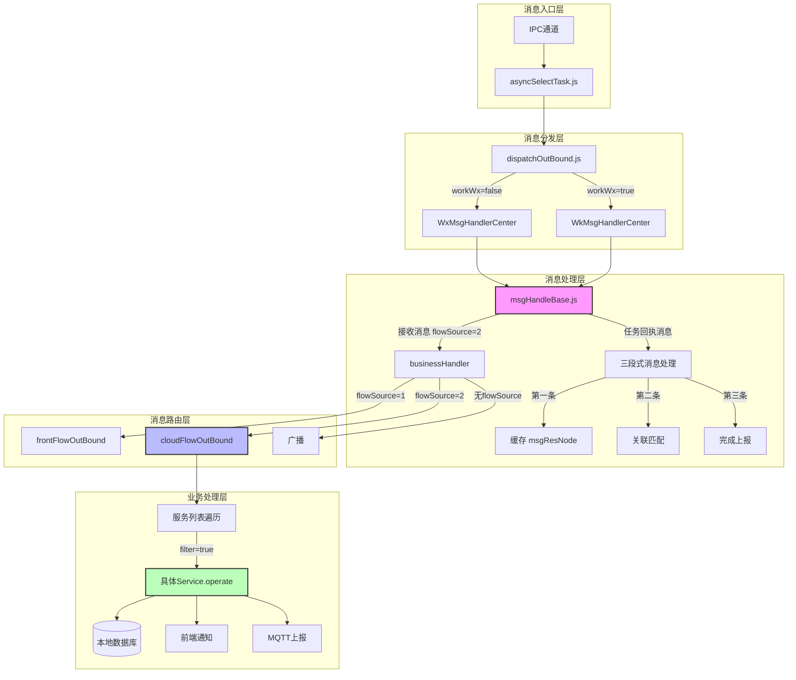
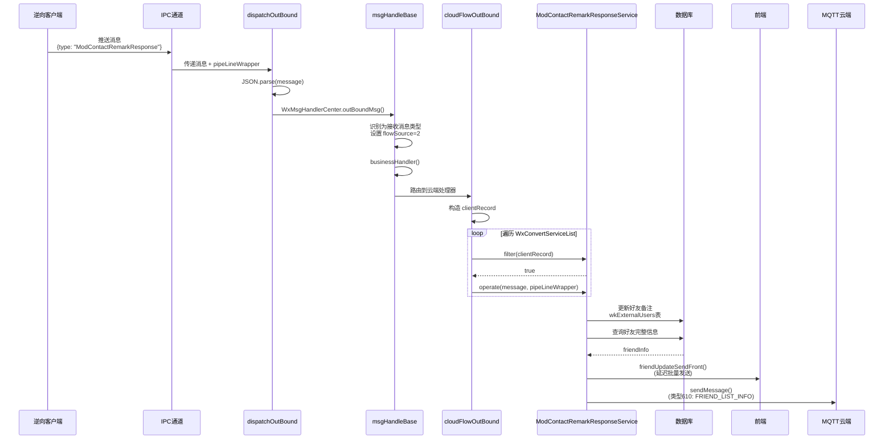
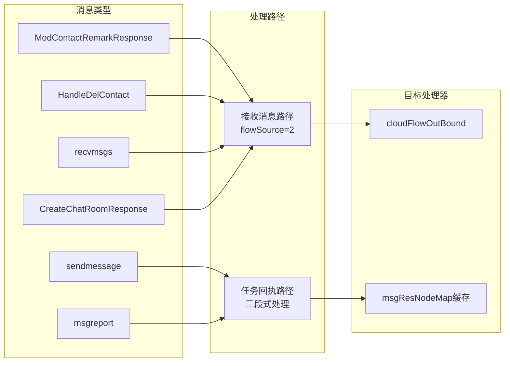

# ModContactRemarkResponse 消息处理链路分析

> 本文档详细分析 `clientRecord.type === 'ModContactRemarkResponse'` 消息的完整处理链路，帮助理解项目中 clientRecord 的运行原理。

## 目录

- [1. 概述](#1-概述)
- [2. 完整处理链路](#2-完整处理链路)
- [3. 数据流转详解](#3-数据流转详解)
- [4. 关键代码分析](#4-关键代码分析)
- [5. 架构设计图](#5-架构设计图)
- [6. 潜在问题与优化建议](#6-潜在问题与优化建议)
- [7. 新增消息类型指南](#7-新增消息类型指南)
- [8. 相关文件清单](#8-相关文件清单)

---

## 1. 概述

### 1.1 消息类型说明

`ModContactRemarkResponse` 是微信4.0版本新增的**备注修改通知**消息类型，属于逆向主动推送的消息（非任务回执）。

**触发场景：**
- 用户在微信助手中修改好友备注
- 用户在微信客户端中手动修改好友备注

**消息示例：**
```json
{
  "type": "ModContactRemarkResponse",
  "to": "wxid_48mm0oowbxmo22",
  "content": "新备注名",
  "timer": 1762238345,
  "reportId": "341288_144"
}
```

### 1.2 消息分类

在本项目中，消息按来源和处理方式分为两大类：

| 分类 | 说明 | 代表类型 |
|------|------|----------|
| **任务回执消息** | 由任务触发，需要三段式处理 | sendmessage、recvmsg、msgreport |
| **接收消息** | 逆向主动推送，直接路由处理 | ModContactRemarkResponse、HandleDelContact、recvmsgs |

`ModContactRemarkResponse` 属于**接收消息**类型，会跳过三段式任务回执流程，直接路由到 `cloudFlowOutBound` 进行 Service 处理。

---

## 2. 完整处理链路

### 2.1 处理流程概览

```
IPC通道接收消息
      ↓
asyncSelectTask.js (successIpcConnect)
      ↓ pipeLineWrapper
dispatchOutBound.js (dispatchOutBound)
      ↓ pipeLineWrapper
wxMsgHandle.js (WxMsgHandlerCenter.outBoundMsg)
      ↓ 继承自 msgHandleBase.js
msgHandleBase.js (messageHandler → 识别为接收消息，设置 flowSource=2)
      ↓
msgHandleBase.js (businessHandler → 根据 flowSource 路由)
      ↓
cloudFlowOutBound.js (cloudFlowOutBound → 遍历服务列表)
      ↓
ModContactRemarkResponseService.js (filter → operate)
      ↓
   ┌──────────────────┬──────────────────┐
   ↓                  ↓                  ↓
更新本地数据库    通知前端更新      上报云端MQTT
(wkExternalUsers) (friendUpdate)    (610类型)
```

### 2.2 处理阶段详解

| 阶段 | 文件 | 函数/方法 | 作用 |
|------|------|----------|------|
| 1 | initIpcTask.js | createPipeLineWrapper | 创建 pipeLineWrapper 管道上下文 |
| 2 | asyncSelectTask.js | successIpcConnect | 接收IPC消息，传递给分发器 |
| 3 | dispatchOutBound.js | dispatchOutBound | 解析JSON，按微信类型路由 |
| 4 | wxMsgHandle.js | outBoundMsg | 个人微信消息处理入口 |
| 5 | msgHandleBase.js | messageHandler | 识别消息类型，设置 flowSource |
| 6 | msgHandleBase.js | businessHandler | 根据 flowSource 路由到处理器 |
| 7 | cloudFlowOutBound.js | cloudFlowOutBound | 遍历服务列表执行转换处理 |
| 8 | modContactRemarkResponseService.js | filter → operate | 执行具体业务逻辑 |

---

## 3. 数据流转详解

### 3.1 pipeLineWrapper 生命周期

`pipeLineWrapper` 是贯穿整个消息处理流程的上下文对象，包含连接和账号信息：

```javascript
// 创建位置: src/msg-center/core/reverse/initIpcTask.js
const pipeLineWrapper = {
    pipeCode,                            // 管道代码
    id: processId,                       // 进程 ID
    processId,                           // 进程 ID（冗余）
    available: IpcConfig.NOT_AVAILABLE,  // 可用状态
    workWx,                              // 是否企业微信
    wxid,                                // 机器人微信ID（登录后设置）
    createTime: new Date().getTime(),    // 创建时间
    lastReportId: null,                  // 最后上报 ID
    lastTimer: null,                     // 最后计时器
};
```

### 3.2 clientRecord 构造过程

```javascript
// 位置: cloudFlowOutBound.js 第412-414行
let msgObj = message ? JSON.parse(message) : {};
let clientRecord = {...ClientMsgBO, ...msgObj};
```

`clientRecord` 由两部分合并而成：
- **ClientMsgBO**: 预定义的消息模板，包含默认字段
- **msgObj**: 实际接收到的消息数据

### 3.3 flowSource 路由机制

```javascript
// 位置: msgHandleBase.js 第1359-1375行
const isNewWxReceivedMsg =
    sendType === 'HandleDelContact' ||
    sendType === 'recvmsgs' ||
    sendType === 'CreateChatRoomResponse' ||
    sendType === 'HandleChatroomMemberResp' ||
    sendType === 'AddChatRoomMemberResponse' ||
    sendType === 'ModContactRemarkResponse' ||  // ← 备注修改通知
    (sendType === 'recvmsg' && jsonObj.status === 2 && !isTaskReceipt);

if (isNewWxReceivedMsg) {
    jsonObj.flowSource = 2;  // 路由到云端出站处理器
    return jsonObj;
}
```

**flowSource 枚举值：**
| 值 | 常量 | 说明 |
|---|------|------|
| 1 | FRONT | 前端来源 → frontFlowOutBound |
| 2 | CLOUND | 云端来源 → cloudFlowOutBound |
| 3 | OWNER | 本地来源 |

---

## 4. 关键代码分析

### 4.1 服务注册机制

```javascript
// 位置: cloudFlowOutBound.js 第131行、第331行

// 引入服务
const ModContactRemarkResponseService = require('../../business/convert-service/modContactRemarkResponseService');

// 注册到服务列表
const WxConvertServiceList = [
    ...commonConvertServiceList,
    // ... 其他服务 ...
    ModContactRemarkResponseService,  // 备注修改通知
    // ... 其他服务 ...
];
```

### 4.2 服务调度逻辑

```javascript
// 位置: cloudFlowOutBound.js 第428-447行
for (let i = 0; i < WxConvertServiceList.length; i++) {
    const wxConvertService = WxConvertServiceList[i];
    // 1. 调用 filter 方法判断是否需要处理
    if (wxConvertService.filter(clientRecord)) {
        // 2. 检查登录状态
        if (clientRecord.type) {
            if (!GalaxyTaskType.NOT_NEED_LOGIN_TYPE_SET.has(clientRecord.type) 
                && !pipeLineWrapper.wxid) {
                break;
            }
        }
        // 3. 调用 operate 方法执行处理
        wxConvertService.operate(message, pipeLineWrapper);
    }
}
```

**注意：** 服务列表遍历**没有 break 机制**，同一消息可能被多个服务处理。

### 4.3 ModContactRemarkResponseService 实现

```javascript
// 位置: modContactRemarkResponseService.js

const ModContactRemarkResponseService = {
    ...BaseConvertService,  // 继承基础服务

    // 过滤器：只处理 ModContactRemarkResponse 类型
    filter(clientRecord) {
        return clientRecord.type === 'ModContactRemarkResponse';
    },

    // 业务处理
    async operate(clientMsg, pipeLineWrapper) {
        const clientMsgBO = JSON.parse(clientMsg);
        const ownerWxId = this.parseWxId(clientMsg, pipeLineWrapper);
        const { to: friendWxid, content: newRemark, timer, reportId } = clientMsgBO;

        // 1. 更新本地数据库
        await wkExternalUserService.saveExternalUsersOp('edit', {
            accountId: ownerWxId,
            wxid: friendWxid,
            remark: newRemark
        });

        // 2. 查询好友完整信息
        const friendInfo = await wkExternalUserService.getWxidToUserInfo(ownerWxId, friendWxid);

        // 3. 通知前端更新
        DelaySendFrontMsgTimer.friendUpdateSendFront(
            pipeLineWrapper.id,
            ownerWxId,
            friendUpdateVo
        );

        // 4. 上报云端 MQTT (610类型)
        MqttSendService.sendMessage(ownerWxId, clientMsgCloud);
    }
};
```

### 4.4 前端通知机制

```javascript
// 位置: delaySendFrontmsgTimer.js

// 消息先缓存到 Map
friendUpdateSendFront(id, wxid, data) {
    const sendMsgList = this.friendUpdateMap[wxId] || [];
    sendMsgList.push(sendMsg);
    this.friendUpdateMap[wxId] = sendMsgList;
}

// 定时批量发送（减少高频更新对前端的冲击）
async friendUpdateFront() {
    // 按渠道分组、合并相同好友的更新
    // 调用 sendToFront 发送到前端
}
```

---

## 5. 架构设计图

### 5.1 整体消息处理架构



### 5.2 ModContactRemarkResponse 处理流程



### 5.3 消息类型与处理器映射



---

## 6. 潜在问题与优化建议

### 6.1 当前实现的问题

#### 问题1：服务列表遍历无 break 机制 ⚠️

**位置：** `cloudFlowOutBound.js` 第433-447行

```javascript
for (let i = 0; i < WxConvertServiceList.length; i++) {
    if (wxConvertService.filter(clientRecord)) {
        wxConvertService.operate(message, pipeLineWrapper);
        // ❌ 没有 break，同一消息可能被多个服务处理
    }
}
```

**风险：**
- 同一消息可能被多个服务重复处理
- 性能浪费

**建议：**
```javascript
for (let i = 0; i < WxConvertServiceList.length; i++) {
    if (wxConvertService.filter(clientRecord)) {
        wxConvertService.operate(message, pipeLineWrapper);
        break;  // ✅ 匹配后退出循环
    }
}
```

#### 问题2：服务列表过大，启动加载慢 ⚠️

**位置：** `cloudFlowOutBound.js` 第53-264行

**问题：** 引入了70+个服务模块，文件依赖过重

**建议：**
- 采用懒加载机制
- 使用服务注册表模式动态注册
- 按消息类型分组，减少遍历次数

#### 问题3：参数校验不完整 🐛

**位置：** `modContactRemarkResponseService.js` 第52-58行

```javascript
if (!friendWxid || !newRemark) {
    logUtil.customLog(`参数不完整，跳过处理`);
    return;
}
```

**问题：** 只校验了 `friendWxid` 和 `newRemark`，未校验 `ownerWxId`

**建议：**
```javascript
if (!ownerWxId || !friendWxid || !newRemark) {
    logUtil.customLog(`参数不完整，跳过处理`);
    return;
}
```

#### 问题4：数据库操作无重试机制 🐛

**位置：** `modContactRemarkResponseService.js` 第65-79行

```javascript
try {
    await wkExternalUserService.saveExternalUsersOp('edit', {...});
} catch (error) {
    logUtil.customLog(...);  // 只记录日志，无重试
}
```

**建议：** 添加重试机制或事务补偿

#### 问题5：前端通知和云端上报无原子性保证 🐛

**位置：** `modContactRemarkResponseService.js` 第120-151行

**问题：** 如果 MQTT 上报失败，前端已经收到通知，导致数据不一致

**建议：** 
- 使用事务或补偿机制
- 添加消息确认机制

#### 问题6：dispatchOutBound 版本号比较逻辑错误 🐛

**位置：** `dispatchOutBound.js` 第93行

```javascript
// ❌ 错误：!GalaxyVersionCache.galaxyVersion === galaxyVersion
// 实际效果：总是 false === galaxyVersion
if (!GalaxyVersionCache.galaxyVersion === galaxyVersion && galaxyVersion) {
    GalaxyVersionCache.galaxyVersion = galaxyVersion;
}
```

**修复：**
```javascript
// ✅ 正确
if (GalaxyVersionCache.galaxyVersion !== galaxyVersion && galaxyVersion) {
    GalaxyVersionCache.galaxyVersion = galaxyVersion;
}
```

### 6.2 性能优化建议

| 优化点 | 当前实现 | 建议 |
|--------|----------|------|
| 服务查找 | 遍历数组 O(n) | 使用 Map 按 type 索引 O(1) |
| 消息解析 | 多次 JSON.parse | 统一解析，传递对象 |
| 日志级别 | 全量日志 | 按环境配置日志级别 |
| 数据库查询 | 单次查询 | 批量查询或缓存 |

---

## 7. 新增消息类型指南

### 7.1 新增步骤

当需要新增一个消息类型（如 `NewFeatureResponse`）时，按以下步骤操作：

#### Step 1: 创建 Service 文件

```javascript
// 文件: src/msg-center/business/convert-service/newFeatureResponseService.js

const BaseConvertService = require('../baseConvert');
const logUtil = require('../../../init/log');

const NewFeatureResponseService = {
    ...BaseConvertService,

    // 1. 实现 filter 方法
    filter(clientRecord) {
        return clientRecord.type === 'NewFeatureResponse';
    },

    // 2. 实现 operate 方法
    async operate(clientMsg, pipeLineWrapper) {
        try {
            const clientMsgBO = JSON.parse(clientMsg);
            const ownerWxId = this.parseWxId(clientMsg, pipeLineWrapper);
            
            // TODO: 实现业务逻辑
            // - 更新数据库
            // - 通知前端
            // - 上报云端
            
        } catch (error) {
            logUtil.customLog(
                `[codeError] [NewFeatureResponseServiceError] ${error.message}`,
                { level: 'error' }
            );
        }
    }
};

module.exports = NewFeatureResponseService;
```

#### Step 2: 注册到服务列表

```javascript
// 文件: src/msg-center/dispatch-center/dispatch/cloudFlowOutBound.js

// 1. 引入服务
const NewFeatureResponseService = require('../../business/convert-service/newFeatureResponseService');

// 2. 添加到服务列表
const WxConvertServiceList = [
    ...commonConvertServiceList,
    // ... 其他服务 ...
    NewFeatureResponseService,  // 新功能响应
    // ... 其他服务 ...
];
```

#### Step 3: 如果是接收消息类型，添加到 messageHandler 识别列表

```javascript
// 文件: src/msg-center/dispatch-center/handle/msgHandleBase.js
// 位置: 第1359-1366行

const isNewWxReceivedMsg =
    sendType === 'HandleDelContact' ||
    sendType === 'recvmsgs' ||
    sendType === 'NewFeatureResponse' ||  // ← 新增
    // ... 其他类型 ...
```

### 7.2 Service 接口规范

```typescript
interface ConvertService {
    /**
     * 消息过滤器
     * @param clientRecord - 客户端消息记录
     * @returns 是否处理该消息
     */
    filter(clientRecord: ClientRecord): boolean;

    /**
     * 消息处理器
     * @param clientMsg - 原始消息JSON字符串
     * @param pipeLineWrapper - 管道上下文
     */
    operate(clientMsg: string, pipeLineWrapper: PipeLineWrapper): Promise<void>;
}
```

### 7.3 消息类型分类决策树

```
收到新消息类型
      ↓
是否由任务触发？
      ├── 是 → 任务回执消息
      │         ↓
      │   需要三段式处理吗？
      │         ├── 是 → 添加到 CALLBACK_SET
      │         └── 否 → 直接处理
      │
      └── 否 → 接收消息
                ↓
          添加到 isNewWxReceivedMsg 判断
                ↓
          设置 flowSource=2
                ↓
          路由到 cloudFlowOutBound
```

---

## 8. 相关文件清单

| 类别 | 文件路径 | 作用 |
|------|----------|------|
| **入口** | `src/msg-center/core/reverse/asyncSelectTask.js` | IPC消息接收入口 |
| **分发** | `src/msg-center/dispatch-center/dispatchOutBound.js` | 出站消息分发器 |
| **处理基类** | `src/msg-center/dispatch-center/handle/msgHandleBase.js` | 消息处理基类 |
| **微信处理** | `src/msg-center/dispatch-center/handle/wxMsgHandle.js` | 个人微信处理器 |
| **企微处理** | `src/msg-center/dispatch-center/handle/workWxMsgHandle.js` | 企业微信处理器 |
| **云端出站** | `src/msg-center/dispatch-center/dispatch/cloudFlowOutBound.js` | 云端出站处理器 |
| **前端出站** | `src/msg-center/dispatch-center/dispatch/frontFlowOutBound.js` | 前端出站处理器 |
| **业务服务** | `src/msg-center/business/convert-service/modContactRemarkResponseService.js` | 备注修改服务 |
| **基础服务** | `src/msg-center/business/baseConvert.js` | 服务基类 |
| **前端通知** | `src/msg-center/business/timer/delaySendFrontmsgTimer.js` | 延迟批量通知 |
| **MQTT发送** | `src/msg-center/dispatch-center/mqttSend.js` | MQTT消息发送 |
| **配置-回调类型** | `src/msg-center/core/data-config/galaxyCallBackType.js` | 回调类型常量 |
| **配置-回调分类** | `src/msg-center/core/data-config/callbackClassify.js` | 回调阶段分类 |
| **配置-流来源** | `src/msg-center/core/data-config/flowSourceEnum.js` | 流来源枚举 |
| **配置-上报类型** | `src/msg-center/core/data-config/prismRecordType.js` | MQTT上报类型 |

---

## 附录：常见问题

### Q1: 为什么 ModContactRemarkResponse 不走三段式处理？

**A:** 三段式处理用于**任务回执**消息（由平台下发任务触发），而 ModContactRemarkResponse 是逆向**主动推送**的消息，不需要关联任务状态。

### Q2: clientRecord 和 clientMsg 的区别？

**A:**
- `clientMsg`: 原始 JSON 字符串
- `clientRecord`: 解析后的对象，与 ClientMsgBO 模板合并后的结果

### Q3: 如何判断一个消息是否需要登录后才能处理？

**A:** 查看 `GalaxyTaskType.NOT_NEED_LOGIN_TYPE_SET`，不在该集合中的消息类型需要登录后才能处理。

---

> 文档版本：v1.0  
> 更新日期：2026-02-05  
> 作者：AI Assistant
