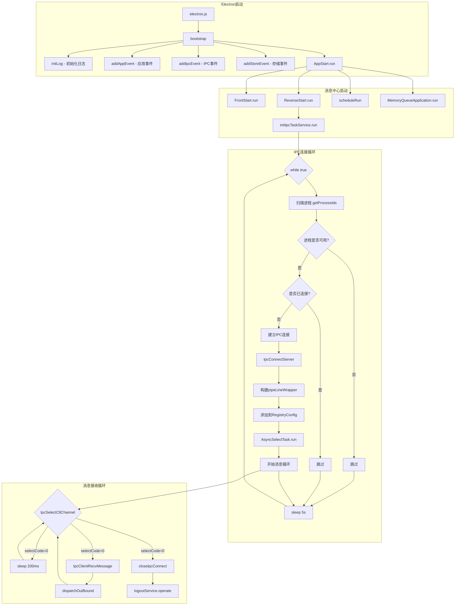
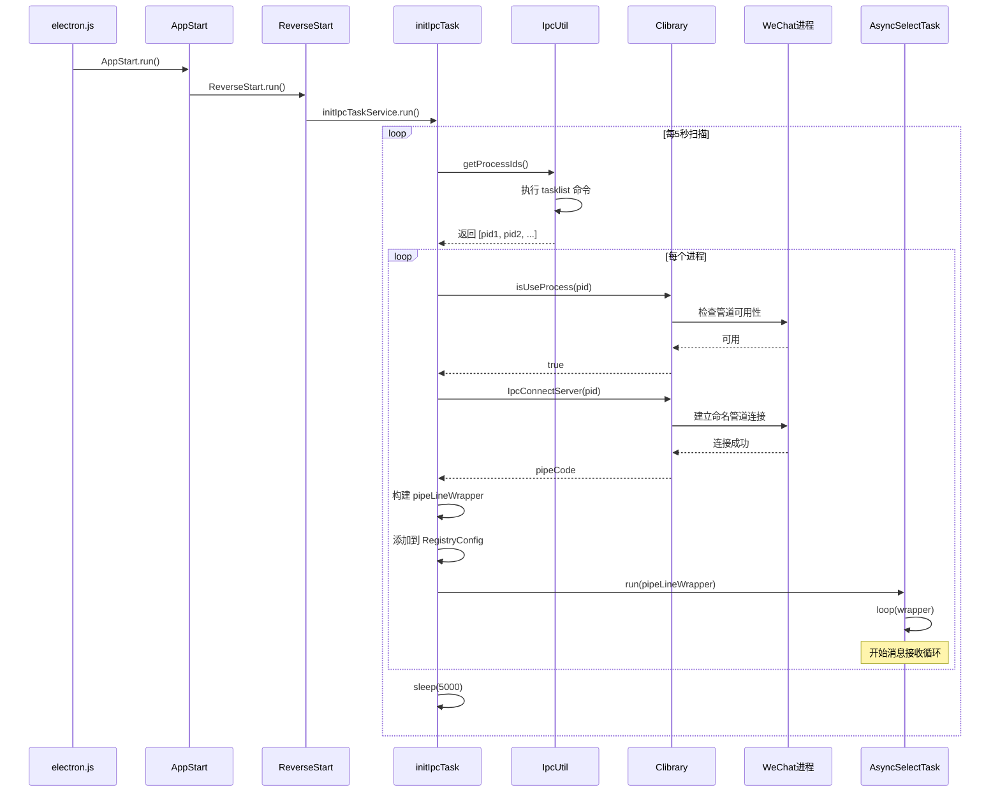

# IPC 通信机制建立流程详解

> 本文档详细解释 Galaxy Client 如何建立与微信客户端的 IPC（进程间通信）连接。

---

## 目录

1. [启动流程总览](#启动流程总览)
2. [详细启动链路](#详细启动链路)
3. [IPC 连接建立机制](#ipc-连接建立机制)
4. [消息接收任务启动](#消息接收任务启动)
5. [关键数据结构](#关键数据结构)
6. [流程图](#流程图)

---

## 启动流程总览

### 从应用启动到 IPC 连接建立的完整链路

```
┌─────────────────────────────────────────────────────────────────────────────────┐
│                            Galaxy Client 启动流程                                │
├─────────────────────────────────────────────────────────────────────────────────┤
│                                                                                  │
│   electron.js (主入口)                                                           │
│       │                                                                          │
│       ├── initLog()           ─→ 初始化日志系统                                   │
│       ├── addAppEvent()       ─→ 注册应用事件，单实例检测                          │
│       ├── addIpcEvent()       ─→ 注册 IPC 事件处理器                              │
│       ├── addStoreEvent()     ─→ 注册存储事件监听器                               │
│       │                                                                          │
│       └── AppStart.run()      ─→ 启动消息中心服务 ★                              │
│               │                                                                  │
│               ├── FrontStart.run()       ─→ 启动前端 WebSocket 服务              │
│               ├── ReverseStart.run()     ─→ 启动逆向 IPC 服务 ★★                 │
│               │       │                                                          │
│               │       └── initIpcTaskService.run()                               │
│               │               │                                                  │
│               │               └── 开始进程扫描循环 ★★★                           │
│               │                                                                  │
│               ├── scheduleRun()          ─→ 启动定时任务调度                       │
│               ├── MemoryQueueApplication.run() ─→ 启动内存消息队列                 │
│               └── judgeCrashAndReport()  ─→ 崩溃检测与上报                         │
│                                                                                  │
└─────────────────────────────────────────────────────────────────────────────────┘
```

---

## 详细启动链路

### 1. 应用入口 (electron.js)

**文件位置**: `src/electron.js`

```javascript
// 记录应用启动时间
global.readyStartTime = Date.now();

function bootstrap() {
    // 1. 注册应用事件，返回是否需要退出（单实例检测）
    let isQuit = addAppEvent();
    if (isQuit) return;
    
    // 2. 注册 IPC 通信事件处理器
    addIpcEvent();
    
    // 3. 注册存储状态变化监听器
    addStoreEvent();
    
    // 4. 启动消息中心服务 ⭐ 关键入口
    AppStart.run();
}

bootstrap();
```

**作用说明**:
- 这是 Electron 主进程的入口文件
- 负责初始化各个核心模块
- `AppStart.run()` 是启动 IPC 服务的关键调用

---

### 2. 应用启动器 (appStart.js)

**文件位置**: `src/msg-center/start/appStart.js`

```javascript
const AppMain = {
    run() {
        // 记录启动时间
        global.startTime = Date.now();
        
        // 1. 启动前端 WebSocket 服务
        FrontStart.run();
        
        // 2. 启动逆向 IPC 连接服务 ⭐ 核心
        ReverseStart.run();
        
        // 3. 启动定时任务调度器
        scheduleRun();
        
        // 4. 启动内存消息队列
        MemoryQueueApplication.run();
        
        // 5. 检测崩溃并上报
        judgeCrashAndReport();
    }
}
```

**启动顺序说明**:

| 顺序 | 服务 | 作用 |
|:---:|:---|:---|
| 1 | FrontStart | 启动 WebSocket 服务端，与渲染进程通信 |
| 2 | ReverseStart | **启动 IPC 连接服务，与微信进程通信** |
| 3 | scheduleRun | 启动心跳、消息补发等定时任务 |
| 4 | MemoryQueueApplication | 处理异步消息队列 |
| 5 | judgeCrashAndReport | 检测上次是否异常退出 |

---

### 3. 逆向服务启动器 (reverseStart.js)

**文件位置**: `src/msg-center/start/reverseStart.js`

```javascript
// 获取 IPC 任务服务的单例实例
const initIpcTaskService = initIpcTask.getInstance();

const IpcStart = {
    run() {
        logUtil.customLog("启动ipc连接");
        // 调用 IPC 任务服务启动
        initIpcTaskService.run();
    }
}
```

**作用说明**:
- 作为桥梁模块，连接应用启动和 IPC 任务
- 获取 `initIpcTask` 单例并启动

---

## IPC 连接建立机制

### 4. IPC 初始化任务 (initIpcTask.js)

**文件位置**: `src/msg-center/core/reverse/initIpcTask.js`

这是 IPC 连接建立的核心模块，采用**单例模式**实现。

#### 核心功能

```
┌─────────────────────────────────────────────────────────────────────┐
│                    initIpcTask 核心功能                              │
├─────────────────────────────────────────────────────────────────────┤
│                                                                      │
│  ┌─────────────┐    ┌─────────────┐    ┌─────────────────────────┐  │
│  │   run()     │    │ 批量检查    │    │ 启动消息接收            │  │
│  │  无限循环   │ ─→ │ 进程状态    │ ─→ │ AsyncSelectTask.run()  │  │
│  │  每5秒扫描  │    │             │    │                         │  │
│  └─────────────┘    └─────────────┘    └─────────────────────────┘  │
│         │                  │                       │                 │
│         ▼                  ▼                       ▼                 │
│  ┌─────────────┐    ┌─────────────┐    ┌─────────────────────────┐  │
│  │  扫描进程   │    │  清理已退   │    │  开始接收逆向消息       │  │
│  │  weixin.exe │    │  出的连接   │    │  进入消息循环           │  │
│  │  WXWork.exe │    │             │    │                         │  │
│  └─────────────┘    └─────────────┘    └─────────────────────────┘  │
│                                                                      │
└─────────────────────────────────────────────────────────────────────┘
```

#### 进程扫描循环（run 方法）

```
                         ┌─────────────────┐
                         │     开始扫描     │
                         └────────┬────────┘
                                  │
                                  ▼
                    ┌─────────────────────────────┐
                    │  1. IpcUtil.getProcessIds() │
                    │  扫描 weixin.exe/WXWork.exe │
                    └─────────────┬───────────────┘
                                  │
                                  ▼
              ┌───────────────────────────────────────────┐
              │         2. 检查进程是否可用                │
              │    Clibrary.isUseProcess(processId)      │
              └───────────────────┬───────────────────────┘
                                  │
                    ┌─────────────┴─────────────┐
                    │                           │
                    ▼                           ▼
           ┌───────────────┐           ┌───────────────┐
           │   可用进程     │           │  不可用进程   │
           │               │           │  尝试清理旧   │
           │               │           │  连接后跳过   │
           └───────┬───────┘           └───────────────┘
                   │
                   ▼
    ┌──────────────────────────────────┐
    │    3. 对比已连接进程列表          │
    │  RegistryConfig.getCurrProcessIds│
    └──────────────┬───────────────────┘
                   │
        ┌──────────┴──────────┐
        │                     │
        ▼                     ▼
┌───────────────┐     ┌───────────────┐
│  已存在连接   │     │   新进程      │
│  跳过         │     │  需要建立连接 │
└───────────────┘     └───────┬───────┘
                              │
                              ▼
              ┌───────────────────────────────────────┐
              │    4. 建立 IPC 连接                    │
              │  Clibrary.IpcConnectServer(processId) │
              └───────────────────┬───────────────────┘
                                  │
                                  ▼
              ┌───────────────────────────────────────┐
              │    5. 构建 pipeLineWrapper 对象        │
              │    包含: pipeCode, processId,         │
              │    workWx, createTime 等              │
              └───────────────────┬───────────────────┘
                                  │
                                  ▼
              ┌───────────────────────────────────────┐
              │    6. 添加到 RegistryConfig           │
              │    并通知前端更新配置                  │
              └───────────────────┬───────────────────┘
                                  │
                                  ▼
              ┌───────────────────────────────────────┐
              │    7. 启动消息接收任务                 │
              │  AsyncSelectTask.run(pipeLineWrapper) │
              └───────────────────┬───────────────────┘
                                  │
                                  ▼
              ┌───────────────────────────────────────┐
              │    8. 清理已退出进程的连接             │
              │    batchCheckAndExit()                │
              └───────────────────┬───────────────────┘
                                  │
                                  ▼
                         ┌───────────────┐
                         │  sleep(5000)  │
                         │  等待5秒后    │
                         │  继续下一轮   │
                         └───────────────┘
```

#### 核心代码分析

```javascript
async run() {
    while(true) {
        try {
            // ========== 1. 扫描进程 ==========
            let processIds = IpcUtil.getProcessIds();
            
            // ========== 2. 过滤可用进程 ==========
            processIds.forEach(processId => {
                const isAvaliable = Clibrary.isUseProcess(processId);
                if (isAvaliable) {
                    processIdsTemp.push(processId);
                }
            });
            
            // ========== 3. 获取当前已连接的进程 ==========
            let currProcessIds = RegistryConfig.getCurrProcessIds();
            
            // ========== 4. 为新进程建立连接 ==========
            for(let processId of processIds) {
                if (!currProcessIds.includes(processId)) {
                    // 使用异步锁防止重复创建
                    lock.acquire(`ipcLock-${processId}`, (done) => {
                        // 建立 IPC 连接
                        let pipeCode = Clibrary.IpcConnectServer(processId);
                        
                        // 构建包装对象
                        const pipeLineWrapper = {
                            pipeCode,
                            id: processId,
                            processId,
                            workWx: IpcUtil.processMap[processId] || false,
                            createTime: new Date().getTime(),
                        };
                        
                        // 注册并启动消息接收
                        RegistryConfig.add(registry);
                        this.startSelectMessage(registry);
                        
                        done();
                    });
                }
            }
            
            // ========== 5. 清理已退出的进程 ==========
            this.batchCheckAndExit(currProcessIds);
            
            await sleep(5000);
        } catch(error) {
            await sleep(5000);
        }
    }
}
```

---

## 消息接收任务启动

### 5. 异步消息选择任务 (asyncSelectTask.js)

**文件位置**: `src/msg-center/core/reverse/asyncSelectTask.js`

当 IPC 连接建立后，`initIpcTask` 会调用 `AsyncSelectTask.run()` 启动消息接收循环。

#### 消息接收循环机制

```
┌─────────────────────────────────────────────────────────────────────────────┐
│                        AsyncSelectTask 消息接收循环                          │
├─────────────────────────────────────────────────────────────────────────────┤
│                                                                              │
│   AsyncSelectTask.run(wrapper)                                               │
│           │                                                                  │
│           └──→ AsyncSelectTask.loop(wrapper)                                │
│                       │                                                      │
│                       ▼                                                      │
│               ┌───────────────────────────────────────┐                     │
│               │  IpcSelectCltChannel(pipeCode)        │                     │
│               │  检查 IPC 通道是否有数据               │                     │
│               └───────────────────┬───────────────────┘                     │
│                                   │                                          │
│           ┌───────────────────────┼───────────────────────┐                 │
│           │                       │                       │                  │
│           ▼                       ▼                       ▼                  │
│   selectCode == 0          selectCode > 0          selectCode < 0           │
│   ┌───────────────┐      ┌───────────────┐      ┌───────────────┐          │
│   │  暂无消息     │      │  有消息       │      │  通道关闭     │          │
│   │  sleep(200ms) │      │  selectCode   │      │               │          │
│   │  继续循环     │      │  = 消息长度   │      │               │          │
│   └───────────────┘      └───────┬───────┘      └───────┬───────┘          │
│           │                      │                      │                   │
│           │                      ▼                      ▼                   │
│           │         ┌────────────────────┐   ┌───────────────────┐         │
│           │         │ successIpcConnect  │   │ closeIpcConnect   │         │
│           │         │                    │   │                   │         │
│           │         └────────┬───────────┘   └─────────┬─────────┘         │
│           │                  │                         │                    │
│           │                  ▼                         ▼                    │
│           │    ┌─────────────────────────┐   ┌───────────────────┐         │
│           │    │ IpcClientRecvMessage    │   │ logoutService     │         │
│           │    │ 读取消息内容             │   │ 处理登出逻辑      │         │
│           │    └─────────┬───────────────┘   └───────────────────┘         │
│           │              │                                                  │
│           │              ▼                                                  │
│           │    ┌─────────────────────────┐                                 │
│           │    │ dispatchOutBound        │                                 │
│           │    │ 分发消息到处理器        │                                 │
│           │    └─────────────────────────┘                                 │
│           │              │                                                  │
│           └──────────────┴──────────────────────────────────────────────→  │
│                               继续循环                                       │
│                                                                              │
└─────────────────────────────────────────────────────────────────────────────┘
```

#### 核心代码

```javascript
const AsyncSelectTask = {
    async loop(wrapper) {
        const pipeCode = wrapper.pipeCode;
        
        // 检查 IPC 通道是否有数据
        const selectCode = Clibrary.IpcSelectCltChannel(pipeCode);
        
        // selectCode == 0：暂无消息
        if (selectCode == 0) {
            await sleep(sleepTime);  // 200ms
            this.loop(wrapper);
            return;
        }
        
        // selectCode < 0：通道关闭
        if (selectCode < 0) {
            this.closeIpcConnect(pipeCode, selectCode, wrapper);
            return;
        }
        
        // selectCode > 0：有消息
        this.successIpcConnect(pipeCode, selectCode, createTime, wrapper);
        this.loop(wrapper);
    },
    
    successIpcConnect(pipeCode, selectCode, createTime, wrapper) {
        // 读取消息
        let message = Clibrary.IpcClientRecvMessage(pipeCode, selectCode, wrapper.wxid);
        
        // 处理大数字精度问题
        message = replaceLargeNumbers(message);
        
        // 分发消息
        dispatchOutBound(message, wrapper);
    },
    
    closeIpcConnect(pipeCode, selectCode, wrapper) {
        logUtil.customLog(`IPC-CONNECT-CLOSE [wxid-${wrapper.wxid}]`);
        logoutService.operate(null, wrapper);
    }
}
```

---

## 关键数据结构

### pipeLineWrapper 对象

```javascript
{
    pipeCode: number,              // DLL 返回的管道代码
    id: number,                    // 进程 ID
    processId: number,             // 进程 ID（冗余）
    available: number,             // 是否可用 (0: 不可用, 1: 可用)
    workWx: boolean,               // 是否为企业微信
    createTime: number,            // 连接创建时间戳
    lastReportId: number | null,   // 最后上报的消息 ID
    lastTimer: any | null,         // 最后的定时器
    wxid: string,                  // 微信 ID（登录后填充）
    lastReadTime: number           // 最后读取消息时间
}
```

### registry 对象

```javascript
{
    pipeLineWrapper: object,       // 管道包装对象
    sendToCloudFlag: number,       // 是否已发送登录到云端
    id: number,                    // 进程 ID
    scanTime: number,              // 扫描时间戳
    workWx: boolean,               // 是否为企业微信
    wxid: string                   // 微信 ID（登录后填充）
}
```

---

## 流程图

### Mermaid 流程图 - 完整启动流程



### Mermaid 时序图 - IPC 连接建立



---

## ASCII 流程图 - 启动流程总览

```
╔══════════════════════════════════════════════════════════════════════════════════════╗
║                           Galaxy Client IPC 建立流程                                   ║
╠══════════════════════════════════════════════════════════════════════════════════════╣
║                                                                                       ║
║    ┌──────────────────────────────────────────────────────────────────────────────┐  ║
║    │                           第一阶段：应用启动                                   │  ║
║    └──────────────────────────────────────────────────────────────────────────────┘  ║
║                                        │                                              ║
║                                        ▼                                              ║
║    ┌──────────────┐    ┌──────────────┐    ┌──────────────┐    ┌──────────────┐      ║
║    │ electron.js  │───▶│  bootstrap() │───▶│ AppStart.run │───▶│ ReverseStart │      ║
║    │   主入口     │    │   启动函数   │    │  消息中心    │    │    逆向服务  │      ║
║    └──────────────┘    └──────────────┘    └──────────────┘    └──────────────┘      ║
║                                                                       │               ║
║    ┌──────────────────────────────────────────────────────────────────┘               ║
║    │                                                                                  ║
║    ▼                                                                                  ║
║    ┌──────────────────────────────────────────────────────────────────────────────┐  ║
║    │                           第二阶段：IPC 连接扫描                               │  ║
║    └──────────────────────────────────────────────────────────────────────────────┘  ║
║                                        │                                              ║
║                                        ▼                                              ║
║    ┌────────────────────────────────────────────────────────────────────────┐        ║
║    │                        initIpcTask.run()                                │        ║
║    │  ┌──────────────────────────────────────────────────────────────────┐  │        ║
║    │  │   while (true) {                                                   │  │        ║
║    │  │       1. 扫描进程 (tasklist weixin.exe / WXWork.exe)              │  │        ║
║    │  │       2. 过滤可用进程 (isUseProcess)                              │  │        ║
║    │  │       3. 对比已连接列表                                           │  │        ║
║    │  │       4. 为新进程建立连接 (IpcConnectServer)                       │  │        ║
║    │  │       5. 启动消息接收 (AsyncSelectTask.run)                       │  │        ║
║    │  │       6. 清理退出进程                                             │  │        ║
║    │  │       await sleep(5000);                                          │  │        ║
║    │  │   }                                                                │  │        ║
║    │  └──────────────────────────────────────────────────────────────────┘  │        ║
║    └────────────────────────────────────────────────────────────────────────┘        ║
║                                        │                                              ║
║                                        ▼                                              ║
║    ┌──────────────────────────────────────────────────────────────────────────────┐  ║
║    │                           第三阶段：消息接收循环                               │  ║
║    └──────────────────────────────────────────────────────────────────────────────┘  ║
║                                        │                                              ║
║                                        ▼                                              ║
║    ┌────────────────────────────────────────────────────────────────────────┐        ║
║    │                     AsyncSelectTask.loop(wrapper)                      │        ║
║    │  ┌──────────────────────────────────────────────────────────────────┐  │        ║
║    │  │   selectCode = IpcSelectCltChannel(pipeCode)                      │  │        ║
║    │  │                                                                    │  │        ║
║    │  │   if (selectCode == 0)  ──▶  sleep(200ms), 继续循环               │  │        ║
║    │  │   if (selectCode > 0)   ──▶  读取消息，分发到处理器               │  │        ║
║    │  │   if (selectCode < 0)   ──▶  连接关闭，执行登出逻辑               │  │        ║
║    │  └──────────────────────────────────────────────────────────────────┘  │        ║
║    └────────────────────────────────────────────────────────────────────────┘        ║
║                                                                                       ║
╚══════════════════════════════════════════════════════════════════════════════════════╝
```

---

## 核心模块关系图

```
┌─────────────────────────────────────────────────────────────────────────────────────┐
│                              IPC 通信模块依赖关系                                     │
├─────────────────────────────────────────────────────────────────────────────────────┤
│                                                                                      │
│   ┌─────────────┐                                                                   │
│   │ electron.js │                                                                   │
│   └──────┬──────┘                                                                   │
│          │                                                                           │
│          ▼                                                                           │
│   ┌─────────────┐     ┌──────────────┐                                              │
│   │  appStart   │────▶│ reverseStart │                                              │
│   └─────────────┘     └──────┬───────┘                                              │
│                              │                                                       │
│                              ▼                                                       │
│                       ┌─────────────┐                                               │
│                       │ initIpcTask │◀─────────────────────┐                        │
│                       └──────┬──────┘                      │                        │
│                              │                              │                        │
│          ┌───────────────────┼───────────────────┐         │                        │
│          │                   │                   │         │                        │
│          ▼                   ▼                   ▼         │                        │
│   ┌─────────────┐     ┌─────────────┐     ┌───────────┐   │                        │
│   │   IpcUtil   │     │  Clibrary   │     │ AsyncSelect│   │                        │
│   │  进程扫描   │     │  DLL调用    │     │  Task     │   │                        │
│   └──────┬──────┘     └──────┬──────┘     └─────┬─────┘   │                        │
│          │                   │                   │         │                        │
│          ▼                   ▼                   │         │                        │
│   ┌─────────────┐     ┌─────────────┐           │         │                        │
│   │  tasklist   │     │ PipeCore.dll│           │         │                        │
│   │   命令      │     │ ReUtils64.dll│           │         │                        │
│   └─────────────┘     └─────────────┘           │         │                        │
│                              │                   │         │                        │
│                              ▼                   │         │                        │
│                       ┌─────────────┐           │         │                        │
│                       │  微信进程   │◀──────────┤         │                        │
│                       │  IPC管道    │           │         │                        │
│                       └─────────────┘           │         │                        │
│                                                  │         │                        │
│                                                  ▼         │                        │
│                                           ┌─────────────┐ │                        │
│                                           │dispatchOut- │ │                        │
│                                           │   Bound     │ │                        │
│                                           └──────┬──────┘ │                        │
│                                                  │        │                        │
│                                                  ▼        │                        │
│                                           ┌─────────────┐ │                        │
│                                           │ 消息处理器  │─┘                        │
│                                           │ MsgHandler  │                          │
│                                           └─────────────┘                          │
│                                                                                      │
└─────────────────────────────────────────────────────────────────────────────────────┘
```

---

## 关键问题解答

### Q1: 谁执行的 initIpcTask.js？

**调用链**:
```
electron.js → AppStart.run() → ReverseStart.run() → initIpcTaskService.run()
```

- `electron.js` 是 Electron 主进程入口
- 通过 `bootstrap()` 函数启动
- 最终调用 `initIpcTask.getInstance().run()`

### Q2: 谁执行的 asyncSelectTask.js？

**调用链**:
```
initIpcTask.run() 
    → 检测到新微信进程 
    → IpcConnectServer() 建立连接 
    → startSelectMessage(registry) 
    → AsyncSelectTask.run(pipeLineWrapper)
```

- 由 `initIpcTask` 在建立新 IPC 连接后调用
- 每个微信/企业微信进程对应一个 `AsyncSelectTask` 消息循环

### Q3: 从打开应用到完成 IPC 建立的时间线？

```
T+0ms:    electron.js 启动
T+10ms:   日志系统初始化完成
T+50ms:   应用事件注册完成
T+100ms:  AppStart.run() 开始执行
T+150ms:  FrontStart.run() WebSocket 服务启动
T+200ms:  ReverseStart.run() IPC 服务启动
T+250ms:  initIpcTask.run() 开始进程扫描
T+300ms:  第一次扫描开始 (getProcessIds)
T+500ms:  发现微信进程，检查可用性
T+600ms:  IpcConnectServer() 建立连接
T+700ms:  AsyncSelectTask.run() 开始消息接收
T+5200ms: 第二次扫描（每5秒循环）
...
```

---

## 相关文件列表

| 文件 | 作用 |
|:---|:---|
| `src/electron.js` | 应用入口 |
| `src/msg-center/start/appStart.js` | 应用启动器 |
| `src/msg-center/start/reverseStart.js` | 逆向服务启动器 |
| `src/msg-center/core/reverse/initIpcTask.js` | IPC 初始化任务 |
| `src/msg-center/core/reverse/asyncSelectTask.js` | 消息接收任务 |
| `src/msg-center/core/reverse/ipcUtil.js` | 进程扫描工具 |
| `src/msg-center/core/reverse/dll/clibrary.js` | DLL 调用封装 |
| `src/msg-center/dispatch-center/dispatchOutBound.js` | 消息分发器 |

---

> 📌 **下一篇**: [16-IPC消息处理链路详解.md](./16-IPC消息处理链路详解.md)
