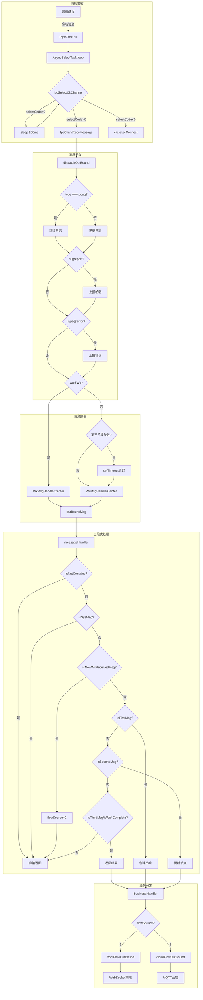
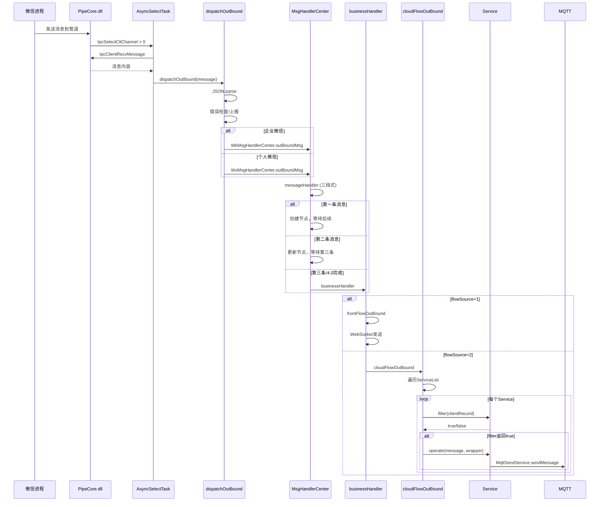

# IPC 消息处理链路详解

> 本文档详细解释当 IPC 通道收到消息时，系统内部的完整处理流程和分支逻辑。

---

## 目录

1. [消息处理总览](#消息处理总览)
2. [核心处理模块](#核心处理模块)
3. [消息分发流程](#消息分发流程)
4. [三段式回执机制](#三段式回执机制)
5. [重点分支详解（20个关键分支）](#重点分支详解)
6. [流程图](#流程图)

---

## 消息处理总览

### 消息处理完整链路

```
┌─────────────────────────────────────────────────────────────────────────────────────────┐
│                           IPC 消息处理完整链路                                            │
├─────────────────────────────────────────────────────────────────────────────────────────┤
│                                                                                          │
│   微信进程                                                                               │
│      │                                                                                   │
│      │ 命名管道                                                                          │
│      ▼                                                                                   │
│   ┌──────────────────┐                                                                  │
│   │   PipeCore.dll   │  ← IPC 管道接收数据                                               │
│   └────────┬─────────┘                                                                  │
│            │                                                                             │
│            ▼                                                                             │
│   ┌────────────────────────────┐                                                        │
│   │   AsyncSelectTask.loop()   │  ← 消息接收循环                                         │
│   │   • IpcSelectCltChannel    │  ← 检查是否有消息                                       │
│   │   • IpcClientRecvMessage   │  ← 读取消息内容                                         │
│   └────────────┬───────────────┘                                                        │
│                │                                                                         │
│                ▼                                                                         │
│   ┌────────────────────────────┐                                                        │
│   │    dispatchOutBound()      │  ← 消息分发入口                                         │
│   │    • 解析 JSON             │                                                        │
│   │    • 错误上报              │                                                        │
│   │    • 版本缓存              │                                                        │
│   └────────────┬───────────────┘                                                        │
│                │                                                                         │
│        ┌───────┴───────┐                                                                │
│        │               │                                                                 │
│        ▼               ▼                                                                 │
│   ┌──────────┐   ┌──────────┐                                                           │
│   │ 企业微信 │   │ 个人微信 │                                                           │
│   │ WkMsg    │   │ WxMsg    │                                                           │
│   │ Handler  │   │ Handler  │                                                           │
│   │ Center   │   │ Center   │                                                           │
│   └────┬─────┘   └────┬─────┘                                                           │
│        │              │                                                                  │
│        └──────┬───────┘                                                                  │
│               │                                                                          │
│               ▼                                                                          │
│   ┌────────────────────────────┐                                                        │
│   │   MsgHandlerCenterBase     │  ← 消息处理基类                                         │
│   │   • outBoundMsg()          │                                                        │
│   │   • messageHandler()       │  ← 三段式回执处理                                       │
│   │   • businessHandler()      │  ← 业务分发                                            │
│   └────────────┬───────────────┘                                                        │
│                │                                                                         │
│        ┌───────┴───────┐                                                                │
│        │               │                                                                 │
│        ▼               ▼                                                                 │
│   ┌──────────┐   ┌──────────┐                                                           │
│   │ 前端流   │   │ 云端流   │                                                           │
│   │ frontFlow│   │cloudFlow │                                                           │
│   │ OutBound │   │ OutBound │                                                           │
│   └────┬─────┘   └────┬─────┘                                                           │
│        │              │                                                                  │
│        ▼              ▼                                                                  │
│   ┌──────────┐   ┌──────────┐                                                           │
│   │ WebSocket│   │   MQTT   │                                                           │
│   │  前端    │   │   云端   │                                                           │
│   └──────────┘   └──────────┘                                                           │
│                                                                                          │
└─────────────────────────────────────────────────────────────────────────────────────────┘
```

---

## 核心处理模块

### 1. AsyncSelectTask - 消息接收入口

**文件**: `src/msg-center/core/reverse/asyncSelectTask.js`

```javascript
successIpcConnect(pipeCode, selectCode, createTime, wrapper) {
    // 1. 从 DLL 读取消息
    let message = Clibrary.IpcClientRecvMessage(pipeCode, selectCode, wrapper.wxid);
    
    // 2. 处理大数字精度（17位以上数字加引号）
    message = replaceLargeNumbers(message);
    
    // 3. 分发到处理器
    dispatchOutBound(message, wrapper);
}
```

### 2. dispatchOutBound - 消息分发器

**文件**: `src/msg-center/dispatch-center/dispatchOutBound.js`

```javascript
function dispatchOutBound(message, pipeLineWrapper) {
    // 1. 解析 JSON
    let jsonObject = message ? JSON.parse(message) : {};
    
    // 2. 过滤 pong 消息（心跳）
    if (jsonObject.type !== 'pong') {
        logUtil.customLog(`接收逆向type=${jsonObject.type}`);
    }
    
    // 3. 错误上报
    if (jsonObject.type === 'bugreport') { /* 上报 */ }
    if (jsonObject.type?.indexOf('error') !== -1) { /* 上报 */ }
    
    // 4. 版本缓存更新
    const galaxyVersion = jsonObject.galaxyver;
    
    // 5. 根据微信类型路由
    if (pipeLineWrapper.workWx) {
        WkMsgHandlerCenter.outBoundMsg(jsonObject, pipeLineWrapper, sendType);
    } else {
        // 第三阶段失败任务延迟处理
        if (CallBackClassify.THIRD_CALLBACKS.has(jsonObject.type) && jsonObject.status != 0) {
            setTimeout(() => {
                WxMsgHandlerCenter.outBoundMsg(...);
            }, apolloConfig.taskFailWaitTime);
        } else {
            WxMsgHandlerCenter.outBoundMsg(jsonObject, pipeLineWrapper, sendType);
        }
    }
}
```

### 3. MsgHandlerCenterBase - 消息处理基类

**文件**: `src/msg-center/dispatch-center/handle/msgHandleBase.js`

这是最复杂的模块，包含以下核心方法：

| 方法 | 作用 |
|:---|:---|
| `outBoundMsg()` | 出站消息处理入口 |
| `messageHandler()` | 三段式回执处理 |
| `businessHandler()` | 业务分发 |
| `get/add/remove()` | 消息节点缓存管理 |

---

## 消息分发流程

### dispatchOutBound 处理流程

```
                    ┌─────────────────────────────────────┐
                    │        dispatchOutBound()           │
                    │        消息分发入口                  │
                    └─────────────────┬───────────────────┘
                                      │
                                      ▼
                    ┌─────────────────────────────────────┐
                    │      JSON.parse(message)            │
                    │      解析消息字符串                  │
                    └─────────────────┬───────────────────┘
                                      │
                                      ▼
                             ┌────────────────┐
                             │ type === 'pong'│
                             │    心跳消息？   │
                             └────────┬───────┘
                                      │
                        ┌─────────────┴─────────────┐
                        │是                         │否
                        ▼                           ▼
                ┌───────────────┐          ┌───────────────┐
                │ 跳过日志记录  │          │ 记录接收日志  │
                └───────┬───────┘          └───────┬───────┘
                        │                          │
                        └──────────┬───────────────┘
                                   │
                                   ▼
                             ┌────────────────┐
                             │type === 'bug-' │
                             │   report？     │
                             └────────┬───────┘
                                      │
                        ┌─────────────┴─────────────┐
                        │是                         │否
                        ▼                           │
                ┌───────────────┐                   │
                │ reportLog()   │                   │
                │ 上报哈勃      │                   │
                └───────┬───────┘                   │
                        │                           │
                        └──────────┬────────────────┘
                                   │
                                   ▼
                             ┌────────────────┐
                             │type含'error'？ │
                             └────────┬───────┘
                                      │
                        ┌─────────────┴─────────────┐
                        │是                         │否
                        ▼                           │
                ┌───────────────┐                   │
                │ 记录错误日志  │                   │
                │ 上报哈勃      │                   │
                └───────┬───────┘                   │
                        │                           │
                        └──────────┬────────────────┘
                                   │
                                   ▼
                             ┌────────────────┐
                             │pipeLineWrapper │
                             │  .workWx？     │
                             └────────┬───────┘
                                      │
                        ┌─────────────┴─────────────┐
                        │是                         │否
                        ▼                           ▼
                ┌───────────────┐          ┌───────────────┐
                │ WkMsgHandler  │          │ WxMsgHandler  │
                │ Center        │          │ Center        │
                │ 企业微信处理   │          │ 个人微信处理   │
                └───────────────┘          └───────────────┘
```

---

## 三段式回执机制

### 回执流程说明

**旧版本（微信 3.x）三段式**:
```
msgreport → sendmessage → MM.* (具体消息类型)
   │            │            │
   ▼            ▼            ▼
第一条        第二条        第三条
消息上报确认   发送确认      结果回执
```

**新版本（微信 4.0）两段式**:
```
sendmessage → recvmsg
     │           │
     ▼           ▼
  第一条       第二条
  发送确认     接收确认
```

### 消息节点缓存

```javascript
// msgResNodeMap 存储结构
{
    "msgKey_123456": {
        first: { taskId, hash, status, type },   // 第一条消息
        second: { taskId, hash, status, type },  // 第二条消息
        third: { taskId, hash, status, type },   // 第三条消息
        expireTime: 1234567890000                // 过期时间
    }
}
```

### messageHandler 三段式处理流程

```
                    ┌─────────────────────────────────────┐
                    │        messageHandler()             │
                    │        三段式回执处理                │
                    └─────────────────┬───────────────────┘
                                      │
                                      ▼
                    ┌─────────────────────────────────────┐
                    │   isNotContains(sendType) ?         │
                    │   消息类型是否在处理范围内           │
                    └─────────────────┬───────────────────┘
                                      │
                        ┌─────────────┴─────────────┐
                        │否                         │是
                        │                           ▼
                        │                   ┌───────────────┐
                        │                   │ 直接返回      │
                        │                   │ 不处理        │
                        │                   └───────────────┘
                        ▼
                    ┌─────────────────────────────────────┐
                    │   isSysMsg() ?                      │
                    │   是否为系统消息（如newsapp）        │
                    └─────────────────┬───────────────────┘
                                      │
                        ┌─────────────┴─────────────┐
                        │否                         │是
                        │                           ▼
                        │                   ┌───────────────┐
                        │                   │ 直接返回      │
                        │                   └───────────────┘
                        ▼
                    ┌─────────────────────────────────────┐
                    │   isNotSendMsg() ?                  │
                    │   是否为非群发消息（sequence != 0） │
                    └─────────────────┬───────────────────┘
                                      │
                        ┌─────────────┴─────────────┐
                        │否                         │是
                        │                           ▼
                        │                   ┌───────────────┐
                        │                   │ 直接返回      │
                        │                   └───────────────┘
                        ▼
                    ┌─────────────────────────────────────┐
                    │   isNewWxReceivedMsg ?              │
                    │   微信4.0接收消息类型？              │
                    │   (HandleDelContact/recvmsgs/等)    │
                    └─────────────────┬───────────────────┘
                                      │
                        ┌─────────────┴─────────────┐
                        │否                         │是
                        │                           ▼
                        │                   ┌───────────────┐
                        │                   │ flowSource=2  │
                        │                   │ 跳过三段式    │
                        │                   │ 直接返回      │
                        │                   └───────────────┘
                        ▼
                    ┌─────────────────────────────────────┐
                    │   获取/创建消息节点                  │
                    │   msgResNode = get(msgKey)          │
                    └─────────────────┬───────────────────┘
                                      │
                                      ▼
                    ┌─────────────────────────────────────┐
                    │   判断消息所处阶段                   │
                    │   isFirstMsg / isSecondMsg /        │
                    │   isThirdMsg / isWx4RecvmsgComplete │
                    └─────────────────┬───────────────────┘
                                      │
            ┌─────────────┬───────────┴───────────┬─────────────┐
            │             │                       │             │
            ▼             ▼                       ▼             ▼
    ┌───────────┐  ┌───────────┐         ┌───────────┐  ┌───────────┐
    │ 第一条    │  │ 第二条    │         │ 第三条    │  │ 4.0完成   │
    │ 创建节点  │  │ 更新节点  │         │ 返回结果  │  │ 返回结果  │
    │ add()     │  │           │         │ remove()  │  │ remove()  │
    └───────────┘  └───────────┘         └───────────┘  └───────────┘
```

---

## 重点分支详解

### 分支 1: 心跳消息过滤 (pong)

**位置**: `dispatchOutBound.js:66`

```javascript
if (jsonObject.type !== 'pong'){
    logUtil.customLog(`接收逆向type=${jsonObject.type}`);
}
```

**说明**: 
- pong 是心跳响应消息，频率高
- 过滤日志避免刷屏

**流程**:
```
消息到达 → type === 'pong' ? → 是 → 跳过日志
                              → 否 → 记录日志
```

---

### 分支 2: Bug 报告上报

**位置**: `dispatchOutBound.js:71-76`

```javascript
if (jsonObject.type === 'bugreport') {
    reportLog({
        name: 'REVERSE_BUG_REPORT',
        wxid: pipeLineWrapper.wxid,
    })
}
```

**说明**:
- 逆向客户端发现异常时发送 bugreport
- 上报到哈勃监控平台

---

### 分支 3: 错误消息上报

**位置**: `dispatchOutBound.js:78-88`

```javascript
if (jsonObject.type?.indexOf('error') !== -1 && jsonObject.type !== 'cdnonerror') {
    logUtil.customLog(`逆向返回error`, {level: 'error'})
    reportLog({
        name: 'REVERSE_ERROR',
        wxid: pipeLineWrapper.wxid,
        errorName: jsonObject.type,
        errorMessage: jsonObject.error,
    })
}
```

**说明**:
- 过滤 type 包含 'error' 的消息
- 排除 cdnonerror（CDN 加载错误）
- 上报到监控平台

---

### 分支 4: 企业微信 vs 个人微信路由

**位置**: `dispatchOutBound.js:99-115`

```javascript
if (pipeLineWrapper.workWx) {
    WkMsgHandlerCenter.outBoundMsg(jsonObject, pipeLineWrapper, sendType);
} else {
    // 个人微信处理逻辑
    if (CallBackClassify.THIRD_CALLBACKS.has(jsonObject.type) && jsonObject.status != 0) {
        // 失败任务延迟处理
        setTimeout(() => {
            WxMsgHandlerCenter.outBoundMsg(...);
        }, apolloConfig.taskFailWaitTime);
    } else {
        WxMsgHandlerCenter.outBoundMsg(jsonObject, pipeLineWrapper, sendType);
    }
}
```

**流程**:
```
                    ┌─────────────────┐
                    │  workWx ?       │
                    └────────┬────────┘
                             │
               ┌─────────────┴─────────────┐
               │是                         │否
               ▼                           ▼
       ┌───────────────┐           ┌───────────────┐
       │ WkMsgHandler  │           │ 第三阶段失败? │
       │ Center        │           └───────┬───────┘
       └───────────────┘                   │
                               ┌───────────┴───────────┐
                               │是                     │否
                               ▼                       ▼
                       ┌───────────────┐       ┌───────────────┐
                       │ setTimeout    │       │ 立即处理      │
                       │ 延迟处理      │       │               │
                       └───────────────┘       └───────────────┘
```

---

### 分支 5: 回调类型过滤 (isNotContains)

**位置**: `msgHandleBase.js:1288-1291`

```javascript
if (this.isNotContains(sendType)) {
    return jsonObj;
}
```

**CALLBACK_SET 包含的类型**:
- `scenesendmsg` - 场景发送消息
- `MM.FileAndCardMsg` - 文件和卡片
- `MM.VideoMsg` - 视频
- `MM.PictureMsg` - 图片
- `MM.EmojiMsg` - 表情
- `MM.TextMsg` - 文本
- `sendmessage` - 发送确认
- `msgreport` - 消息上报
- `recvmsg` - 接收确认

**说明**: 不在 CALLBACK_SET 中的消息类型直接跳过三段式处理

---

### 分支 6: 系统消息过滤 (isSysMsg)

**位置**: `msgHandleBase.js:1293-1295`

```javascript
if (this.isSysMsg(jsonObj)) {
    return jsonObj;
}
```

**wxSysMsg 集合**:
- `newsapp` - 新闻应用

**说明**: 系统消息不参与任务回执流程

---

### 分支 7: 非群发消息过滤 (isNotSendMsg)

**位置**: `msgHandleBase.js:1297-1299`

```javascript
if (this.isNotSendMsg(jsonObj)) {
    return jsonObj;
}

// isNotSendMsg 定义
isNotSendMsg(jsonObj) {
    const sequence = jsonObj.sequence;
    return jsonObj.type === 'recvmsg' && sequence && sequence !== 0;
}
```

**说明**: 
- `recvmsg` 类型且 `sequence !== 0` 的消息是非群发消息
- 跳过任务回执处理

---

### 分支 8: 非本人发送消息过滤 (isNotSelfSendMsg)

**位置**: `msgHandleBase.js:1301-1303`

```javascript
if (!wrapper.workWx && this.isNotSelfSendMsg(jsonObj, wrapper.wxid)) {
    return jsonObj;
}
```

**说明**:
- 仅对个人微信生效
- 过滤 `from !== ownerWxId` 的消息
- 只处理自己发送的消息回执

---

### 分支 9: 微信4.0 文件消息过滤

**位置**: `msgHandleBase.js:1312-1318`

```javascript
if (msgType === 49 && jsonObj.msgtype2 === 6) {
    const isValidFileRecvmsg = this.checkFileRecvmsgValid(jsonObj);
    if (!isValidFileRecvmsg) {
        logUtil.customLog(`过滤无效的文件recvmsg`);
        return jsonObj;
    }
}
```

**说明**:
- 文件消息 `msgtype1=49, msgtype2=6`
- 必须包含 `attachid` 才是有效的文件回执
- 过滤重复推送

---

### 分支 10: 微信4.0 视频消息过滤

**位置**: `msgHandleBase.js:1321-1327`

```javascript
if (msgType == 43) {
    const isValidVideoRecvmsg = this.checkVideoRecvmsgValid(jsonObj);
    if (!isValidVideoRecvmsg) {
        logUtil.customLog(`过滤无效的视频recvmsg`);
        return jsonObj;
    }
}
```

**说明**:
- 视频消息 `msgtype1=43`
- 必须包含 `aeskey` 或 `cdnvideourl` 才有效
- 过滤重复推送

---

### 分支 11: 微信4.0 接收消息类型识别

**位置**: `msgHandleBase.js:1359-1376`

```javascript
const isNewWxReceivedMsg =
    sendType === 'HandleDelContact' ||           // 删除好友/退群
    sendType === 'recvmsgs' ||                   // 批量接收消息
    sendType === 'CreateChatRoomResponse' ||     // 新建群聊
    sendType === 'HandleChatroomMemberResp' ||   // 群成员变动
    sendType === 'AddChatRoomMemberResponse' ||  // 邀请加入群聊
    sendType === 'ModContactRemarkResponse' ||   // 备注修改通知
    (sendType === 'recvmsg' && jsonObj.status === 2 && !isTaskReceipt);

if (isNewWxReceivedMsg) {
    jsonObj.flowSource = 2;  // 直接路由到 cloudFlowOutBound
    return jsonObj;
}
```

**说明**:
- 这些类型是"接收消息"而非"任务回执"
- 直接设置 `flowSource=2` 跳过三段式
- 路由到 cloudFlowOutBound 进行业务处理

**流程图**:
```
        ┌─────────────────────────────────────┐
        │   isNewWxReceivedMsg ?              │
        │   是否为微信4.0接收消息类型          │
        └─────────────────┬───────────────────┘
                          │
            ┌─────────────┴─────────────┐
            │是                         │否
            ▼                           ▼
    ┌───────────────┐           ┌───────────────┐
    │ flowSource=2  │           │ 继续三段式    │
    │ 直接返回      │           │ 处理流程      │
    │ → cloudFlow   │           │               │
    └───────────────┘           └───────────────┘
```

---

### 分支 12: 第一条消息处理 (isFirstMsg)

**位置**: `msgHandleBase.js:1440-1460` (概念)

```javascript
if (this.isFirstMsg(node, sendType)) {
    // 创建新的消息节点
    let msgResNode = new MsgResNode();
    msgResNode.first = this.getDefaultMsgResNode(jsonObj);
    
    // 添加到缓存
    this.add(msgResNode, msgKey, jsonObj, wxId);
    
    // 返回原消息，不进入业务处理
    return jsonObj;
}
```

**isFirstMsg 判断条件**:
- 旧版本: `!node && FIRST_CALLBACKS.has(sendType)` (msgreport)
- 新版本: `!node && FIRST_CALLBACKS_NEW.has(sendType)` (sendmessage)

---

### 分支 13: 第二条消息处理 (isSecondMsg)

**位置**: `msgHandleBase.js` (概念)

```javascript
if (this.isSecondMsg(node, sendType)) {
    // 更新消息节点
    node.second = this.getDefaultMsgResNode(jsonObj);
    
    // 返回原消息，继续等待第三条
    return jsonObj;
}
```

**isSecondMsg 判断条件**:
- `node && node.first && !node.second`
- 旧版本: `SECOND_CALLBACKS.has(sendType)` (sendmessage)
- 新版本: `SECOND_CALLBACKS_NEW.has(sendType)` (recvmsg)

---

### 分支 14: 第三条消息处理 (isThirdMsg)

**位置**: `msgHandleBase.js:1248-1273`

```javascript
if (this.isThirdMsg(node, sendType, msgObj)) {
    // 处理第三条消息
    return this.thirdMsgHandler(msgResNode, msgKey);
}

thirdMsgHandler(msgResNode, msgKey) {
    const {third} = msgResNode;
    let taskId = this.getTaskId(msgResNode);
    
    // 记录 msgId 到 taskId 的映射
    if (third.client_id) {
        MsgTaskInfoCache.msgIdToTaskIdInfo[third.client_id] = taskId;
    }
    
    third.taskId = taskId;
    
    // 更新任务状态
    const galaxyTaskStatus = GalaxyTaskCache.GALAXY_TASK_STATUS_MAP[taskId];
    if (galaxyTaskStatus) {
        galaxyTaskStatus.thirdMessageStatus = GalaxyTaskStatusConstant.RECEIVE_STATUS;
    }
    
    // 清除缓存
    this.remove(msgKey);
    GalaxyTaskCache.removeTaskMsgTypeMapToTaskId(taskId);
    
    return third;
}
```

---

### 分支 15: 微信4.0 两段式完成 (isWx4RecvmsgComplete)

**位置**: `wxMsgHandle.js:147-189`

```javascript
isWx4RecvmsgComplete(node, sendType, msgObj) {
    if (node && node.first
        && CallBackClassify.FIRST_CALLBACKS_NEW.has(node.first.type)
        && sendType === 'recvmsg') {
        
        // 状态转换: status=2 → 0(成功), 其他 → 1(失败)
        const originalStatus = msgObj.status || msgObj.data?.status;
        const convertedStatus = originalStatus === 2 ? 0 : 1;
        
        // 继承第一条的 taskId
        if (node.first.taskId && !msgObj.taskId) {
            msgObj.taskId = node.first.taskId;
        }
        
        // 更新状态
        msgObj.status = convertedStatus;
        
        // 添加 flowSource=2
        msgObj.flowSource = 2;
        
        return true;
    }
    return false;
}
```

**流程图**:
```
        ┌─────────────────────────────────────┐
        │   isWx4RecvmsgComplete ?            │
        │   微信4.0两段式是否完成              │
        └─────────────────┬───────────────────┘
                          │
        条件: node.first存在
              node.first.type是sendmessage
              当前sendType是recvmsg
                          │
            ┌─────────────┴─────────────┐
            │是                         │否
            ▼                           ▼
    ┌───────────────────────────┐   ┌───────────────────┐
    │ 1. 状态转换               │   │ 返回 false        │
    │    status=2 → 0(成功)     │   │ 继续其他分支      │
    │    其他 → 1(失败)         │   └───────────────────┘
    │                           │
    │ 2. 继承 taskId            │
    │    从第一条消息继承       │
    │                           │
    │ 3. 设置 flowSource=2      │
    │    确保云端上报           │
    │                           │
    │ 4. 返回 true              │
    │    触发回执处理           │
    └───────────────────────────┘
```

---

### 分支 16: flowSource 路由分发

**位置**: `msgHandleBase.js:96-101`

```javascript
const FLOW_HANDLER_MAP = {
    [`${FlowSourceEnum.FRONT}`]: frontFlowOutBound,   // flowSource=1
    [`${FlowSourceEnum.CLOUND}`]: cloudFlowOutBound,  // flowSource=2
};

// businessHandler 中使用
let source = jsonObject[GalaxyConstant.FLOW_SOURCE_KEY];
if ([FlowSourceEnum.CLOUND, FlowSourceEnum.FRONT, FlowSourceEnum.OWNER].includes(source)) {
    FLOW_HANDLER_MAP[`${source}`](msgStr, pipeLineWrapper);
}
```

**FlowSourceEnum 定义**:
- `FRONT = 1`: 前端来源，路由到 frontFlowOutBound
- `CLOUND = 2`: 云端来源，路由到 cloudFlowOutBound
- `OWNER = 3`: 自己来源（特殊处理）

---

### 分支 17: cloudFlowOutBound 服务遍历

**位置**: `cloudFlowOutBound.js:380-420` (概念)

```javascript
function cloudFlowOutBound(message, pipeLineWrapper) {
    const clientRecord = { ...ClientMsgBO, ...JSON.parse(message) };
    
    const ServiceList = pipeLineWrapper.workWx 
        ? WorkWxConvertServiceList 
        : WxConvertServiceList;
    
    for (let i = 0; i < ServiceList.length; i++) {
        const service = ServiceList[i];
        
        // 使用 filter 方法判断是否处理
        if (service.filter(clientRecord)) {
            // 登录状态检查...
            
            // 执行处理
            service.operate(message, pipeLineWrapper);
            
            // 注意：没有 break，可能多个服务处理同一消息
        }
    }
}
```

**个人微信服务列表（部分）**:
| 服务 | 处理的消息类型 |
|:---|:---|
| LoginService | login |
| LogoutService | logout |
| PongService | pong |
| FriendUpdateService | friendupdate |
| ModContactRemarkResponseService | ModContactRemarkResponse |
| RecvMsgsService | recvmsgs |
| RecvMsgService | recvmsg |
| ... | ... |

---

### 分支 18: 登录状态检查

**位置**: `cloudFlowOutBound.js` (概念)

```javascript
if (wxConvertService.filter(clientRecord)) {
    // 检查登录状态
    const registry = RegistryConfig.getRegistryByKey(pipeLineWrapper.id, 'id');
    if (!registry || !registry.wxid) {
        // 未登录，部分服务跳过
        if (!isLoginRelatedService(wxConvertService)) {
            logUtil.customLog('未登录，跳过处理');
            break;
        }
    }
    
    wxConvertService.operate(message, pipeLineWrapper);
}
```

---

### 分支 19: 视频消息特殊缓存

**位置**: `msgHandleBase.js:125-163`

```javascript
getVideoMsgKey(jsonObj, wxId) {
    let msgType = jsonObj.wechatMsgType || jsonObj?.data?.wechatMsgType;
    
    // 检查是否是49001类型的视频文件
    const isVideoFile = msgType == '49001' && jsonObj.data?.content?.toLowerCase().endsWith('.mp4');
    
    if (isVideoFile || msgType == '43') {
        const fromUser = jsonObj.from || jsonObj.ownerWxId;
        const toUser = jsonObj.to || jsonObj?.data?.to;
        const key = `video_${fromUser}_${toUser}_${msgType}`;
        return key;
    }
    return null;
}
```

**说明**:
- 视频消息使用特殊 key 存储
- 使用数组存储多条视频消息
- 支持关联匹配

---

### 分支 20: 发送频繁告警

**位置**: `msgHandleBase.js:1389-1401`

```javascript
const frequentlyContent = ["消息发送过于频繁，请稍后再试", "Abnormal request frequency"];

if (GalaxyCallBackType.RECVMSG === sendType 
    && frequentlyContent.includes(jsonObj.content) 
    && !this.frequentSendIdMap[jsonObj.send_id]) {
    
    this.frequentSendIdMap[jsonObj.send_id] = true;
    
    // 发送告警到前端
    sendToFront(JSON.stringify({
        type: 2,
        title: `企业微信提示频繁，任务已被暂停`,
        content: '账号频繁！！！',
        taskId
    }), wrapper.id, wxId, 'sendNotice');
    
    // 1小时后释放缓存
    setTimeout(() => {
        delete this.frequentSendIdMap[jsonObj.send_id];
    }, 60 * 60 * 1000);
}
```

---

## 流程图

### Mermaid 完整消息处理流程



### Mermaid 时序图 - 消息处理



---

## ASCII 完整流程图

```
╔════════════════════════════════════════════════════════════════════════════════════════════════════╗
║                                    IPC 消息处理完整流程                                             ║
╠════════════════════════════════════════════════════════════════════════════════════════════════════╣
║                                                                                                     ║
║   ┌─────────────────────────────────────────────────────────────────────────────────────────────┐  ║
║   │                                    第一层：消息接收                                          │  ║
║   └─────────────────────────────────────────────────────────────────────────────────────────────┘  ║
║                                                                                                     ║
║       微信进程                                                                                      ║
║          │                                                                                          ║
║          │ 命名管道 (\\.\\pipe\\{GUID}-{pid})                                                       ║
║          ▼                                                                                          ║
║   ┌─────────────┐     ┌─────────────────────────┐     ┌─────────────────────┐                      ║
║   │ PipeCore.dll│────▶│ IpcSelectCltChannel     │────▶│ IpcClientRecvMessage│                      ║
║   │  读取管道   │     │ 返回消息长度(selectCode)│     │ 读取消息内容         │                      ║
║   └─────────────┘     └─────────────────────────┘     └──────────┬──────────┘                      ║
║                                                                   │                                 ║
║                                                                   │ message (JSON字符串)            ║
║                                                                   ▼                                 ║
║   ┌─────────────────────────────────────────────────────────────────────────────────────────────┐  ║
║   │                                    第二层：消息分发                                          │  ║
║   └─────────────────────────────────────────────────────────────────────────────────────────────┘  ║
║                                                                                                     ║
║                           ┌─────────────────────────────────────┐                                  ║
║                           │         dispatchOutBound()          │                                  ║
║                           └─────────────────┬───────────────────┘                                  ║
║                                             │                                                       ║
║                                ┌────────────┼────────────┐                                         ║
║                                │            │            │                                          ║
║                                ▼            ▼            ▼                                          ║
║                         ┌──────────┐  ┌──────────┐  ┌──────────┐                                   ║
║                         │ 解析JSON │  │ 错误上报 │  │ 版本缓存 │                                   ║
║                         └──────────┘  └──────────┘  └──────────┘                                   ║
║                                             │                                                       ║
║                                             ▼                                                       ║
║                              ┌──────────────────────────────┐                                      ║
║                              │      workWx ? 路由分发       │                                      ║
║                              └──────────────┬───────────────┘                                      ║
║                                             │                                                       ║
║                        ┌────────────────────┴────────────────────┐                                 ║
║                        │                                         │                                  ║
║                        ▼                                         ▼                                  ║
║               ┌────────────────┐                       ┌────────────────┐                          ║
║               │ WkMsgHandler   │                       │ WxMsgHandler   │                          ║
║               │ Center (企微)  │                       │ Center (个微)  │                          ║
║               └───────┬────────┘                       └───────┬────────┘                          ║
║                       │                                        │                                    ║
║                       └───────────────────┬────────────────────┘                                   ║
║                                           │                                                         ║
║   ┌─────────────────────────────────────────────────────────────────────────────────────────────┐  ║
║   │                                    第三层：三段式处理                                        │  ║
║   └─────────────────────────────────────────────────────────────────────────────────────────────┘  ║
║                                           │                                                         ║
║                                           ▼                                                         ║
║                           ┌─────────────────────────────────────┐                                  ║
║                           │         messageHandler()            │                                  ║
║                           └─────────────────┬───────────────────┘                                  ║
║                                             │                                                       ║
║        ┌────────────────────────────────────┼────────────────────────────────────┐                 ║
║        │                    │               │               │                    │                  ║
║        ▼                    ▼               ▼               ▼                    ▼                  ║
║   ┌──────────┐        ┌──────────┐    ┌──────────┐    ┌──────────┐        ┌──────────┐             ║
║   │isNotCon- │        │isSysMsg  │    │isFirst   │    │isSecond  │        │isThird/  │             ║
║   │tains?    │        │?         │    │Msg?      │    │Msg?      │        │Wx4Done?  │             ║
║   │          │        │          │    │          │    │          │        │          │             ║
║   │ 不处理   │        │ 系统消息 │    │ 创建节点 │    │ 更新节点 │        │ 返回结果 │             ║
║   │ →跳过    │        │ →跳过    │    │ →等待    │    │ →等待    │        │ →业务    │             ║
║   └──────────┘        └──────────┘    └──────────┘    └──────────┘        └────┬─────┘             ║
║                                                                                 │                   ║
║   ┌─────────────────────────────────────────────────────────────────────────────────────────────┐  ║
║   │                                    第四层：业务分发                                          │  ║
║   └─────────────────────────────────────────────────────────────────────────────────────────────┘  ║
║                                                                                 │                   ║
║                                                                                 ▼                   ║
║                                             ┌─────────────────────────────────────┐                ║
║                                             │         businessHandler()           │                ║
║                                             └─────────────────┬───────────────────┘                ║
║                                                               │                                     ║
║                                                   flowSource=?│                                     ║
║                                        ┌──────────────────────┴──────────────────────┐             ║
║                                        │                                             │              ║
║                                        ▼                                             ▼              ║
║                              ┌─────────────────┐                           ┌─────────────────┐     ║
║                              │ flowSource = 1  │                           │ flowSource = 2  │     ║
║                              │ frontFlowOut    │                           │ cloudFlowOut    │     ║
║                              │ Bound           │                           │ Bound           │     ║
║                              └────────┬────────┘                           └────────┬────────┘     ║
║                                       │                                             │              ║
║                                       ▼                                             ▼              ║
║                              ┌─────────────────┐                           ┌─────────────────┐     ║
║                              │   遍历服务列表  │                           │   遍历服务列表  │     ║
║                              │   FrontService  │                           │   WxConvert     │     ║
║                              │   List          │                           │   ServiceList   │     ║
║                              └────────┬────────┘                           └────────┬────────┘     ║
║                                       │                                             │              ║
║                                       │ filter() → operate()                        │              ║
║                                       │                                             │              ║
║                                       ▼                                             ▼              ║
║                              ┌─────────────────┐                           ┌─────────────────┐     ║
║                              │   WebSocket     │                           │      MQTT       │     ║
║                              │   发送到前端    │                           │   上报到云端    │     ║
║                              └─────────────────┘                           └─────────────────┘     ║
║                                                                                                     ║
╚════════════════════════════════════════════════════════════════════════════════════════════════════╝
```

---

## 消息类型速查表

### 需要三段式处理的类型

| 类型 | 阶段 | 说明 |
|:---|:---:|:---|
| `msgreport` | 第一阶段(旧) | 消息上报确认 |
| `sendmessage` | 第一阶段(4.0)/第二阶段(旧) | 消息发送确认 |
| `recvmsg` | 第二阶段(4.0)/第三阶段 | 消息接收确认 |
| `MM.TextMsg` | 第三阶段 | 文本消息回执 |
| `MM.PictureMsg` | 第三阶段 | 图片消息回执 |
| `MM.VideoMsg` | 第三阶段 | 视频消息回执 |
| `MM.FileAndCardMsg` | 第三阶段 | 文件/名片回执 |
| `MM.EmojiMsg` | 第三阶段 | 表情消息回执 |

### 直接处理的类型（跳过三段式）

| 类型 | 说明 |
|:---|:---|
| `login` | 登录消息 |
| `logout` | 登出消息 |
| `pong` | 心跳响应 |
| `HandleDelContact` | 删除好友/退群 |
| `recvmsgs` | 批量接收消息 |
| `CreateChatRoomResponse` | 新建群聊响应 |
| `HandleChatroomMemberResp` | 群成员变动 |
| `AddChatRoomMemberResponse` | 邀请入群响应 |
| `ModContactRemarkResponse` | 备注修改通知 |

---

## 相关文件列表

| 文件 | 作用 |
|:---|:---|
| `src/msg-center/core/reverse/asyncSelectTask.js` | 消息接收入口 |
| `src/msg-center/dispatch-center/dispatchOutBound.js` | 消息分发器 |
| `src/msg-center/dispatch-center/handle/msgHandleBase.js` | 消息处理基类 |
| `src/msg-center/dispatch-center/handle/wxMsgHandle.js` | 个人微信处理器 |
| `src/msg-center/dispatch-center/handle/workWxMsgHandle.js` | 企业微信处理器 |
| `src/msg-center/dispatch-center/dispatch/cloudFlowOutBound.js` | 云端出站处理 |
| `src/msg-center/dispatch-center/dispatch/frontFlowOutBound.js` | 前端出站处理 |
| `src/msg-center/core/data-config/callbackClassify.js` | 回调分类常量 |
| `src/msg-center/core/data-config/flowSourceEnum.js` | 流来源枚举 |

---

> 📌 **上一篇**: [15-IPC通信机制建立流程.md](./15-IPC通信机制建立流程.md)
> 📌 **下一篇**: [17-IPC架构总览.md](./17-IPC架构总览.md)
