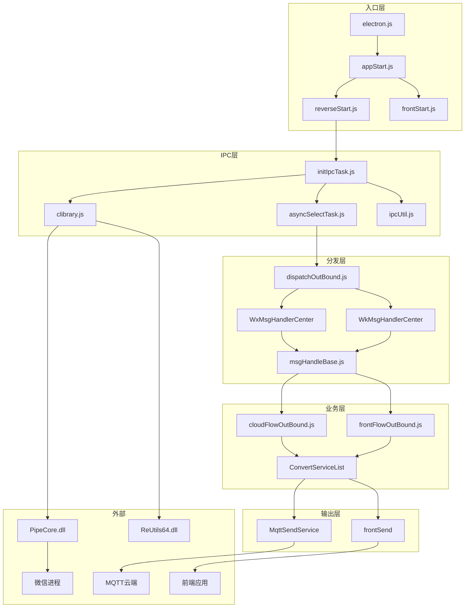

# IPC 架构总览

> 本文档提供 Galaxy Client IPC 通信系统的完整架构视图，作为快速参考和导航文档。

---

## 目录

1. [架构概览](#架构概览)
2. [模块依赖图](#模块依赖图)
3. [数据流图](#数据流图)
4. [关键对象结构](#关键对象结构)
5. [消息类型分类](#消息类型分类)
6. [服务列表速查](#服务列表速查)
7. [常见问题与解决方案](#常见问题与解决方案)

---

## 架构概览

### 系统架构图

```
╔═══════════════════════════════════════════════════════════════════════════════════════════════════════════╗
║                                     Galaxy Client IPC 架构总览                                             ║
╠═══════════════════════════════════════════════════════════════════════════════════════════════════════════╣
║                                                                                                            ║
║   ┌─────────────────────────────────────────────────────────────────────────────────────────────────────┐ ║
║   │                                         外部系统                                                     │ ║
║   │  ┌─────────────┐   ┌─────────────┐   ┌─────────────┐   ┌─────────────┐   ┌─────────────┐           │ ║
║   │  │   微信进程   │   │  企业微信   │   │  前端应用   │   │  MQTT 云端  │   │  哈勃监控   │           │ ║
║   │  │  (weixin)   │   │  (WXWork)   │   │  (Web)      │   │  (Prism)   │   │  (Habo)    │           │ ║
║   │  └──────┬──────┘   └──────┬──────┘   └──────┬──────┘   └──────┬──────┘   └──────┬──────┘           │ ║
║   └─────────┼─────────────────┼─────────────────┼─────────────────┼─────────────────┼───────────────────┘ ║
║             │                 │                 │                 │                 │                     ║
║             │ 命名管道        │ 命名管道        │ WebSocket       │ TCP/TLS         │ HTTP                ║
║             │                 │                 │                 │                 │                     ║
║   ┌─────────┼─────────────────┼─────────────────┼─────────────────┼─────────────────┼───────────────────┐ ║
║   │         ▼                 ▼                 ▼                 ▼                 ▼                   │ ║
║   │   ┌───────────────────────────────────────────────────────────────────────────────────────────────┐ │ ║
║   │   │                              Galaxy Client (Electron 主进程)                                   │ │ ║
║   │   │                                                                                                 │ │ ║
║   │   │   ┌─────────────────────────────────────────────────────────────────────────────────────────┐ │ │ ║
║   │   │   │                                 IPC 通信层                                               │ │ │ ║
║   │   │   │                                                                                          │ │ │ ║
║   │   │   │   ┌─────────────┐   ┌─────────────┐   ┌─────────────┐   ┌─────────────┐                 │ │ │ ║
║   │   │   │   │  clibrary   │   │  initIpc    │   │  asyncSelect│   │  ipcUtil    │                 │ │ │ ║
║   │   │   │   │  (DLL调用)  │   │  Task       │   │  Task       │   │  (进程扫描) │                 │ │ │ ║
║   │   │   │   │             │   │  (连接管理) │   │  (消息接收) │   │             │                 │ │ │ ║
║   │   │   │   └──────┬──────┘   └──────┬──────┘   └──────┬──────┘   └─────────────┘                 │ │ │ ║
║   │   │   │          │                 │                 │                                           │ │ │ ║
║   │   │   └──────────┼─────────────────┼─────────────────┼───────────────────────────────────────────┘ │ │ ║
║   │   │              │                 │                 │                                              │ │ ║
║   │   │              │                 │                 ▼                                              │ │ ║
║   │   │   ┌──────────┼─────────────────┼─────────────────────────────────────────────────────────────┐ │ │ ║
║   │   │   │          │                 │           消息分发层                                         │ │ │ ║
║   │   │   │          │                 │                                                              │ │ │ ║
║   │   │   │          │                 │   ┌─────────────────┐                                       │ │ │ ║
║   │   │   │          │                 └──▶│ dispatchOutBound│                                       │ │ │ ║
║   │   │   │          │                     │   (消息分发)    │                                       │ │ │ ║
║   │   │   │          │                     └────────┬────────┘                                       │ │ │ ║
║   │   │   │          │                              │                                                 │ │ │ ║
║   │   │   │          │               ┌──────────────┴──────────────┐                                 │ │ │ ║
║   │   │   │          │               │                             │                                  │ │ │ ║
║   │   │   │          │               ▼                             ▼                                  │ │ │ ║
║   │   │   │          │      ┌────────────────┐            ┌────────────────┐                         │ │ │ ║
║   │   │   │          │      │ WxMsgHandler   │            │ WkMsgHandler   │                         │ │ │ ║
║   │   │   │          │      │ Center         │            │ Center         │                         │ │ │ ║
║   │   │   │          │      │ (个人微信)     │            │ (企业微信)     │                         │ │ │ ║
║   │   │   │          │      └────────┬───────┘            └────────┬───────┘                         │ │ │ ║
║   │   │   │          │               │                             │                                  │ │ │ ║
║   │   │   │          │               └──────────────┬──────────────┘                                 │ │ │ ║
║   │   │   │          │                              │                                                 │ │ │ ║
║   │   │   │          │                              ▼                                                 │ │ │ ║
║   │   │   │          │                     ┌────────────────┐                                        │ │ │ ║
║   │   │   │          │                     │ MsgHandlerBase │                                        │ │ │ ║
║   │   │   │          │                     │ (三段式处理)   │                                        │ │ │ ║
║   │   │   │          │                     └────────┬───────┘                                        │ │ │ ║
║   │   │   │          │                              │                                                 │ │ │ ║
║   │   │   └──────────┼──────────────────────────────┼────────────────────────────────────────────────┘ │ │ ║
║   │   │              │                              │                                                   │ │ ║
║   │   │              │                              ▼                                                   │ │ ║
║   │   │   ┌──────────┼──────────────────────────────────────────────────────────────────────────────┐  │ │ ║
║   │   │   │          │                        业务分发层                                             │  │ │ ║
║   │   │   │          │                                                                               │  │ │ ║
║   │   │   │          │              ┌─────────────────────────────────────┐                         │  │ │ ║
║   │   │   │          │              │          businessHandler            │                         │  │ │ ║
║   │   │   │          │              └──────────────┬──────────────────────┘                         │  │ │ ║
║   │   │   │          │                             │                                                 │  │ │ ║
║   │   │   │          │              ┌──────────────┴──────────────┐                                 │  │ │ ║
║   │   │   │          │              │                             │                                  │  │ │ ║
║   │   │   │          │              ▼                             ▼                                  │  │ │ ║
║   │   │   │          │     ┌────────────────┐            ┌────────────────┐                         │  │ │ ║
║   │   │   │          │     │ frontFlowOut   │            │ cloudFlowOut   │                         │  │ │ ║
║   │   │   │          │     │ Bound          │            │ Bound          │                         │  │ │ ║
║   │   │   │          │     │ (flowSource=1) │            │ (flowSource=2) │                         │  │ │ ║
║   │   │   │          │     └────────┬───────┘            └────────┬───────┘                         │  │ │ ║
║   │   │   │          │              │                             │                                  │  │ │ ║
║   │   │   │          │              ▼                             ▼                                  │  │ │ ║
║   │   │   │          │     ┌────────────────┐            ┌────────────────┐                         │  │ │ ║
║   │   │   │          │     │ FrontService   │            │ WxConvert      │                         │  │ │ ║
║   │   │   │          │     │ List           │            │ ServiceList    │                         │  │ │ ║
║   │   │   │          │     │ (服务列表)     │            │ (70+服务)      │                         │  │ │ ║
║   │   │   │          │     └────────┬───────┘            └────────┬───────┘                         │  │ │ ║
║   │   │   │          │              │                             │                                  │  │ │ ║
║   │   │   └──────────┼──────────────┼─────────────────────────────┼──────────────────────────────────┘  │ │ ║
║   │   │              │              │                             │                                     │ │ ║
║   │   │              │              │                             │                                     │ │ ║
║   │   │   ┌──────────┼──────────────┼─────────────────────────────┼──────────────────────────────────┐  │ │ ║
║   │   │   │          │              │     输出层                  │                                  │  │ │ ║
║   │   │   │          │              │                             │                                  │  │ │ ║
║   │   │   │          │              ▼                             ▼                                  │  │ │ ║
║   │   │   │          │     ┌────────────────┐            ┌────────────────┐                         │  │ │ ║
║   │   │   │          │     │   WebSocket    │            │   MQTT Send    │                         │  │ │ ║
║   │   │   │          │     │   frontSend    │            │   Service      │                         │  │ │ ║
║   │   │   │          │     └────────────────┘            └────────────────┘                         │  │ │ ║
║   │   │   │          │              │                             │                                  │  │ │ ║
║   │   │   └──────────┼──────────────┼─────────────────────────────┼──────────────────────────────────┘  │ │ ║
║   │   │              │              │                             │                                     │ │ ║
║   │   └──────────────┼──────────────┼─────────────────────────────┼─────────────────────────────────────┘ │ ║
║   │                  │              │                             │                                       │ ║
║   └──────────────────┼──────────────┼─────────────────────────────┼───────────────────────────────────────┘ ║
║                      │              │                             │                                         ║
║                      ▼              ▼                             ▼                                         ║
║              ┌─────────────┐ ┌─────────────┐              ┌─────────────┐                                   ║
║              │ PipeCore.dll│ │   前端应用  │              │  MQTT云端   │                                   ║
║              │ ReUtils64   │ │             │              │             │                                   ║
║              └─────────────┘ └─────────────┘              └─────────────┘                                   ║
║                                                                                                            ║
╚═══════════════════════════════════════════════════════════════════════════════════════════════════════════╝
```

---

## 模块依赖图

### Mermaid 依赖图



### 文件路径速查

```
src/
├── electron.js                                    # 主进程入口
├── msg-center/
│   ├── start/
│   │   ├── appStart.js                           # 应用启动器
│   │   ├── reverseStart.js                       # 逆向服务启动
│   │   └── frontStart.js                         # 前端服务启动
│   │
│   ├── core/
│   │   ├── reverse/
│   │   │   ├── initIpcTask.js                    # IPC初始化任务
│   │   │   ├── asyncSelectTask.js                # 消息接收循环
│   │   │   ├── ipcUtil.js                        # 进程扫描工具
│   │   │   ├── ipcConfig.js                      # IPC配置常量
│   │   │   └── dll/
│   │   │       └── clibrary.js                   # DLL调用封装
│   │   │
│   │   ├── data-config/
│   │   │   ├── callbackClassify.js               # 回调分类
│   │   │   ├── flowSourceEnum.js                 # 流来源枚举
│   │   │   ├── galaxyCallBackType.js             # 回调类型常量
│   │   │   └── prismRecordType.js                # MQTT消息类型
│   │   │
│   │   └── cache/
│   │       ├── galaxyTaskCache.js                # 任务缓存
│   │       └── pipeCodeCache.js                  # 管道代码缓存
│   │
│   ├── dispatch-center/
│   │   ├── dispatchOutBound.js                   # 消息分发入口
│   │   ├── handle/
│   │   │   ├── msgHandleBase.js                  # 消息处理基类
│   │   │   ├── wxMsgHandle.js                    # 个人微信处理器
│   │   │   └── workWxMsgHandle.js                # 企业微信处理器
│   │   │
│   │   └── dispatch/
│   │       ├── cloudFlowOutBound.js              # 云端出站处理
│   │       ├── frontFlowOutBound.js              # 前端出站处理
│   │       └── sendToFront.js                    # 前端发送封装
│   │
│   └── business/
│       ├── convert-service/                      # 消息转换服务
│       │   ├── loginService.js
│       │   ├── logoutService.js
│       │   ├── modContactRemarkResponseService.js
│       │   └── ... (70+ 服务)
│       │
│       └── convert-response/                     # 响应转换服务
│           ├── sendTextMsgResponse.js
│           └── ...
```

---

## 数据流图

### 入站消息数据流

```
┌────────────────────────────────────────────────────────────────────────────────────────┐
│                              入站消息数据流（微信 → 系统）                               │
├────────────────────────────────────────────────────────────────────────────────────────┤
│                                                                                         │
│   ┌─────────┐     ┌─────────┐     ┌─────────────┐     ┌──────────────┐                │
│   │ 微信进程│────▶│命名管道 │────▶│PipeCore.dll │────▶│IpcClientRecv │                │
│   │         │     │         │     │             │     │Message       │                │
│   └─────────┘     └─────────┘     └─────────────┘     └──────┬───────┘                │
│                                                               │                        │
│   数据格式: 二进制字节流                                       │ Buffer → UTF-8 String   │
│                                                               ▼                        │
│                                                    ┌──────────────────┐               │
│                                                    │ AsyncSelectTask  │               │
│                                                    │ successIpcConnect│               │
│                                                    └────────┬─────────┘               │
│                                                             │                          │
│   数据格式: JSON 字符串                                      │ replaceLargeNumbers      │
│             { type, status, data, ... }                     ▼                          │
│                                                    ┌──────────────────┐               │
│                                                    │ dispatchOutBound │               │
│                                                    └────────┬─────────┘               │
│                                                             │                          │
│   数据格式: JavaScript 对象                                  │ JSON.parse              │
│             jsonObject = {...}                              ▼                          │
│                                                    ┌──────────────────┐               │
│                                                    │ MsgHandlerCenter │               │
│                                                    │ (三段式处理)     │               │
│                                                    └────────┬─────────┘               │
│                                                             │                          │
│   数据格式: 带 flowSource 的对象                             │ flowSource=1/2          │
│             jsonObject.flowSource = 2                       ▼                          │
│                                        ┌────────────────────┴────────────────────┐    │
│                                        │                                          │    │
│                                        ▼                                          ▼    │
│                               ┌────────────────┐                        ┌────────────────┐
│                               │frontFlowOutBound│                        │cloudFlowOutBound│
│                               └───────┬────────┘                        └───────┬────────┘
│                                       │                                          │        │
│   数据格式: clientRecord              │ service.operate()                        │        │
│             { ...ClientMsgBO }        ▼                                          ▼        │
│                               ┌────────────────┐                        ┌────────────────┐
│                               │ WebSocket发送  │                        │ MQTT发送       │
│                               └────────────────┘                        └────────────────┘
│                                                                                         │
└────────────────────────────────────────────────────────────────────────────────────────┘
```

### 出站消息数据流（任务下发）

```
┌────────────────────────────────────────────────────────────────────────────────────────┐
│                              出站消息数据流（系统 → 微信）                               │
├────────────────────────────────────────────────────────────────────────────────────────┤
│                                                                                         │
│   ┌─────────┐     ┌─────────────┐     ┌────────────────┐                               │
│   │MQTT云端 │────▶│MqttRecvTask │────▶│ dispatchInBound│                               │
│   │         │     │  接收任务   │     │   任务分发     │                               │
│   └─────────┘     └─────────────┘     └───────┬────────┘                               │
│                                               │                                         │
│                                               ▼                                         │
│                                      ┌────────────────┐                                │
│                                      │ TaskHandler    │                                │
│                                      │ 任务处理器     │                                │
│                                      └───────┬────────┘                                │
│                                               │                                         │
│   数据格式: JSON 字符串                        │ 构建任务消息                            │
│                                               ▼                                         │
│                                      ┌────────────────────┐                            │
│                                      │ IpcClientSendMessage│                            │
│                                      │ (clibrary.js)       │                            │
│                                      └────────┬───────────┘                            │
│                                               │                                         │
│   数据格式: Buffer                             │ Buffer.from(message)                   │
│             UTF-8 编码的字节                   ▼                                         │
│                                      ┌────────────────┐                                │
│                                      │ PipeCore.dll   │                                │
│                                      │ 写入命名管道   │                                │
│                                      └───────┬────────┘                                │
│                                               │                                         │
│                                               ▼                                         │
│                                      ┌────────────────┐                                │
│                                      │   微信进程     │                                │
│                                      │   执行任务     │                                │
│                                      └────────────────┘                                │
│                                                                                         │
└────────────────────────────────────────────────────────────────────────────────────────┘
```

---

## 关键对象结构

### 1. pipeLineWrapper（管道包装对象）

```javascript
{
    pipeCode: 12345,                    // DLL 返回的管道标识
    id: 67890,                          // 进程 ID
    processId: 67890,                   // 进程 ID（冗余）
    available: 1,                       // 0=不可用, 1=可用
    workWx: false,                      // true=企业微信, false=个人微信
    createTime: 1704067200000,          // 连接创建时间戳
    lastReportId: 1000,                 // 最后上报的消息 ID
    lastTimer: null,                    // 定时器引用
    wxid: "wxid_abc123",                // 微信 ID（登录后填充）
    lastReadTime: 1704067300000         // 最后读取消息时间
}
```

### 2. registry（注册表对象）

```javascript
{
    pipeLineWrapper: { ... },           // 管道包装对象
    sendToCloudFlag: 0,                 // 0=未发送, 1=已发送
    id: 67890,                          // 进程 ID
    scanTime: 1704067200000,            // 扫描时间戳
    workWx: false,                      // 是否企业微信
    wxid: "wxid_abc123"                 // 微信 ID
}
```

### 3. msgResNode（消息节点缓存）

```javascript
{
    first: {                            // 第一条消息
        taskId: "task_12345",
        hash: "abc123",
        status: 0,
        client_id: "msg_001",
        type: "sendmessage"
    },
    second: {                           // 第二条消息
        taskId: "task_12345",
        hash: "abc123",
        status: 0,
        client_id: "msg_001",
        type: "recvmsg"
    },
    third: null,                        // 第三条消息（4.0无）
    expireTime: 1704070800000,          // 过期时间
    thirdTime: 0                        // 第三条消息计数
}
```

### 4. clientRecord（业务消息对象）

```javascript
{
    // 基础字段（来自 ClientMsgBO）
    type: "ModContactRemarkResponse",
    status: 0,
    taskId: "",
    
    // 业务数据
    data: {
        wxid: "wxid_friend123",
        remark: "新备注名",
        // ...
    },
    
    // 路由字段
    flowSource: 2,                      // 1=前端, 2=云端
    ownerWxId: "wxid_abc123",           // 机器人微信 ID
    
    // 元数据
    reportId: "report_12345",
    galaxyver: "1.0.0"
}
```

---

## 消息类型分类

### 按处理流程分类

```
┌─────────────────────────────────────────────────────────────────────────────────────┐
│                              消息类型分类图                                          │
├─────────────────────────────────────────────────────────────────────────────────────┤
│                                                                                      │
│   ┌───────────────────────────────────────────────────────────────────────────────┐ │
│   │                          三段式回执消息                                        │ │
│   ├───────────────────────────────────────────────────────────────────────────────┤ │
│   │                                                                                │ │
│   │   旧版本 (3.x):                                                               │ │
│   │   msgreport ──▶ sendmessage ──▶ MM.TextMsg/MM.PictureMsg/...                  │ │
│   │      │              │                    │                                     │ │
│   │    第一条         第二条               第三条                                  │ │
│   │                                                                                │ │
│   │   新版本 (4.0):                                                               │ │
│   │   sendmessage ──▶ recvmsg                                                     │ │
│   │      │              │                                                          │ │
│   │    第一条         第二条                                                       │ │
│   │                                                                                │ │
│   └───────────────────────────────────────────────────────────────────────────────┘ │
│                                                                                      │
│   ┌───────────────────────────────────────────────────────────────────────────────┐ │
│   │                          直接处理消息（跳过三段式）                            │ │
│   ├───────────────────────────────────────────────────────────────────────────────┤ │
│   │                                                                                │ │
│   │   系统消息:      login, logout, pong                                          │ │
│   │                                                                                │ │
│   │   接收消息:      HandleDelContact, recvmsgs, CreateChatRoomResponse           │ │
│   │   (4.0新增)      HandleChatroomMemberResp, AddChatRoomMemberResponse          │ │
│   │                  ModContactRemarkResponse                                      │ │
│   │                                                                                │ │
│   │   错误消息:      error, bugreport                                             │ │
│   │                                                                                │ │
│   └───────────────────────────────────────────────────────────────────────────────┘ │
│                                                                                      │
│   ┌───────────────────────────────────────────────────────────────────────────────┐ │
│   │                          过滤/忽略消息                                         │ │
│   ├───────────────────────────────────────────────────────────────────────────────┤ │
│   │                                                                                │ │
│   │   系统消息:      newsapp (新闻应用)                                           │ │
│   │                                                                                │ │
│   │   非群发消息:    recvmsg (sequence != 0)                                      │ │
│   │                                                                                │ │
│   │   非本人消息:    recvmsg (from != ownerWxId)                                  │ │
│   │                                                                                │ │
│   │   无效媒体:      recvmsg (无 attachid/aeskey)                                 │ │
│   │                                                                                │ │
│   └───────────────────────────────────────────────────────────────────────────────┘ │
│                                                                                      │
└─────────────────────────────────────────────────────────────────────────────────────┘
```

### flowSource 路由规则

| flowSource | 含义 | 路由目标 | 使用场景 |
|:---:|:---|:---|:---|
| 1 | FRONT | frontFlowOutBound | 前端发起的任务回执 |
| 2 | CLOUND | cloudFlowOutBound | 云端发起的任务回执 |
| 3 | OWNER | 特殊处理 | 自己发起的操作 |

---

## 服务列表速查

### 个人微信服务列表（WxConvertServiceList）

| 服务名 | 处理类型 | 作用 |
|:---|:---|:---|
| LoginService | login | 登录处理 |
| LogoutService | logout | 登出处理 |
| PongService | pong | 心跳响应 |
| FriendsListResponceService | friendslist | 好友列表 |
| FriendUpdateService | friendupdate | 好友更新 |
| ModContactRemarkResponseService | ModContactRemarkResponse | 备注修改 |
| RecvMsgsService | recvmsgs | 批量消息 |
| RecvMsgService | recvmsg | 单条消息 |
| SendTextMsgResponse | MM.TextMsg | 文本回执 |
| SendPictureMsgResponse | MM.PictureMsg | 图片回执 |
| SendVideoMsgResponse | MM.VideoMsg | 视频回执 |
| SendFileAndCardMsgResponse | MM.FileAndCardMsg | 文件回执 |
| AddChatroomMemberService | addchatroommember | 加群成员 |
| CreateChatroomResponseService | CreateChatRoomResponse | 建群响应 |
| ... | ... | ... |

### 企业微信服务列表（WorkWxConvertServiceList）

| 服务名 | 处理类型 | 作用 |
|:---|:---|:---|
| LoginService | login | 登录处理 |
| LogoutService | logout | 登出处理 |
| PongService | pong | 心跳响应 |
| WorkFriendsListResponse | friendslist | 好友列表 |
| WorkWxMsgRecordService | msgrecord | 消息记录 |
| WorkWxSendTextMsgResponseService | sendmsg_text | 文本回执 |
| WorkWxCreateRoomResponse | createroom | 建群响应 |
| ... | ... | ... |

---

## 常见问题与解决方案

### Q1: IPC 连接失败

**现象**: 微信进程存在，但无法建立 IPC 连接

**排查步骤**:
1. 检查管道是否可用: `Clibrary.isUseProcess(processId)`
2. 检查 DLL 是否正确加载
3. 检查进程权限

**解决方案**:
```javascript
// 尝试清理旧连接后重连
pipeCodeCache.deleteProcessIdFromCache(processId);
let newPipeCode = Clibrary.IpcConnectServer(processId);
```

---

### Q2: 消息丢失

**现象**: 部分消息未被处理

**排查步骤**:
1. 检查 `selectCode` 是否正常
2. 检查 `msgResNodeMap` 缓存状态
3. 检查是否被过滤（isSysMsg、isNotSendMsg 等）

**解决方案**:
```javascript
// 检查被注释的 reportId 丢失检测逻辑
// asyncSelectTask.js 中有相关代码
```

---

### Q3: 三段式不匹配

**现象**: 任务没有正确回执

**排查步骤**:
1. 检查 `msgKey` 生成逻辑
2. 检查 `msgResNodeMap` 过期清理
3. 检查 `taskId` 传递链路

**日志关键词**:
```
[msgConvert] - 三段式处理日志
nodeEmpty - 节点为空
第一条消息/第二条消息/第三条消息
```

---

### Q4: 微信版本兼容问题

**现象**: 旧版消息格式不兼容

**说明**:
- 微信 3.x 使用三段式: msgreport → sendmessage → MM.*
- 微信 4.0 使用两段式: sendmessage → recvmsg

**判断逻辑**:
```javascript
// wxMsgHandle.js
if (CallBackClassify.FIRST_CALLBACKS_NEW.has(node.first.type)) {
    // 4.0 版本处理
} else {
    // 旧版本处理
}
```

---

## 相关文档导航

| 文档 | 内容 |
|:---|:---|
| [15-IPC通信机制建立流程.md](./15-IPC通信机制建立流程.md) | IPC 连接建立详解 |
| [16-IPC消息处理链路详解.md](./16-IPC消息处理链路详解.md) | 消息处理链路详解 |
| [14-ModContactRemarkResponse消息处理链路分析.md](./14-ModContactRemarkResponse消息处理链路分析.md) | 具体消息类型分析示例 |
| [03-通信机制.md](../技术架构/03-通信机制.md) | 四大通信机制概述 |
| [07-四大通信机制汇总.md](../技术架构/07-四大通信机制汇总.md) | 通信机制汇总 |

---

## 快速调试指南

### 日志关键词

```bash
# IPC 连接相关
grep "建立ipc连接" logs/
grep "IPC-START" logs/
grep "IPC-CONNECT" logs/

# 消息接收相关
grep "接收逆向type" logs/
grep "DispatchCenter" logs/

# 三段式相关
grep "msgConvert" logs/
grep "第一条消息\|第二条消息\|第三条消息" logs/

# 业务处理相关
grep "flowSource" logs/
grep "cloudFlowOutBound" logs/
```

### 关键断点位置

| 文件 | 行号/函数 | 作用 |
|:---|:---|:---|
| asyncSelectTask.js | `successIpcConnect` | 消息接收入口 |
| dispatchOutBound.js | `dispatchOutBound` | 消息分发入口 |
| msgHandleBase.js | `messageHandler` | 三段式处理 |
| msgHandleBase.js | `businessHandler` | 业务分发 |
| cloudFlowOutBound.js | `cloudFlowOutBound` | 云端处理 |

---

> 📌 本文档作为 IPC 系统的快速参考，详细内容请查阅相关专题文档。
