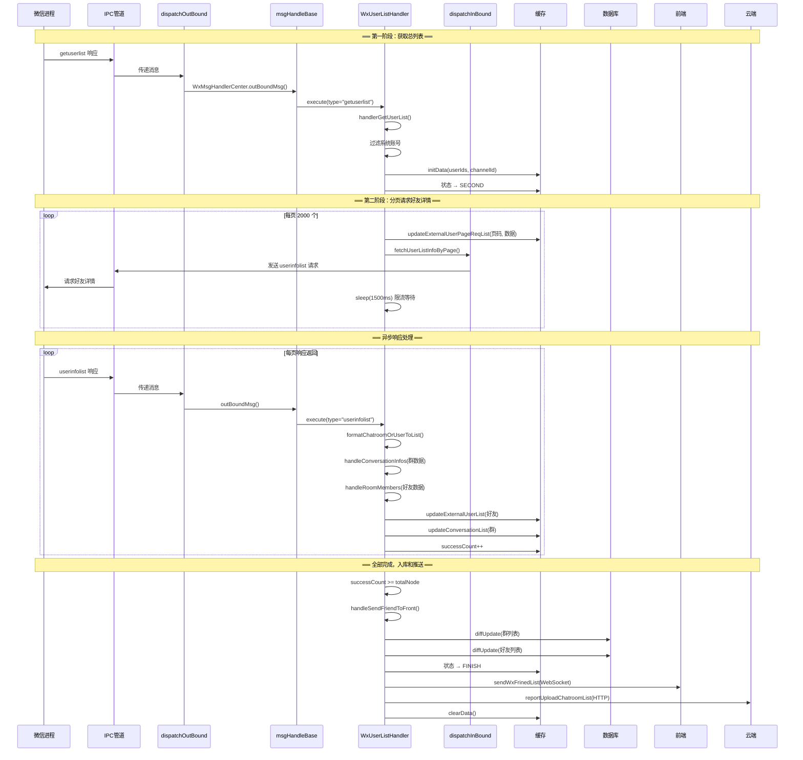
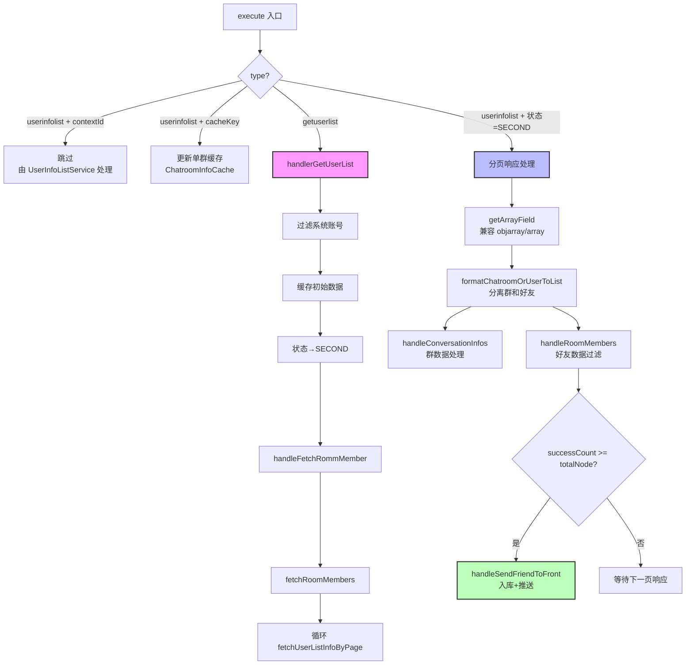
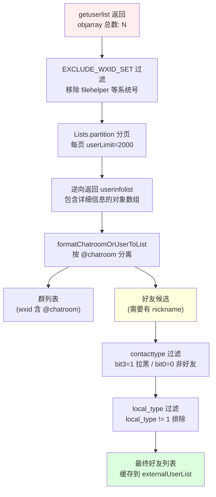

# wxUserListResponseMsgHandler 消息处理链路分析

> 本文档详细分析 `getuserlist` / `userinfolist` 消息的完整处理链路，涵盖好友列表获取、分页处理、数据入库和前端推送的全过程。

## 目录

- [1. 概述](#1-概述)
- [2. 完整处理链路](#2-完整处理链路)
- [3. 数据流转详解](#3-数据流转详解)
- [4. 关键代码分析](#4-关键代码分析)
- [5. 架构设计图](#5-架构设计图)
- [6. 状态机与缓存机制](#6-状态机与缓存机制)
- [7. 潜在问题与优化建议](#7-潜在问题与优化建议)
- [8. 低端电脑性能问题专项分析](#8-低端电脑性能问题专项分析)
- [9. 相关文件清单](#9-相关文件清单)

---

## 1. 概述

### 1.1 消息类型说明

`wxUserListResponseMsgHandler` 处理两种消息类型：

| 类型 | 常量 | 含义 | 触发时机 |
|------|------|------|----------|
| `getuserlist` | `GalaxyTaskType.GET_USER_LIST` | 获取总好友列表 | 登录成功后首次请求 |
| `userinfolist` | `GalaxyTaskType.USER_INFO_LIST` | 分页好友详情 | `getuserlist` 处理后逐页请求 |

### 1.2 消息分类

这两种消息都属于**非任务回执消息**，不走三段式处理。但它们也不走 `cloudFlowOutBound` 的常规服务列表遍历，而是在 `msgHandleBase.businessHandler` 中**被直接拦截处理**：

```javascript
// msgHandleBase.js 第1641行
if (wxUserListResponseMsgHandler.isHandler(type, wrapper.workWx)) {
    await wxUserListResponseMsgHandler.execute(jsonObject, wrapper);
}
```

### 1.3 与 ModContactRemarkResponse 的区别

| 维度 | ModContactRemarkResponse | getuserlist / userinfolist |
|------|--------------------------|---------------------------|
| 消息来源 | 逆向主动推送 | 逆向响应客户端请求 |
| flowSource | 2（路由到 cloudFlowOutBound） | 无（直接拦截处理） |
| 处理方式 | Service.filter → operate | 专用 Handler 直接处理 |
| 是否有状态管理 | 无 | 有（状态机 INIT→SECOND→FINISH） |
| 是否分页 | 否 | 是（2000/页） |
| 请求-响应模式 | 单次推送 | 请求发起 → 多次响应 |

### 1.4 关键配置常量

```javascript
// wxUserListResponseMsgHandler.js 第69-71行
const userLimit = 2000;           // 每页请求的好友数
const friendWait = 1500;          // 每页请求间隔（毫秒）
const userinfolistWait = 20000;   // 超时检测时间（毫秒）
```

---

## 2. 完整处理链路

### 2.1 处理流程概览

好友列表获取是一个**两阶段**过程，涉及**请求下行**和**响应上行**两条链路：

```
═══════════════════ 第一阶段：获取总列表 ═══════════════════

登录成功后触发 getuserlist 请求（下行）
      ↓
逆向返回 getuserlist 响应（上行）
      ↓
asyncSelectTask.js (successIpcConnect)
      ↓
dispatchOutBound.js (dispatchOutBound)
      ↓
wxMsgHandle.js (WxMsgHandlerCenter.outBoundMsg)
      ↓
msgHandleBase.js (businessHandler → 直接拦截)
      ↓
wxUserListResponseMsgHandler.execute()
      ↓ type === "getuserlist"
wxUserListResponseMsgHandler.handlerGetUserList()
      ↓
   ┌──────────────────────────────────────┐
   │ 1. 过滤系统账号 (EXCLUDE_WXID_SET)   │
   │ 2. 缓存初始数据                       │
   │ 3. 更新状态 → SECOND                  │
   └──────────────┬───────────────────────┘
                  ↓

═══════════════════ 第二阶段：分页获取详情 ═══════════════════

wxUserListResponseMsgHandler.fetchRoomMembers()
      ↓
  ┌───────────────── 循环每页 ──────────────────┐
  │                                               │
  │  fetchUserListInfoByPage()                    │
  │       ↓                                       │
  │  dispatchInBound() → 逆向（下行请求）          │
  │       ↓                                       │
  │  sleep(1500) 等待间隔                          │
  │       ↓                                       │
  │  (下一页...)                                   │
  └───────────────────────────────────────────────┘
      ↓
  setTimeout(20s) 注册超时检测
      ↓

═══════════════════ 异步响应处理 ═══════════════════

逆向返回 userinfolist 响应（每页独立返回）
      ↓
asyncSelectTask → dispatchOutBound → msgHandleBase
      ↓
wxUserListResponseMsgHandler.execute()
      ↓ type === "userinfolist" && 状态 === SECOND
   ┌──────────────────────────────────────────┐
   │ 1. formatChatroomOrUserToList() 分离群/好友│
   │ 2. handleConversationInfos() 处理群列表    │
   │ 3. handleRoomMembers() 处理好友列表        │
   │ 4. 检查是否全部完成                        │
   └──────────────┬───────────────────────────┘
                  ↓ successCount >= totalNode
handleSendFriendToFront()
      ↓
   ┌──────────────┬──────────────┬──────────────┐
   ↓              ↓              ↓              ↓
diffUpdate    diffUpdate     sendWxFrinedList  reportUpload
(群入库)      (好友入库)     (发送前端)       (上报云端)
```

### 2.2 处理阶段详解

| 阶段 | 文件 | 函数/方法 | 作用 |
|------|------|----------|------|
| 1 | asyncSelectTask.js | successIpcConnect | IPC 接收消息 |
| 2 | dispatchOutBound.js | dispatchOutBound | 解析 JSON，按微信类型路由 |
| 3 | msgHandleBase.js | businessHandler | 拦截并交给专用 Handler |
| 4 | wxUserListResponseMsgHandler.js | execute | 入口分发：getuserlist / userinfolist |
| 5 | wxUserListResponseMsgHandler.js | handlerGetUserList | 处理总列表，触发分页请求 |
| 6 | wxUserListResponseMsgHandler.js | fetchRoomMembers | 分页循环，发起下行请求 |
| 7 | wxUserListResponseMsgHandler.js | fetchUserListInfoByPage | **单页请求：dispatchInBound + sleep** |
| 8 | dispatchInBound.js | dispatchInBound | 下行请求：JSON→管道→逆向 |
| 9 | reverseSend.js | sendMessage → pipeLineSend | 底层 IPC 管道发送 |
| 10 | wxUserListResponseMsgHandler.js | execute (userinfolist) | 接收分页响应 |
| 11 | wxUserListResponseMsgHandler.js | formatChatroomOrUserToList | 分离群和好友 |
| 12 | wxUserListResponseMsgHandler.js | handleConversationInfos | 群数据处理和入库 |
| 13 | wxUserListResponseMsgHandler.js | handleRoomMembers | 好友数据过滤和缓存 |
| 14 | wxUserListResponseMsgHandler.js | handleSendFriendToFront | 全量入库 + 推送前端 + 上报云端 |

---

## 3. 数据流转详解

### 3.1 两条独立链路

核心理解点：**请求发送和响应处理是两条独立的链路**，通过 IPC 管道异步衔接。

```
┌─────────────────────────────────────────────────────────────────────┐
│                       Node.js 进程（客户端）                         │
│                                                                      │
│  【下行链路 - 发起请求】                                              │
│  fetchUserListInfoByPage()                                          │
│       │                                                              │
│       ▼                                                              │
│  dispatchInBound()                                                   │
│       │                                                              │
│       ▼                                                              │
│  processInBoundTask()  ← userinfolist 不在 taskCallbackMap 中        │
│       │                   直接走 else 分支                           │
│       ▼                                                              │
│  inBoundAct()                                                        │
│       │                                                              │
│       ▼                                                              │
│  reverseSendService.sendMessage()                                    │
│       │                                                              │
│       ▼                                                              │
│  pipeLineSend()                                                      │
│       │                                                              │
│       ▼                                                              │
│  Clibrary.IpcClientSendMessage(pipeCode, message)  ← 同步 C 调用    │
│       │                                                              │
│       ▼ 写入命名管道                                                  │
│  ═══════════════════════════════════════════════════════════════════  │
│                                                                      │
│  【上行链路 - 接收响应】                                              │
│  ═══════════════════════════════════════════════════════════════════  │
│       ▲ 从命名管道读取                                               │
│       │                                                              │
│  Clibrary.IpcClientRecvMessage()  ← asyncSelectTask 轮询             │
│       │                                                              │
│       ▼                                                              │
│  dispatchOutBound()                                                  │
│       │                                                              │
│       ▼                                                              │
│  WxMsgHandlerCenter.outBoundMsg()                                    │
│       │                                                              │
│       ▼                                                              │
│  msgHandleBase.businessHandler()                                     │
│       │                                                              │
│       ▼                                                              │
│  wxUserListResponseMsgHandler.execute()  ← type="userinfolist"       │
│                                                                      │
└─────────────────────────────────────────────────────────────────────┘
│                                                                      │
│                      ↕ IPC 命名管道 ↕                                │
│                                                                      │
┌─────────────────────────────────────────────────────────────────────┐
│                     微信进程（逆向客户端）                             │
│                                                                      │
│  接收 userinfolist 请求 → 从微信获取好友详情 → 返回结果               │
│                                                                      │
└─────────────────────────────────────────────────────────────────────┘
```

### 3.2 数据格式流转

#### getuserlist 响应数据

```javascript
// 逆向返回的原始数据
{
    "type": "getuserlist",
    "channelId": "1604",
    "objarray": [
        "wxid_abc123",       // 好友 wxid
        "wxid_def456",       // 好友 wxid
        "12345678@chatroom", // 群 wxid
        "filehelper",        // 系统账号（会被过滤）
        // ... 可能有数百上千个
    ]
}
```

#### userinfolist 请求数据（客户端构造）

```javascript
// fetchUserListInfoByPage 构造的请求
{
    "data": {
        "flag": 0,
        "array": ["wxid_abc123", "wxid_def456", ...],  // 本页的 wxid 列表
        "chatroom": ""
    },
    "type": "userinfolist",
    "wxId": "wxid_robot001",
    "channelId": "1604",
    "curNode": 1,       // 当前页码
    "totalNode": 3      // 总页数
}
```

#### userinfolist 响应数据（逆向返回）

```javascript
// 正常格式（对象数组）
{
    "type": "userinfolist",
    "wxId": "wxid_robot001",
    "curNode": 1,
    "totalNode": 3,
    "objarray": [    // 4.0版本用 objarray，老版本用 array
        {
            "wxid": "wxid_abc123",
            "nickname": "张三",
            "remark": "张三-北京",
            "headimg": "http://...",
            "bigheadimg": "http://...",
            "sex": 1,
            "contacttype": 1,
            "local_type": 1,
            "city": "北京",
            "province": "北京",
            "country": "CN"
        },
        {
            "wxid": "12345678@chatroom",
            "nickname": "工作群",
            "ownerwxid": "wxid_abc123",
            "number": 50,
            "headimg": "http://...",
            "simplelist": "wxid_abc123,wxid_def456,..."
        },
        // ...
    ]
}
```

### 3.3 数据在每步的变化

```
步骤                              数据形态                    数量变化
───────────────────────────────────────────────────────────────────
getuserlist 返回                  wxid 字符串数组             500 个
    │
    ▼ EXCLUDE_WXID_SET 过滤
handlerGetUserList                wxid 字符串数组             495 个 (过滤5个系统号)
    │
    ▼ Lists.partition(friends, 2000)
fetchRoomMembers                  分页: [[...495个]]          1 页
    │
    ▼ dispatchInBound (每页)
userinfolist 请求                 { array: [...495个] }       1 次请求
    │
    ▼ 逆向处理后返回
userinfolist 响应                 对象数组 (含详情)            495 个对象
    │
    ▼ formatChatroomOrUserToList
分离                              群: 20个  好友: 475个       按 @chatroom 分类
    │                             ⚠️ 无 nickname 的被丢弃
    ▼ handleRoomMembers
好友过滤                          好友对象数组                 460 个
    │                             ⚠️ contacttype/local_type 过滤
    ▼ updateExternalUserList
缓存累加                          缓存中好友列表               460 个
    │
    ▼ handleSendFriendToFront
入库                              diffUpdate 到 SQLite         460 个
    │
    ├─▶ sendWxFrinedList → 前端 WebSocket
    └─▶ reportUploadChatroomList → 云端 HTTP
```

---

## 4. 关键代码分析

### 4.1 入口分发：execute()

```javascript
// wxUserListResponseMsgHandler.js 第119-208行

async execute(jsonObject, wrapper) {
    // 场景隔离1：有 contextId 的 userinfolist → 交给 UserInfoListService 处理
    if (jsonObject.type === 'userinfolist' && jsonObject.contextId) {
        return jsonObject;  // 跳过
    }
    
    // 场景隔离2：有 cacheKey 的 userinfolist → 单群详情查询，更新缓存
    if (jsonObject.type === 'userinfolist' && jsonObject.cacheKey) {
        ChatroomInfoCache.updateSingleChatroomInfoCache(...);
        return jsonObject;
    }
    
    // 分支A：收到总列表
    if (jsonObject.type === 'getuserlist') {
        await this.handlerGetUserList(jsonObject, wrapper);
        return jsonObject;
    }
    
    // 分支B：收到分页详情（且状态为 SECOND）
    if (jsonObject.type === 'userinfolist' 
        && !jsonObject.contextId
        && status === MsgStatus.SECOND) {
        // 分离群和好友
        const { chatroomIdList, friendIdList } = this.formatChatroomOrUserToList(arrayData);
        // 分别处理
        await this.handleConversationInfos(...);
        await this.handleRoomMembers(...);
        return jsonObject;
    }
}
```

**execute 的四个分支：**

```
                    ┌──────────────────────────────────┐
                    │           execute()               │
                    └──────────────┬───────────────────┘
                                   │
              ┌────────────────────┼────────────────────┐
              │                    │                     │
              ▼                    ▼                     ▼
    ┌─────────────────┐  ┌─────────────────┐  ┌─────────────────┐
    │ userinfolist    │  │ getuserlist      │  │ userinfolist    │
    │ + contextId     │  │                  │  │ + status=SECOND │
    │ 或 + cacheKey   │  │                  │  │ (无contextId)   │
    ├─────────────────┤  ├─────────────────┤  ├─────────────────┤
    │ 跳过/更新缓存   │  │ 第一阶段处理     │  │ 第二阶段处理    │
    │                 │  │ handlerGetUser-  │  │ formatChatroom- │
    │                 │  │ List()           │  │ OrUserToList()  │
    │                 │  │ → fetchRoom-     │  │ → handleConver- │
    │                 │  │   Members()      │  │   sationInfos() │
    │                 │  │                  │  │ → handleRoom-   │
    │                 │  │                  │  │   Members()     │
    └─────────────────┘  └─────────────────┘  └─────────────────┘
```

### 4.2 分页请求循环：fetchRoomMembers()

```javascript
// wxUserListResponseMsgHandler.js 第292-345行

async fetchRoomMembers(payload) {
    const { channelId, friends, wrapper } = payload;
    
    // 1. 分页：每 2000 个一页
    let friendList = Lists.partition(friends, userLimit);  // userLimit=2000
    const totalNode = friendList.length;
    
    // 2. 串行发送每一页
    for (let friendIds of friendList) {
        let curNode = pageNum++;
        
        // 记录分页请求数据（用于重试）
        wxUserAndChatRoomCache.updateExternalUserPageReqList(wxId, curNode, friendIds);
        
        // 发送请求并等待间隔
        await this.fetchUserListInfoByPage(fetPayload);  // 内含 sleep(1500)
    }
    
    // 3. 注册超时检测（20秒后）
    setTimeout(() => {
        if (successCount < totalNode) {
            notify.onUserInfoListNotReturn(wxid, 漏掉的页数);
        }
    }, userinfolistWait);  // 20000ms
}
```

**时间线示意（3页为例）：**

```
t=0s      ├── 发送第1页请求 (dispatchInBound)
t=0s~1.5s ├── sleep(1500)
t=1.5s    ├── 发送第2页请求
t=1.5s~3s ├── sleep(1500)
t=3.0s    ├── 发送第3页请求
t=3.0s~4.5s ├── sleep(1500)
t=4.5s    ├── for 循环结束，注册 setTimeout(20s)
          │
          │   ← 与此同时，逆向异步返回响应 →
          │
t≈1~2s    ├── 收到第1页响应 → execute → handleRoomMembers (successCount=1)
t≈2~4s    ├── 收到第2页响应 → execute → handleRoomMembers (successCount=2)
t≈4~6s    ├── 收到第3页响应 → execute → handleRoomMembers (successCount=3 >= totalNode)
          │                                    ↓
          │                          handleSendFriendToFront() 触发！
          │
t=24.5s   ├── setTimeout 触发超时检测（已完成，无告警）
```

### 4.3 核心方法：fetchUserListInfoByPage()

```javascript
// wxUserListResponseMsgHandler.js 第268-289行

async fetchUserListInfoByPage(payload) {
    const { totalNode, curNode, wxId, channelId, friendIds } = payload;
    
    // 1. 构造请求消息
    let sendMsgBo = {
        data: {
            flag: 0,
            array: friendIds,     // 本页好友 wxid 列表
            chatroom: "",
        },
        type: "userinfolist",
        wxId,
        channelId,
        curNode,                  // 当前页码
        totalNode,                // 总页数
    };
    
    // 2. 同步发送到逆向（fire-and-forget）
    dispatchInBound(channelId, wxId, JSON.stringify(sendMsgBo));
    
    // 3. 固定延时等待（限流）
    await sleep(friendWait);  // 1500ms
}
```

**关键特性：**
- `dispatchInBound` 是同步调用（往 IPC 管道写数据），瞬间完成
- `sleep(1500)` 是纯限流，不等待响应
- 响应由另一条独立链路异步处理

### 4.4 好友过滤逻辑：handleRoomMembers()

```javascript
// wxUserListResponseMsgHandler.js 第616-720行

// 过滤规则1：contacttype 位运算
if (contacttype && (
    (parseInt(contacttype) & 8) != 0 ||   // bit3=1 → 已拉黑
    parseInt(contacttype) % 2 != 1         // bit0=0 → 非好友关系
)) {
    continue;  // 跳过
}

// 过滤规则2：local_type 检查
if (local_type && local_type != 1) {
    continue;  // 跳过非本地好友
}
```

**contacttype 位运算解读：**

```
bit 位:  7  6  5  4  3  2  1  0
         │  │  │  │  │  │  │  │
         │  │  │  │  │  │  │  └── bit0: 是否好友 (1=是)
         │  │  │  │  │  │  └───── bit1: 未知
         │  │  │  │  │  └──────── bit2: 未知
         │  │  │  │  └─────────── bit3: 是否拉黑 (1=已拉黑)
         │  │  │  └────────────── bit4-7: 其他标志
         
过滤条件：
  (contacttype & 8) != 0  → bit3 为 1 → 已拉黑 → 过滤
  contacttype % 2 != 1    → bit0 为 0 → 非好友 → 过滤
```

### 4.5 完成判定与入库：handleSendFriendToFront()

```javascript
// wxUserListResponseMsgHandler.js 第976-1063行

async handleSendFriendToFront(wrapper) {
    // 1. 群列表差量入库
    const diffUpdateConversationRes = await wkConversationsService.diffUpdate(
        wrapper.wxid, conversationList
    );
    
    // 2. 好友列表差量入库
    const diffUpdateExternalUserRes = await wkExternalUserService.diffUpdate(
        wrapper.wxid, externalUserList
    );
    
    // 3. 更新状态 → FINISH
    wxUserAndChatRoomCache.updateUserMsgStatus(wrapper.wxid, MsgStatus.FINISH);
    
    // 4. 发送给前端（WebSocket）
    await frontSendService.sendWxFrinedList(wrapper, null, externalUserList);
    
    // 5. 上报群列表到云端（HTTP）
    this.reportUploadChatroomList(wrapper, chatroomIds);
    
    // 6. 清除缓存
    wxUserAndChatRoomCache.clearData(wrapper.wxid);
}
```

---

## 5. 架构设计图

### 5.1 完整消息处理时序图



### 5.2 execute 分支决策流程



### 5.3 数据过滤漏斗



---

## 6. 状态机与缓存机制

### 6.1 状态机流转

```
                    登录成功
                       │
                       ▼
              ┌──────────────┐
              │  START (-1)  │  初始态
              └──────┬───────┘
                     │ initData()
                     ▼
              ┌──────────────┐
              │  INIT (0)    │  初始化完成
              └──────┬───────┘
                     │ handlerGetUserList() 末尾
                     ▼
              ┌──────────────┐
              │  SECOND (1)  │  等待分页响应
              └──────┬───────┘
                     │ handleSendFriendToFront()
                     ▼
              ┌──────────────┐
              │  FINISH (3)  │  全部完成
              └──────────────┘
```

**状态的作用：** `execute` 中只有 `状态 === SECOND` 时才处理 userinfolist 响应，这是防止在其他状态下误处理分页数据的门控条件。

### 6.2 缓存数据结构

```javascript
wxUserAndChatRoomCache = {
    // 状态管理
    userMsgStatus: Map {
        "wxid_robot001" → 1 (SECOND)
    },
    
    // 初始数据（getuserlist 返回的 wxid 列表）
    userInfoInitData: Map {
        "wxid_robot001" → {
            userIds: ["wxid_abc", "wxid_def", ...],
            channelId: "1604"
        }
    },
    
    // 分页请求追踪（用于重试）
    userPageMap: Map {
        "wxid_robot001" → {
            1: ["wxid_abc", ...],   // 第1页的 wxid 列表（收到响应后删除）
            2: ["wxid_ghi", ...],   // 第2页
        }
    },
    
    // 请求计数
    usersRequestMap: Map {
        "wxid_robot001" → {
            successCount: 2,   // 已成功收到的页数
            failCount: 0,
            retryCount: 0
        }
    },
    
    // 群列表缓存（累加）
    conversationList: Map {
        "wxid_robot001" → [{ wxid, nickname, ownerwxid, ... }, ...]
    },
    
    // 好友列表缓存（累加）
    externalUserList: Map {
        "wxid_robot001" → [{ wxid, nickname, remark, headimg, ... }, ...]
    }
}
```

### 6.3 分页追踪机制

```
请求发送时：
  updateExternalUserPageReqList(wxId, curNode=1, friendIds=[...])
  → userPageMap["wxid"] = { 1: [...] }

响应收到时：
  updateExternalUserPageReqList(wxId, curNode=1, true)  // true 表示删除
  → delete userPageMap["wxid"][1]
  
  updateExternalUserRequest(wxId, true)  // successCount++

重试时（fetchRoomMembersRetry）：
  读取 userPageMap 中仍存在的页码 → 这些是未收到响应的页
  重新发送请求
```

---

## 7. 潜在问题与优化建议

### 7.1 当前实现的问题

#### 问题1：盲发模式，请求与响应解耦 ⚠️

**位置：** `fetchUserListInfoByPage` 第287-288行

```javascript
dispatchInBound(channelId, wxId, JSON.stringify(sendMsgBo));  // 发了就忘
await sleep(friendWait);  // 固定等1.5秒，不管响应
```

**风险：**
- 不等响应就发下一页，逆向端可能积压
- `sleep` 时长与实际处理时间无关，可能等多了（浪费时间）或等少了（请求堆积）
- 无法感知发送是否成功

**建议：** 改为事件驱动模式，等到上一页响应后再发下一页（参见第8节方案分析）

#### 问题2：fetchRoomMembersRetry 是死方法 🐛

**位置：** 第348-381行

**问题：** 在整个代码库中，`fetchRoomMembersRetry` **没有任何调用方**。虽然定义了重试逻辑，但永远不会被执行。

**实际的重试保障：** 仅有 `setTimeout(userinfolistWait)` 的超时通知（第326-338行），但通知后也不会触发重试，只是发一个告警。

**建议：** 在超时检测回调中实际调用 `fetchRoomMembersRetry`：

```javascript
setTimeout(() => {
    if (successCount < totalNode) {
        notify.onUserInfoListNotReturn(wxid, 漏掉的页数);
        // ✅ 应该触发重试
        this.fetchRoomMembersRetry({ totalNode, wxId, channelId });
    }
}, userinfolistWait);
```

#### 问题3：formatChatroomOrUserToList 静默丢弃无 nickname 的好友 ⚠️

**位置：** 第597-613行

```javascript
formatChatroomOrUserToList(userIdList) {
    userIdList.forEach((item) => {
        if (`${item.wxid}`.indexOf("@chatroom") > -1) {
            chatroomIdList.push(item);
        } else {
            if (item.nickname) {      // ← 无 nickname 直接丢弃！
                friendIdList.push(item);
            }
            // else → 静默丢弃，无日志
        }
    });
}
```

**风险：**
- 新注册用户可能暂时没有 nickname
- 逆向返回数据异常时可能丢失大量好友
- 没有日志记录，排查困难

**建议：**
```javascript
if (item.nickname) {
    friendIdList.push(item);
} else if (item.wxid) {
    // 使用 wxid 作为 fallback
    friendIdList.push({ ...item, nickname: item.wxid });
    logUtil.customLog(`[warn] 好友 ${item.wxid} 无 nickname，使用 wxid 替代`);
}
```

#### 问题4：日志级别滥用 🐛

**位置：** 多处

```javascript
// 第271-274行：正常的分页请求日志，用的 level: "error"
logUtil.customLog(`[fetchUserListInfoByPage] 好友数=...`, { level: "error" });

// 第1000-1007行：正常的入库成功日志，用的 level: "error"
logUtil.customLog(`diffUpdateConversationFinish 成功 ...`, { level: "error" });
```

**影响：** 错误告警系统会被大量非错误日志淹没，真正的错误难以发现

#### 问题5：超时窗口 20s 可能不够 ⚠️

**位置：** 第338行 `userinfolistWait = 20000`

```
假设好友 10000 人:
  分页数 = 10000 / 2000 = 5 页
  发送耗时 = 5 × 1.5s = 7.5s
  逆向处理耗时 = 5 × 约3-5s = 15-25s
  总耗时 ≈ 22-32s
  
  超时窗口 20s → 可能误报！
```

**建议：** 超时时间应动态计算：`userinfolistWait = totalNode * 5000 + 10000`

#### 问题6：handleConversationInfos 中 map 内有副作用 🐛

**位置：** 第471-501行

```javascript
const dataToSave = chatroomListTmp.map((s) => {
    // ❌ 在 map 回调里执行数据库写入（副作用）
    if (s.simplelist && s.simplelist.trim()) {
        chatroomMemberinfoService.saveAll(...);  // 副作用！
    }
    return result;
});
chatroomInfoService.saveAll(dataToSave);
```

**问题：** `map` 语义是"转换"，不应有副作用。且 `chatroomMemberinfoService.saveAll` 是异步的但没有 `await`。

---

## 8. 低端电脑性能问题专项分析

### 8.1 问题描述

在低端电脑上，当微信好友数据量较大时，当前的配置参数处理不过来，需要调整：

| 参数 | 当前值 | 调整后 | 变化 |
|------|--------|--------|------|
| `friendWait` | 1500ms | 2000ms | +33% 延时 |
| `userLimit` | 2000 | 1500 | -25% 页大小 |

### 8.2 根因推测

#### 原因1：逆向客户端处理能力不足（最可能）

**机制：** 每页请求发送到逆向后，逆向需要向微信进程查询每个好友的详细信息。

```
客户端发送: userinfolist { array: [2000个wxid] }
                ↓
逆向客户端: 向微信进程逐个/批量查询 2000 个用户的详细信息
                ↓
            ← 这一步在低端电脑上非常慢！
                ↓
逆向返回: userinfolist { objarray: [2000个详细对象] }
```

**在低端电脑上：**
- CPU 弱 → 逆向客户端（BasicService.exe）处理 2000 条数据耗时更长
- 内存少 → 2000 条用户数据的 JSON 序列化/反序列化内存压力大
- 微信进程本身在低端机上响应也更慢

**当 friendWait=1500ms 不够时的现象：**

```
t=0s     发送第1页(2000人) → 逆向开始处理（需要3-4秒）
t=1.5s   发送第2页(2000人) → 逆向还在处理第1页！第2页排队
t=3.0s   发送第3页(2000人) → 逆向还在处理第1页！第2/3页排队
t=4.5s   发送第4页(2000人) → 积压严重！
         ...
         逆向内部请求队列溢出 → 丢弃部分请求 → 部分分页永远不返回
```

**调整后 (friendWait=2000, userLimit=1500)：**
- 每页只有 1500 人 → 逆向处理时间缩短（约 2-3s 内完成）
- 间隔 2000ms → 给逆向更多喘息时间
- 效果：请求不再积压，每页在下一页发送前基本能处理完

#### 原因2：IPC 管道数据量压力

**机制：** 命名管道是有缓冲区的，单次写入数据量有限。

```
单页请求数据量估算:
  2000 个 wxid × 平均 20 字节/wxid = 40KB（请求）
  
单页响应数据量估算:
  2000 个用户对象 × 平均 500 字节/对象 = 1MB（响应）

调整后:
  1500 个 wxid → 30KB（请求）
  1500 个用户对象 → 750KB（响应）
```

低端电脑上管道 I/O 和 JSON 解析速度更慢，减小数据量可以降低单次操作的压力。

#### 原因3：Node.js 事件循环阻塞

**机制：** 收到 userinfolist 响应后，`handleRoomMembers` 需要遍历处理每个好友对象：

```javascript
for (const external of userList) {  // 遍历 2000 个对象
    // 解构 12 个字段
    const { wxid, remark, sex, nickname, ... } = external;
    // contacttype 位运算
    // 构造 userDto 对象
    // 缓存操作
}
```

在低端 CPU 上：
- 2000 次循环 + 对象解构 + 位运算 = 可能阻塞事件循环 50-100ms
- 减到 1500 次 → 阻塞时间缩短约 25%
- 事件循环被阻塞期间，其他消息（如 pong 心跳）无法及时处理

#### 原因4：SQLite 数据库压力

**机制：** `handleSendFriendToFront` 中的 `diffUpdate` 需要对比新旧数据并批量入库。

```javascript
// 差量更新：对比缓存中的好友列表和数据库中的记录
await wkExternalUserService.diffUpdate(wrapper.wxid, externalUserList);
```

低端电脑通常使用 HDD 而非 SSD，数据库操作 I/O 密集：
- 2000 条记录的 SELECT + INSERT/UPDATE = 大量磁盘 I/O
- 减到 1500 条 → 单次 diffUpdate 数据量减小
- 虽然总页数增加（因为 userLimit 减小），但每次入库压力降低

#### 原因5：JSON 序列化/反序列化开销

**机制：** 整条链路中 JSON 操作非常频繁：

```
fetchUserListInfoByPage:  JSON.stringify(sendMsgBo)     ← 序列化请求
dispatchInBound:          JSON.parse(message)            ← 反序列化
reverseSend.sendMessage:  JSON.parse(message)            ← 再次反序列化
reverseSend.pipeLineSend: JSON.parse(message).type       ← 第三次反序列化
                                                         
dispatchOutBound:         JSON.parse(message)            ← 反序列化响应
execute:                  getArrayField(jsonObject)       
handleRoomMembers:        遍历 2000 个对象
```

**2000 个对象的 JSON 字符串大小约 1MB**，在低端 CPU 上 `JSON.parse(1MB)` 可能耗时 20-50ms。减小到 1500 → 数据量降低 25%，解析更快。

### 8.3 影响量化分析

以好友数 8000 人为例：

| 指标 | 调整前 (2000/1500ms) | 调整后 (1500/2000ms) | 变化 |
|------|---------------------|---------------------|------|
| 分页数 | 4 页 | 6 页 | +50% |
| 单页数据量 | ~1MB | ~750KB | -25% |
| 发送总耗时 | 4×1.5s = 6s | 6×2s = 12s | +100% |
| 逆向单页处理时间（低端） | ~3-4s | ~2-2.5s | -37% |
| 请求积压风险 | 高 | 低 | 显著降低 |
| 内存峰值 | 高 | 较低 | -25% |
| 总完成时间 | ~16-22s | ~18-27s | 略增 |

**核心权衡：用总时间的小幅增加，换取稳定性的大幅提升。**

### 8.4 更彻底的解决方案

#### 方案 A：参数配置化（最小改动，推荐短期方案）

将硬编码改为 Apollo 远程配置，按机器性能动态调整：

```javascript
// 从 Apollo 获取配置，不同环境可以设置不同值
const userLimit = apolloConfig.userInfoListPageSize || 2000;
const friendWait = apolloConfig.userInfoListPageInterval || 1500;
```

**优点：** 改动极小，可以按机器分组配置，无需发版
**效果：** 高端机用 2000/1500，低端机用 1500/2000，甚至极端情况下可以用 1000/3000

#### 方案 B：自适应动态调参（中等改动，推荐中期方案）

根据每页实际响应时间动态调整下一页的参数：

```javascript
async fetchRoomMembers(payload) {
    let dynamicWait = friendWait;
    let dynamicLimit = userLimit;
    
    for (let friendIds of friendList) {
        const startTime = Date.now();
        await this.fetchUserListInfoByPage({ ...fetPayload, friendIds });
        const elapsed = Date.now() - startTime;
        
        // 如果实际耗时接近 sleep 时间，说明逆向处理慢，动态增加等待
        if (elapsed > dynamicWait * 0.8) {
            dynamicWait = Math.min(dynamicWait * 1.3, 5000);  // 最多5秒
            dynamicLimit = Math.max(dynamicLimit * 0.8, 500);  // 最少500
            logUtil.customLog(`[自适应] 增加间隔到 ${dynamicWait}ms，减少页大小到 ${dynamicLimit}`);
        }
    }
}
```

**优点：** 自动适配不同性能的机器，无需手动配置
**效果：** 高端机自动用高速参数，低端机自动降速

#### 方案 C：事件驱动 + 背压控制（大改动，推荐长期方案）

彻底解决"盲发"问题，等上一页响应后再发下一页：

```javascript
async fetchUserListInfoByPage(payload) {
    return new Promise((resolve, reject) => {
        const callbackKey = `${wxId}_page_${curNode}`;
        
        // 注册超时
        const timeout = setTimeout(() => {
            wxUserAndChatRoomCache.removePageCallback(callbackKey);
            reject(new Error(`第 ${curNode} 页超时`));
        }, 15000);
        
        // 注册响应回调
        wxUserAndChatRoomCache.registerPageCallback(callbackKey, () => {
            clearTimeout(timeout);
            resolve();
        });
        
        // 发送请求
        dispatchInBound(channelId, wxId, JSON.stringify(sendMsgBo));
    });
}

// 在 handleRoomMembers 中触发回调
async handleRoomMembers(jsonObject, wrapper) {
    // ... 处理数据 ...
    wxUserAndChatRoomCache.triggerPageCallback(`${wrapper.wxid}_page_${curNode}`);
}
```

**优点：** 
- 完全消除盲发问题
- 低端机自然降速（等待时间 = 实际处理时间）
- 高端机自然加速（响应快就发得快）
- 无请求积压风险

**效果：** 最优方案，但改动面大，需要改造 `handleRoomMembers` 配合触发回调

#### 方案 D：系统性能检测 + 预设方案（中等改动）

在启动时检测系统性能，自动选择参数组：

```javascript
const os = require('os');

function getPerformanceProfile() {
    const cpuCount = os.cpus().length;
    const totalMem = os.totalmem() / (1024 * 1024 * 1024); // GB
    const cpuSpeed = os.cpus()[0]?.speed || 0; // MHz
    
    if (cpuCount <= 2 || totalMem < 4 || cpuSpeed < 2000) {
        return { userLimit: 1000, friendWait: 2500 };  // 低端
    } else if (cpuCount <= 4 || totalMem < 8) {
        return { userLimit: 1500, friendWait: 2000 };  // 中端
    } else {
        return { userLimit: 2000, friendWait: 1500 };  // 高端
    }
}
```

**优点：** 全自动，不需要远程配置
**缺点：** 性能分级标准需要根据实际数据调优

### 8.5 方案对比

| 维度 | 方案A (配置化) | 方案B (自适应) | 方案C (事件驱动) | 方案D (性能检测) |
|------|:---:|:---:|:---:|:---:|
| 改动量 | 极小 | 小 | 大 | 中 |
| 精确性 | ★★★ | ★★★★ | ★★★★★ | ★★★ |
| 可维护性 | ★★★★ | ★★★★ | ★★★★★ | ★★★ |
| 实施速度 | 最快 | 快 | 慢 | 中 |
| 风险 | 极低 | 低 | 中 | 低 |
| 能否根治 | 否（治标） | 部分 | 是（治本） | 部分 |

### 8.6 推荐实施路径

```
短期（1天内）  → 方案 A：参数配置化，通过 Apollo 下发低端机配置
中期（1-2周）  → 方案 B：自适应动态调参，消除手动配置负担
长期（1月+）   → 方案 C：事件驱动重构，彻底解决架构问题
```

---

## 9. 相关文件清单

| 类别 | 文件路径 | 作用 |
|------|----------|------|
| **核心处理器** | `src/msg-center/dispatch-center/handle/wxUserListResponseMsgHandler.js` | 好友列表处理器（本文档分析对象） |
| **企微处理器** | `src/msg-center/dispatch-center/handle/wkUserListResponseMsgHandler.js` | 企业微信版好友列表处理器 |
| **消息分发** | `src/msg-center/dispatch-center/dispatchOutBound.js` | 出站消息分发器 |
| **消息入站** | `src/msg-center/dispatch-center/dispatchInBound.js` | 入站消息调度器 |
| **消息处理基类** | `src/msg-center/dispatch-center/handle/msgHandleBase.js` | 消息处理基类（拦截点在此） |
| **逆向发送** | `src/msg-center/dispatch-center/reverseSend.js` | IPC 管道发送服务 |
| **缓存管理** | `src/msg-center/core/cache/wx/wxUserAndChatRoomCache.js` | 状态机 + 数据缓存 |
| **群缓存** | `src/msg-center/core/cache/chatroomInfoCache.js` | 群信息缓存 |
| **前端发送** | `src/msg-center/dispatch-center/frontSend.js` | WebSocket 推送前端 |
| **好友数据库** | `src/msg-center/business/dao-service/workwx/wkExternalUserService.js` | 好友表 CRUD |
| **群数据库** | `src/msg-center/business/dao-service/workwx/wkConversationService.js` | 群表 CRUD |
| **群成员数据库** | `src/msg-center/business/dao-service/chatroomMemberinfoService.js` | 群成员表 CRUD |
| **群基础数据库** | `src/msg-center/business/dao-service/chatroomInfoService.js` | 群基础信息表 CRUD |
| **系统账号集合** | `src/msg-center/core/data-config/wxRobotType.js` | EXCLUDE_WXID_SET |
| **任务类型常量** | `src/msg-center/core/data-config/galaxyTaskType.js` | GET_USER_LIST 等常量 |
| **告警通知** | `src/common/notify.js` | 超时告警通知 |
| **工具-sleep** | `src/msg-center/core/utils/sleep.js` | Promise 延时工具 |
| **工具-分页** | `src/msg-center/core/utils/lists.js` | 数组分页工具 |

---

## 附录：常见问题

### Q1: getuserlist 和 userinfolist 为什么不走 cloudFlowOutBound 的服务列表？

**A:** 因为它们需要**状态管理**（分页请求、响应匹配、完成判定），这不是简单的 filter → operate 模式能处理的。所以在 `msgHandleBase.businessHandler` 中直接拦截，交给专用 Handler 处理，绕过了通用的服务遍历机制。

### Q2: fetchUserListInfoByPage 中的 sleep(1500) 是在等什么？

**A:** 不是在等 `dispatchInBound` 完成（它是同步的，瞬间完成），而是作为**限流措施**——给逆向客户端处理上一页数据的时间窗口。响应是另一条独立链路异步回来的。

### Q3: 为什么 fetchRoomMembersRetry 永远不会被调用？

**A:** 这是一个历史遗留的死方法。当前的超时检测（`setTimeout(userinfolistWait)`）只发告警不触发重试。如果某页响应丢失，`successCount` 永远凑不齐 `totalNode`，`handleSendFriendToFront` 就不会触发。

### Q4: 好友数量不对时应该怎么排查？

**A:** 参见 [18-问题排查指南-好友数量不对.md](./18-问题排查指南-好友数量不对.md)，该文档提供了完整的 SLS 日志查询方案和数量对照分析模板。

### Q5: 低端电脑应该设置什么参数？

**A:** 推荐参数：`friendWait=2000, userLimit=1500`。如果仍有问题，可以进一步调整为 `friendWait=2500, userLimit=1000`。最终建议通过 Apollo 配置下发，避免硬编码。

---

> 文档版本：v1.0  
> 更新日期：2026-02-07  
> 关联文档：[13-问题排查指南-好友列表空白.md](./13-问题排查指南-好友列表空白.md) | [18-问题排查指南-好友数量不对.md](./18-问题排查指南-好友数量不对.md)
