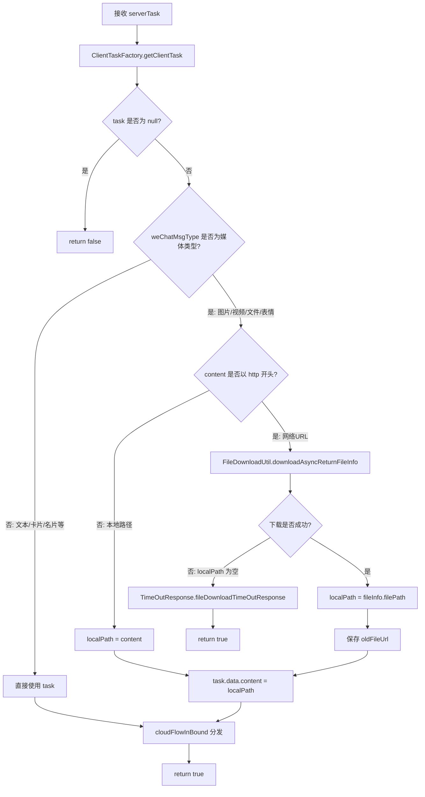
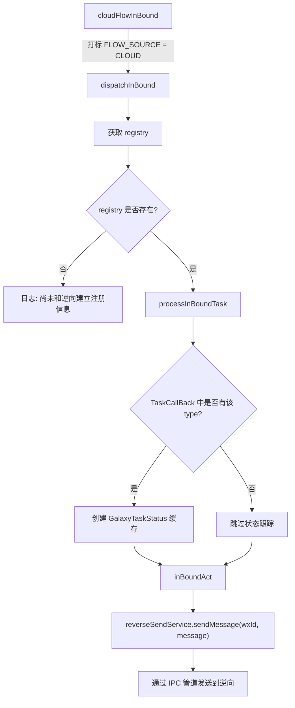

# 微信 MQTT 聊天服务完整链路分析

> **文档定位**：深度解读微信（个人号）MQTT 聊天消息服务的完整处理链路，包含逐行级代码逻辑、各消息类型处理细节、文件下载流程、日志关键字速查表及潜在问题分析。  
> **适用仓库**：`galaxy-client`  
> **核心源文件**：`src/msg-center/business/task-mqtt/mqttChatService.js`  
> **关联文件**：`clientTaskFactory.js`、`abstractMqttOptService.js`、`fileDownload.js`、`cloudFlowInBound.js`、`timeoutResponse.js`

---

## 一、服务定位与入口

### 1.1 在系统中的位置

`MqttChatService` 是**微信（个人号）**的 MQTT 聊天消息处理器，处于 MQTT 任务分发链路的业务层：


### 1.2 服务注册

该服务在 `mqttClientBase.js` 中注册到**微信服务列表**：

```javascript
// src/msg-center/core/mq/mqttClientBase.js
const WxConvertServiceList = [
    MqttChatService,    // 发送消息
    // ... 其他17个服务
];
```

当 `registry.workWx === false`（个人微信）时，`runTask()` 遍历 `WxConvertServiceList`，依次调用 `filter()` 和 `operate()`。

### 1.3 filter 匹配逻辑

```javascript
// src/msg-center/business/task-mqtt/mqttChatService.js:47-50
filter(serverTask) {
    return serverTask.type === SunTaskType.CHATROOM_SEND_MSG   // 群聊发消息 (type=1)
        || serverTask.type === SunTaskType.FRIEND_SEND_MSG;    // 私聊发消息 (type=100)
}
```

| 任务类型 | SunTaskType 常量 | 数值 | 含义 |
|---------|-----------------|-----|------|
| 群聊发消息 | `CHATROOM_SEND_MSG` | 1 | 发送到群聊 |
| 私聊发消息 | `FRIEND_SEND_MSG` | 100 | 发送给好友 |

---

## 二、operate 完整执行流程

### 2.1 流程图



### 2.2 逐行代码解读

```javascript
// src/msg-center/business/task-mqtt/mqttChatService.js:64-108
async operate(serverTask, wxId) {
    let {content, weChatMsgType} = serverTask;
    
    // 【步骤1】构建客户端任务对象
    // ClientTaskFactory 根据 serverTask.type 和 weChatMsgType 生成可发给逆向的 ClientTask
    let task = ClientTaskFactory.getClientTask(serverTask, wxId);
    
    // 名片消息（微信号方式）或未识别的消息类型会返回 null
    if (!task) {
        return false;
    }
    
    // 【步骤2】处理媒体类型消息
    // 以下四种类型需要先将文件下载到本地
    if (weChatMsgType == EMessage.TYPE__VIDEO           // 视频 (43)
        || weChatMsgType == EMessage.TYPE__MSG_CARD_FILE // 文件 (49001)
        || weChatMsgType == EMessage.TYPE__STICKER       // 表情 (47)
        || weChatMsgType == EMessage.TYPE__IMAGE) {      // 图片 (3)
        
        // 日志：记录文件/图片发送请求
        // SLS关键字: "send-file-img"
        logUtil.customLog(`wxid-${wxId} send-file-img -[${content}]`);
        
        let localPath = content;
        
        // 【步骤2a】判断 content 是否为 HTTP/HTTPS 链接
        if (content.startsWith(CommonConstant.HTTP_LINK_FLAG) 
            || content.startsWith(CommonConstant.HTTPS_LINK_FLAG)) {
            
            let fileName = serverTask.ext;  // ext 字段作为文件名（含扩展名）
            
            // 异步下载文件到本地
            let fileInfo = await FileDownloadUtil.downloadAsyncReturnFileInfo(content, fileName);
            localPath = fileInfo.filePath;
            
            // 【步骤2b】下载失败处理
            if (!localPath) {
                // 上报文件下载超时
                TimeOutResponse.fileDownloadTimeOutResponse(serverTask, wxId);
                return true;  // 返回 true 表示已处理（虽然失败）
            }
            
            // 保存原始 URL，用于重试时重新下载
            task.oldFileUrl = content;
        }
        
        // 【步骤2c】更新 content 为本地文件路径
        task.data.content = localPath;
    }
    
    // 【步骤3】发送任务到逆向执行
    // cloudFlowInBound 会打上 "来源: 云端" 标记，再交给 dispatchInBound
    cloudFlowInBound(null, wxId, JSON.stringify(task));
    
    // SLS关键字: "friend-chat"
    logUtil.customLog(`wxid-${wxId} friend-chat - clientTask=[${JSON.stringify(task)}]`);
    return true;
}
```

---

## 三、ClientTaskFactory 任务构建细节

### 3.1 入口路由

`getClientTask()` 根据 `serverTask.type` 路由到 `getSendMessageTask()`：

```javascript
// src/msg-center/core/factory/clientTaskFactory.js:1097-1106
case SunTaskType.CHATROOM_SEND_MSG:
case SunTaskType.FRIEND_SEND_MSG:
    return this.getSendMessageTask(serverTask, username, GalaxyTaskType.SEND_MESSAGE);
```

### 3.2 getSendMessageTask 内部流程

该方法分为三个阶段：

**阶段一：引用消息特判**

```javascript
// 如果 ext 存在且消息类型为文本 → 视为引用消息
if (serverTask.ext && serverTask.weChatMsgType === MsgTypeConstant.TEXT_MSG) {
    return this.getReferenceMsgTask(serverTask, username);
}
```

**阶段二：根据任务类型确定目标**

| serverTask.type | 方法 | 设置字段 |
|----------------|------|---------|
| `CHATROOM_SEND_MSG (1)` | `getChatroomSendMessageTask` | `data.to = chatroom`, `data.array = toUsernames`（@列表） |
| `FRIEND_SEND_MSG (100)` | `getFriendSendMessageTask` | `data.to = toUsernames[0]` |

**阶段三：根据消息类型（weChatMsgType）设置参数**

| weChatMsgType | EMessage 常量 | 值 | data.flag | data.param | 说明 |
|---------------|--------------|-----|-----------|------------|------|
| 文本 | `TYPE__TEXT` | 1 | `TEXT_AND_BUSINESS_CARD` | `TEXT` | 换行符统一处理 |
| 图片 | `TYPE__IMAGE` | 3 | `PICTURE` | - | 仅设置 flag |
| 视频 | `TYPE__VIDEO` | 43 | `FILE_AND_VIDEO` | - | 与文件共用 flag |
| 表情 | `TYPE__STICKER` | 47 | `EMOJI` | `EMOJI` | - |
| 文件 | `TYPE__MSG_CARD_FILE` | 49001 | `FILE_AND_VIDEO` | - | 注意值是 49001 而非 49 |
| 链接卡片 | `TYPE__MSG_CARD_LINK` | 49002 | `CARD` 或 `MINI_PROGRAM_CARD` | 49 | 根据 ext 区分普通链接/小程序 |
| 名片 | `TYPE__CONTACT_CARD` | 42 | `BUSINESS_CARD_FLAG` | `PERSON_CARD` | content 为名片 XML |
| 视频号 | `TYPE__MSG_FINDER` | 67 | `VIDEO_FINDER_FLAG` | 49 | 需要从 XML 中提取字段 |
| 视频号直播 | `TYPE__MSG_FINDER_LIVE` | 70 | `ONLINE_FINDER_FLAG` | 49 | 需要从 XML 中提取字段 |
| 视频通话 | `TYPE_VIDEO_CALL` | 10008 | `VIDEO_CALL` | - | 设置在 clientTask 而非 data |
| 语音通话 | `TYPE_VOICE_CALL` | 10007 | `VOICE_CALL` | - | 设置在 clientTask 而非 data |

### 3.3 微信 ClientTask 最终数据结构

```javascript
{
    type: "sendmessage",         // GalaxyTaskType.SEND_MESSAGE
    taskId: "xxx",               // 来自 serverTask.id
    ownerWxId: "wxid_xxx",       // 机器人 wxId
    typeExt: "MSG_TASK",         // 消息任务扩展类型
    wechatMsgType: 1,            // 微信消息类型
    oldFileUrl: "https://...",   // 原始文件URL（仅媒体类型）
    data: {
        to: "wxid_xxx@chatroom", // 目标群/好友 wxid
        content: "消息内容",      // 文本内容或本地文件路径
        flag: 0,                 // 发送标志
        param: 0,                // 参数类型
        array: ["wxid_xxx"],     // @成员列表（群聊时）
        // 以下为卡片/视频号等特殊字段
        desc: "",
        url: "",
        headimg: "",
        ghname: "",
        ghid: "",
    }
}
```

---

## 四、各消息类型处理逻辑

### 4.1 文本消息（weChatMsgType = 1）

**处理路径**：`getClientTask` → `getSendMessageTask` → `cloudFlowInBound`

1. 不进入 `operate` 中的媒体下载分支
2. 在 `ClientTaskFactory.getSendMessageTask` 中将 Windows 换行符 `\r\n` 替换为 `\n`
3. 设置 `data.content = 文本内容`, `data.flag = TEXT_AND_BUSINESS_CARD`, `data.param = TEXT`
4. 直接通过 `cloudFlowInBound` 分发

**日志查询**：
```
wxid-${wxId} friend-chat - clientTask=
```

### 4.2 图片消息（weChatMsgType = 3）

**处理路径**：`operate` 媒体分支 → 下载 → `cloudFlowInBound`

1. 命中 `EMessage.TYPE__IMAGE` 条件
2. 判断 `content` 是否为 HTTP 链接
   - **是**：调用 `FileDownloadUtil.downloadAsyncReturnFileInfo(content, serverTask.ext)` 下载
   - **否**：直接使用本地路径
3. `task.data.content` 更新为本地文件路径
4. `data.flag = PICTURE`

**日志查询**：
```
wxid-${wxId} send-file-img -[https://...]
```

### 4.3 视频消息（weChatMsgType = 43）

**处理路径**：与图片相同，进入 `operate` 媒体分支

1. 命中 `EMessage.TYPE__VIDEO` 条件
2. 文件下载逻辑与图片一致
3. `data.flag = FILE_AND_VIDEO`

**注意**：微信版视频消息在 `mqttChatService` 中**不**生成缩略图和时长，这些处理在逆向侧完成。与企微版不同。

### 4.4 文件消息（weChatMsgType = 49001）

**处理路径**：与图片相同，进入 `operate` 媒体分支

1. 命中 `EMessage.TYPE__MSG_CARD_FILE` 条件（值 = 49001）
2. `serverTask.ext` 作为文件名（如 `报告.pdf`）传入下载方法
3. `data.flag = FILE_AND_VIDEO`

**注意**：`EMessage.TYPE__MSG_CARD_FILE = 49001`，不是 `TYPE__MSG_CARD = 49`。49 是卡片消息的通用类型，49001 是具体文件子类型。

### 4.5 表情消息（weChatMsgType = 47）

**处理路径**：与图片相同，进入 `operate` 媒体分支

1. 命中 `EMessage.TYPE__STICKER` 条件
2. 文件下载逻辑与图片一致
3. `data.flag = EMOJI`, `data.param = EMOJI`

### 4.6 链接卡片（weChatMsgType = 49002）

**不进入** `operate` 的媒体分支，在 `ClientTaskFactory` 中处理：

1. 判断 `ext` 是否为小程序类型：
   - **小程序**：调用 `parseMiniProgramXml` 解析 XML，填充 ghname/desc/url/headimg 等
   - **普通链接**：调用 `newLinkCardXmlGenerator` 从 contentList 提取 title/desc/link/img_url
2. `data.param = 49`，`data.flag = CARD` 或 `MINI_PROGRAM_CARD`

### 4.7 名片消息（weChatMsgType = 42）

**不进入**媒体分支：

1. `data.content = serverTask.content`（名片 XML）
2. `data.param = PERSON_CARD`，`data.flag = BUSINESS_CARD_FLAG`

### 4.8 视频号/视频号直播（weChatMsgType = 67/70）

**不进入**媒体分支，在 `ClientTaskFactory` 中处理：

1. 从 `serverTask.content`（XML 格式）中提取 authorName、objectId、objectNonceId 等字段
2. 视频号设置 `data.flag = VIDEO_FINDER_FLAG`
3. 直播设置 `data.flag = ONLINE_FINDER_FLAG`

### 4.9 引用消息（文本类型 + ext 存在）

**特殊处理**：在 `getSendMessageTask` 开头被拦截，路由到 `getReferenceMsgTask`：

```javascript
{
    type: "sendquotemessage",
    ownerWxId: wxId,
    data: {
        quote: ext,           // 被引用的消息
        content: content,     // 回复内容
        to: conversationId    // chatroom 或 "S:wxId_toUsername"
    }
}
```

### 4.10 语音/视频通话（weChatMsgType = 10007/10008）

**不进入**媒体分支：

1. 设置 `clientTask.flag = VOICE_CALL` 或 `VIDEO_CALL`（注意是设置在 clientTask 而非 data）

---

## 五、文件下载失败处理

### 5.1 TimeOutResponse.fileDownloadTimeOutResponse

当文件下载返回空路径时触发：

```javascript
// src/msg-center/core/cloud/timeoutResponse.js
fileDownloadTimeOutResponse(serverTask, wxId) {
    this.fileResponse(
        serverTask.id,
        wxId,
        "文件下载超时",
        CommonConstant.FAIL_TASK   // status = 4
    );
}

fileResponse(taskId, wxId, reason, status) {
    // 构建上报消息
    const taskInfoBO = {
        reason: reason,
        status: status,
        taskId: taskId,
        javaClient: clientVersion
    };
    const clientMsgCloud = {
        username: wxId,
        taskInfo: taskInfoBO,
        type: PrismRecordType.TASK_RESULT_MSG  // 604
    };
    // 通过 MQTT 发送失败上报
    mqttSendService.sendMessage(wxId, clientMsgCloud);
}
```

**SLS 日志关键字**：`fileDownloadTimeOutResponse`

---

## 六、cloudFlowInBound 分发路径

任务通过 `cloudFlowInBound` 进入消息分发中心：



**关键点**：
- `cloudFlowInBound` 的第一个参数 `channelId` 传 `null`，因为是云端来源
- 消息被打上 `FLOW_SOURCE_KEY = CLOUND` 标记，用于后续区分消息来源
- `dispatchInBound` 会为需要追踪的任务创建三段式状态缓存

---

## 七、SLS 日志关键字速查表

### 7.1 正常流程日志

| 日志关键字 | 出现位置 | 含义 | SLS 查询语句 |
|-----------|---------|------|-------------|
| `send-file-img` | mqttChatService.js:80 | 媒体文件发送请求 | `wxid-{wxId} send-file-img` |
| `friend-chat` | mqttChatService.js:106 | 消息任务构建完成 | `wxid-{wxId} friend-chat - clientTask=` |
| `[文件下载]` | fileDownload.js:396 | 文件开始下载 | `[文件下载] [fileOssUrl]` |
| `[文件下载成功]` | fileDownload.js:437 | 文件下载完成 | `[文件下载成功]` |
| `[文件下载缓存]` | fileDownload.js:265 | 命中下载缓存 | `[文件下载缓存]` |

### 7.2 异常流程日志

| 日志关键字 | 出现位置 | 含义 | SLS 查询语句 |
|-----------|---------|------|-------------|
| `fileDownloadTimeOutResponse` | timeoutResponse.js | 文件下载超时上报 | `fileDownloadTimeOutResponse` |
| `[下载文件请求失败]` | fileDownload.js:514 | HTTP 请求非 200 | `[下载文件请求失败]` |
| `[下载文件重试]` | fileDownload.js:417 | 下载重试失败 | `[下载文件重试]` |
| `[文件下载不完整]` | fileDownload.js:559 | Content-Length 校验失败 | `[文件下载不完整]` |
| `[文件缓存失效]` | fileDownload.js:279 | 缓存文件被删除 | `[文件缓存失效]` |

### 7.3 典型排查场景

**场景：消息未发送**

```
# 1. 先查 MQTT 是否收到任务
wxid-{wxId} and "friend-chat"

# 2. 如果是媒体消息，查下载情况
wxid-{wxId} and "send-file-img"

# 3. 查是否下载失败
"fileDownloadTimeOutResponse" and wxid-{wxId}

# 4. 查逆向是否收到任务
wxid-{wxId} and "消息已发送到逆向"
```

**场景：图片/文件发送失败**

```
# 查看下载全链路
wxid-{wxId} and ("send-file-img" or "[文件下载]" or "[文件下载成功]" or "[下载文件请求失败]")
```

---

## 八、潜在问题与优化建议

### 8.1 Bug：fileInfo 为 null 时的空指针风险

```javascript
let fileInfo = await FileDownloadUtil.downloadAsyncReturnFileInfo(content, fileName);
localPath = fileInfo.filePath;  // ← 如果 fileInfo 为 null，这里会抛异常
```

`downloadAsyncReturnFileInfo` 在下载失败时返回 `null`（而非 `{filePath: null}`）。如果返回 `null`，`fileInfo.filePath` 会抛出 `TypeError: Cannot read properties of null`。

**建议修复**：

```javascript
let fileInfo = await FileDownloadUtil.downloadAsyncReturnFileInfo(content, fileName);
localPath = fileInfo?.filePath;
```

### 8.2 问题：TYPE__MSG_CARD_FILE 值的混淆

- `EMessage.TYPE__MSG_CARD = 49`（通用卡片类型）
- `EMessage.TYPE__MSG_CARD_FILE = 49001`（文件子类型）

在 `operate` 方法中使用的是 `TYPE__MSG_CARD_FILE (49001)`，而在 `getSendMessageTask` 的 switch 中也使用的是 `TYPE__MSG_CARD_FILE`，两处一致没有问题。但如果云端传来的 `weChatMsgType` 是 49 而非 49001，则文件消息会进入 `getSendMessageTask` 的 default 分支返回 null，导致发送失败。

**建议**：确认云端下发文件消息时使用的 weChatMsgType 值。

### 8.3 问题：oldFileUrl 仅在 HTTP 链接时保存

`task.oldFileUrl = content` 仅在 content 为 HTTP/HTTPS 链接时赋值。如果 content 是本地路径，则 `oldFileUrl` 不存在。这在重试逻辑中可能导致无法重新下载文件。

### 8.4 问题：表情消息是否需要下载

表情消息（TYPE__STICKER = 47）在代码中进入了文件下载分支。但表情消息的 content 通常是 CDN 链接还是本地资源？如果大部分表情都是网络链接，则下载逻辑是正确的；如果是自定义表情的本地路径，则不会触发下载。

### 8.5 优化：media 类型判断可抽取为常量集合

当前四种媒体类型通过 `||` 连接判断，建议改为集合判断：

```javascript
const MEDIA_MSG_TYPES = new Set([
    EMessage.TYPE__VIDEO,
    EMessage.TYPE__MSG_CARD_FILE,
    EMessage.TYPE__STICKER,
    EMessage.TYPE__IMAGE,
]);

if (MEDIA_MSG_TYPES.has(weChatMsgType)) { ... }
```

### 8.6 注意：operate 返回值的不一致

- `task` 为 null 时返回 `false`
- 下载失败时返回 `true`
- 正常处理返回 `true`

返回值的含义不明确。下载失败和正常处理都返回 `true`，调用方无法区分。目前 `runTask` 中不检查返回值，不影响运行，但语义上可以优化。

---

*文档生成时间：2026-03-17 | 基于 galaxy-client 仓库实际代码分析*
