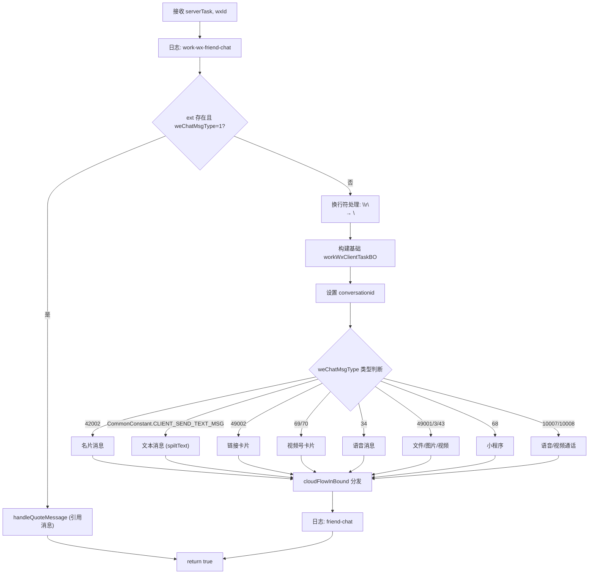
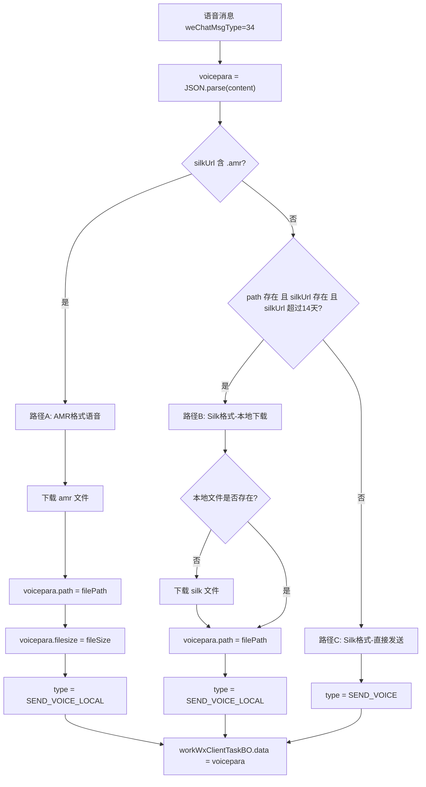
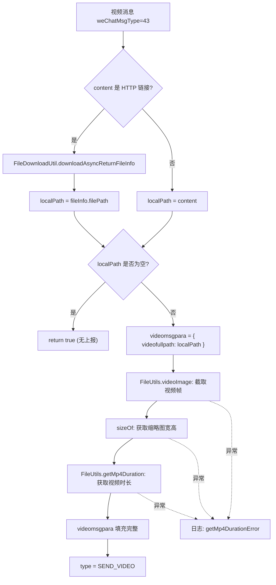

# 企业微信 MQTT 聊天服务完整链路分析

> **文档定位**：深度解读企业微信 MQTT 聊天消息服务的完整处理链路，逐类型分析 12 种消息的处理逻辑，包含文本解析算法、文件下载、视频处理、日志关键字速查表及潜在 bug 分析。  
> **适用仓库**：`galaxy-client`  
> **核心源文件**：`src/msg-center/business/task-mqtt/wkwx/mqttWorkWxChatService.js`  
> **关联文件**：`prismRecordType.js`、`galaxyTaskType.js`、`commonConstant.js`、`fileDownload.js`、`fileUtils.js`、`inspectFailResponse.js`

---

## 一、服务定位与微信版差异概述

### 1.1 在系统中的位置

`MqttWorkWxChatService` 是**企业微信**的 MQTT 聊天消息处理器。它在 `mqttClientBase.js` 中注册到企微服务列表：

```javascript
// src/msg-center/core/mq/mqttClientBase.js
let WorkWxConvertServiceList = [
    require("../../business/task-mqtt/wkwx/mqttWorkWxChatService"),  // 发送消息
    // ... 其他24个服务
];
```

当 `registry.workWx === true`（企业微信）时，`runTask()` 遍历 `WorkWxConvertServiceList`。

### 1.2 与微信版的核心差异

| 对比维度 | 微信 mqttChatService | 企微 mqttWorkWxChatService |
|---------|---------------------|--------------------------|
| 任务构建 | 委托 `ClientTaskFactory` | 自行构建 `workWxClientTaskBO` |
| 消息格式 | `{ type: "sendmessage", data: {...} }` | `{ type: "sendmsg_sendtext", msg_items: [...] }` |
| 会话标识 | `data.to = wxid` | `conversationid = "R:群ID"` 或 `"S:wxId_toUser"` |
| 文本处理 | 交给 ClientTaskFactory | 自行拆分表情 + @人 (`spiltText`) |
| 支持类型 | 10种 | 12种（多语音、视频号卡片、小程序、通话、引用） |
| 视频处理 | 不生成缩略图 | 需要 ffmpeg 生成缩略图+获取时长 |
| 语音处理 | 不支持 | 支持 amr/silk 两种格式，14天有效期判断 |
| 下载失败 | 上报 TimeOutResponse | 直接 return true（**未上报**） |

### 1.3 filter 匹配逻辑

```javascript
// src/msg-center/business/task-mqtt/wkwx/mqttWorkWxChatService.js:48-54
filter(serverTask) {
    return (
        serverTask.type == SunTaskType.CHATROOM_SEND_MSG ||   // 群聊发消息 (1)
        serverTask.type == SunTaskType.FRIEND_SEND_MSG        // 私聊发消息 (100)
    );
}
```

与微信版完全一致，因为通过 `registry.workWx` 已经区分了微信/企微，不会同时命中。

---

## 二、会话 ID 构建规则

### 2.1 构建逻辑

企微使用 `conversationid` 字段标识会话，格式与微信不同：

```javascript
// src/msg-center/business/task-mqtt/wkwx/mqttWorkWxChatService.js:70-79
if (serverTask.type === PrismRecordType.CHAT_MSG) {           // type === 1 (群聊)
    let { chatroom } = serverTask;
    if (!chatroom.startsWith(GROUP_CHAT_PREFIX)) {             // "R:"
        chatroom = GROUP_CHAT_PREFIX + chatroom;
    }
    workWxClientTaskBO.conversationid = chatroom;
} else {                                                       // type === 100 (私聊)
    let to_username = serverTask.toUsernames[0] || null;
    workWxClientTaskBO.conversationid =
        PERSON_CHAT_PREFIX + wxId + "_" + to_username;         // "S:"
}
```

### 2.2 会话 ID 格式总结

| 会话类型 | 前缀 | 格式 | 示例 |
|---------|------|------|------|
| 群聊 | `R:` | `R:{chatroom_id}` | `R:12345678@chatroom` |
| 私聊 | `S:` | `S:{发送者wxId}_{接收者wxId}` | `S:wxid_abc123_wxid_def456` |

### 2.3 引用消息的特殊入口

在进入常规消息处理之前，operate 方法会先检查是否为引用消息：

```javascript
// src/msg-center/business/task-mqtt/wkwx/mqttWorkWxChatService.js:61-63
if (serverTask.ext && serverTask.weChatMsgType === MsgTypeConstant.TEXT_MSG) {
    return this.handleQuoteMessage(serverTask, wxId);
}
```

**判断条件**：`ext` 字段存在 **且** `weChatMsgType === 1`（文本消息类型）。满足时直接走引用消息分支，**跳过**后续所有消息类型判断。

---

## 三、operate 完整执行流程

### 3.1 总体流程图



### 3.2 公共字段设置

所有消息类型共用以下基础字段：

```javascript
// src/msg-center/business/task-mqtt/wkwx/mqttWorkWxChatService.js:81-87
workWxClientTaskBO = {
    ...workWxClientTaskBO,          // 已设置的 conversationid
    ownerWxId: wxId,                // 机器人 wxId
    wechatMsgType: serverTask.weChatMsgType,  // 消息类型码
    serialNo: serverTask.serialNo,  // 序列号
    taskId: serverTask.id,          // 任务 ID
};
```

---

## 四、各消息类型详细处理逻辑

### 4.1 文本消息（weChatMsgType = CLIENT_SEND_TEXT_MSG）

**类型判断**：`serverTask.weChatMsgType === CommonConstant.CLIENT_SEND_TEXT_MSG`

**处理逻辑**：

```javascript
// src/msg-center/business/task-mqtt/wkwx/mqttWorkWxChatService.js:104-114
msgItemLists = this.spiltText(content, msgItemLists, serverTask.type, serverTask.toUsernames);
workWxClientTaskBO.msg_items = msgItemLists;
workWxClientTaskBO.type = GalaxyTaskType.SEND_TEXT;  // "sendmsg_sendtext"
```

**文本解析流程**（`spiltText` 方法详解见第五章）：

1. 将文本拆分为 `puretext`（纯文本）、`emotion`（表情 `[微笑]`）、`atmsg`（@人）三种类型
2. 生成 `msg_items` 数组

**输出示例**：

```javascript
{
    type: "sendmsg_sendtext",
    conversationid: "R:12345@chatroom",
    msg_items: [
        { texttype: "puretext", content: "大家好 " },
        { texttype: "emotion", content: "[微笑]" },
        { texttype: "puretext", content: " 请 " },
        { texttype: "atmsg", content: "wxid_xxx" }
    ]
}
```

**日志查询**：`work-wx-friend-chat`

---

### 4.2 名片消息（weChatMsgType = 42002）

**类型判断**：`serverTask.weChatMsgType === PrismRecordType.SEND_CONTACT_USER_CARD`（42002）

**处理逻辑**：

```javascript
// src/msg-center/business/task-mqtt/wkwx/mqttWorkWxChatService.js:91-101
workWxClientTaskBO.type = GalaxyTaskType.SENDMSG_SENDPERSONALCARD;
let personalCard = {
    vid: +serverTask.content,   // 注意: content 被转为数字 (+)
    corpname: "",
    name: "",
    avatarurl: "",
};
workWxClientTaskBO.data = personalCard;
```

**关键点**：
- `content` 通过 `+` 运算符转为数字类型（`vid` 是企微用户的数字 ID）
- `corpname`、`name`、`avatarurl` 均为空字符串，逆向侧会自动查询填充

**输出示例**：

```javascript
{
    type: "sendmsg_sendpersonalcard",
    conversationid: "S:wxid_abc_wxid_def",
    data: { vid: 1234567890, corpname: "", name: "", avatarurl: "" }
}
```

---

### 4.3 链接卡片（weChatMsgType = 49002）

**类型判断**：`serverTask.weChatMsgType == PrismRecordType.SEND_LINK`（49002）

**处理逻辑**：

```javascript
// src/msg-center/business/task-mqtt/wkwx/mqttWorkWxChatService.js:116-125
workWxClientTaskBO.type = GalaxyTaskType.SEND_LINK;  // "sendmsg_sendlink"
let linkpara = this.linkCardXmlGenerator(serverTask, wxId, content);
workWxClientTaskBO.linkpara = linkpara;
```

**linkCardXmlGenerator 详解**（见第六章）：从 `serverTask.contentList` 中提取 title/desc/link，`content` 作为图片 URL。

**SLS 日志关键字**：`send-link-card`

**输出示例**：

```javascript
{
    type: "sendmsg_sendlink",
    conversationid: "R:12345@chatroom",
    linkpara: {
        title: "文章标题",
        desc: "文章描述",
        link: "https://example.com/article",
        img_url: "https://cdn.example.com/cover.jpg"
    }
}
```

---

### 4.4 视频号卡片（weChatMsgType = 69 / 70）

**类型判断**：`serverTask.weChatMsgType == 69 || serverTask.weChatMsgType == 70`

- 69 = `PrismRecordType.SEND_ONLINE_FINDER`（直播号）
- 70 = `PrismRecordType.SEND_VIDEO_FINDER`（视频号）

**处理逻辑**：

```javascript
// src/msg-center/business/task-mqtt/wkwx/mqttWorkWxChatService.js:128-135
workWxClientTaskBO.type = GalaxyTaskType.SEND_FINDER_CARD;
let finderpara = JSON.parse(content);    // content 是 JSON 字符串
workWxClientTaskBO.data = finderpara;
```

**SLS 日志关键字**：`send-finder-card`

**注意**：`content` 必须是合法的 JSON 字符串，如果解析失败会抛异常。代码中没有 try-catch 保护。

---

### 4.5 语音消息（weChatMsgType = 34）

**类型判断**：`serverTask.weChatMsgType == PrismRecordType.SEND_VOICE`（34）

这是最复杂的消息类型之一，有三条处理路径：



**路径 A：AMR 格式语音**

```javascript
// src/msg-center/business/task-mqtt/wkwx/mqttWorkWxChatService.js:141-150
if (voicepara?.silkUrl?.indexOf(".amr") > -1) {
    const fileInfo = (await FileDownloadUtil.downloadAsyncReturnFileInfo(
        voicepara.silkUrl, ""
    )) || { filePath: "", fileSize: 1 };
    voicepara.path = fileInfo.filePath;
    voicepara.filesize = fileInfo.fileSize;
    voicepara.voicetime = +voicepara.voicetime || 0;
    workWxClientTaskBO.type = GalaxyTaskType.SEND_VOICE_LOCAL;
}
```

- 下载 `.amr` 文件到本地
- 设置 `voicepara.path` / `filesize` / `voicetime`
- 使用 `SEND_VOICE_LOCAL` 类型（本地文件发送）

**路径 B：Silk 格式 - 超过14天需下载**

```javascript
// src/msg-center/business/task-mqtt/wkwx/mqttWorkWxChatService.js:158-174
if (voicepara.path && voicepara.silkUrl && !FileUtils.isWithin14Days(voicepara.silkUrl)) {
    const localPath = voicepara.path;
    const silkUrl = voicepara.silkUrl;
    if (!FileDownloadUtil.getIsExistsFile(localPath)) {
        const res = await FileDownloadUtil.downloadAsyncReturnFileInfo(silkUrl, "");
        voicepara.path = res?.filePath;
    }
    workWxClientTaskBO.type = GalaxyTaskType.SEND_VOICE_LOCAL;
}
```

- `isWithin14Days` 通过从 URL 中提取时间戳判断是否在14天内
- 如果 **超过14天**（`!isWithin14Days` 返回 true），且本地文件不存在，则重新下载
- 使用 `SEND_VOICE_LOCAL` 类型

**路径 C：Silk 格式 - 直接发送**

```javascript
// src/msg-center/business/task-mqtt/wkwx/mqttWorkWxChatService.js:175-177
else {
    workWxClientTaskBO.type = GalaxyTaskType.SEND_VOICE;
}
```

- 在14天有效期内，直接使用企微服务端的 silk 链接
- 使用 `SEND_VOICE` 类型（非本地发送）

**aesKey 兼容处理**：

```javascript
// src/msg-center/business/task-mqtt/wkwx/mqttWorkWxChatService.js:153-155
if (!voicepara.aeskey) {
    voicepara.aeskey = voicepara.aesKey;  // 兼容大小写不一致
}
```

**voicepara 数据结构**：

```javascript
{
    silkUrl: "https://cdn.com/voice.silk",   // 语音文件URL
    path: "/local/path/voice.silk",          // 本地路径
    filesize: 12345,                         // 文件大小
    voicetime: 5,                            // 语音时长(秒)
    aeskey: "xxx",                           // AES解密密钥
    aesKey: "xxx",                           // AES解密密钥(驼峰)
}
```

---

### 4.6 文件消息（weChatMsgType = 49001）

**类型判断**：`serverTask.weChatMsgType == PrismRecordType.SEND_FILE`（49001）

**处理逻辑**：

```javascript
// src/msg-center/business/task-mqtt/wkwx/mqttWorkWxChatService.js:184-214
// 1. 判断是否需要下载
let localPath = content;
if (content.startsWith(CommonConstant.HTTP_LINK_FLAG) || content.startsWith(CommonConstant.HTTPS_LINK_FLAG)) {
    let fileName = serverTask.ext;    // 文件名（如 "报告.pdf"）
    let fileInfo = await FileDownloadUtil.downloadAsyncReturnFileInfo(content, fileName);
    localPath = fileInfo.filePath;
}

// 2. 下载失败检查
if (!localPath) {
    return true;   // 注意：这里没有上报失败！
}

// 3. 设置文件路径
workWxClientTaskBO.filefullpath = localPath;
workWxClientTaskBO.type = GalaxyTaskType.SEND_FILE;  // "sendmsg_sendfile"
```

**SLS 日志关键字**：`send-file-img`

**输出示例**：

```javascript
{
    type: "sendmsg_sendfile",
    conversationid: "R:12345@chatroom",
    filefullpath: "C:\\Users\\xxx\\silkfile\\abc123\\报告.pdf",
    oldFileUrl: "https://cdn.example.com/报告.pdf"
}
```

---

### 4.7 图片消息（weChatMsgType = 3）

**类型判断**：`serverTask.weChatMsgType == PrismRecordType.SEND_IMG`（3）

**处理逻辑**：

```javascript
workWxClientTaskBO.imagefullpath = localPath;
workWxClientTaskBO.type = GalaxyTaskType.SEND_IMAG;  // "sendmsg_sendimage"
```

下载逻辑与文件消息共用同一代码块。

**输出示例**：

```javascript
{
    type: "sendmsg_sendimage",
    conversationid: "S:wxid_abc_wxid_def",
    imagefullpath: "C:\\Users\\xxx\\silkfile\\def456\\photo.jpg",
    oldFileUrl: "https://cdn.example.com/photo.jpg"
}
```

---

### 4.8 视频消息（weChatMsgType = 43）

**类型判断**：`serverTask.weChatMsgType == PrismRecordType.SEND_VIDEO`（43）

**这是所有消息类型中最复杂的一个**，因为除了下载视频文件，还需要：

1. 使用 ffmpeg 生成缩略图
2. 获取缩略图尺寸
3. 获取视频时长

**完整处理流程**：



**代码细节**：

```javascript
// src/msg-center/business/task-mqtt/wkwx/mqttWorkWxChatService.js:218-249
let videomsgpara = {
    videofullpath: localPath,
};
try {
    // 1. 生成缩略图
    let imagePath = await FileUtils.videoImage(
        localPath,
        FileUtils.getFilePath("thumb")    // ~/silkfile/thumb/
    );
    videomsgpara.thumbfullpath = imagePath;
    
    // 2. 获取缩略图尺寸
    let dimensions = sizeOf(imagePath);
    videomsgpara.thumbwidth = dimensions.width;
    videomsgpara.thumbheight = dimensions.height;
    
    // 3. 获取视频时长
    let mp4Duration = await FileUtils.getMp4Duration(localPath);
    let seconds = mp4Duration ?? 23;      // 默认23秒
    videomsgpara.seconds = seconds;
} catch (error) {
    // 缩略图/时长获取失败，不阻止发送
    logUtil.customLog(
        `[codeError] [getMp4DurationError] wxId:[wxid-${wxId}] [${error.name}] [${error.message}] [${error.stack}]`,
        { level: "error", errorKey: "getMp4DurationError" }
    );
}
workWxClientTaskBO.type = GalaxyTaskType.SEND_VIDEO;
workWxClientTaskBO.videomsgpara = videomsgpara;
```

**SLS 日志关键字**：
- 正常：`视频长度=`、`具体视频为=`、`具体视频封面图为=`
- 异常：`[codeError] [getMp4DurationError]`

**输出示例**：

```javascript
{
    type: "sendmsg_sendvideo",
    conversationid: "R:12345@chatroom",
    videomsgpara: {
        videofullpath: "C:\\Users\\xxx\\silkfile\\abc\\video.mp4",
        thumbfullpath: "C:\\Users\\xxx\\silkfile\\thumb\\thumb_1710654321.jpg",
        thumbwidth: 1280,
        thumbheight: 720,
        seconds: 15
    },
    oldFileUrl: "https://cdn.example.com/video.mp4"
}
```

**FileUtils.videoImage 实现细节**：
- 使用 fluent-ffmpeg 从视频中截帧
- 如果视频时长 > 1秒，截取第 0.5 秒的帧
- 如果视频时长 <= 1秒，截取中间帧
- 输出为 JPG 格式，保存在 `~/silkfile/thumb/` 目录

**FileUtils.getMp4Duration 实现细节**：
- 使用 ffprobe 获取视频元数据
- 返回 `Math.round(duration)` 秒
- 如果获取失败，默认使用 23 秒（`mp4Duration ?? 23`）

---

### 4.9 小程序（weChatMsgType = 68）

**类型判断**：`serverTask.weChatMsgType == PrismRecordType.TYPE_WORK_MINI_PROGRAM`（68）

**处理逻辑**：

```javascript
// src/msg-center/business/task-mqtt/wkwx/mqttWorkWxChatService.js:254-259
workWxClientTaskBO.type = GalaxyTaskType.SENDMSG_SENDAPPLET;
let miniProgram = JSON.parse(content);
workWxClientTaskBO.data = miniProgram;
```

**注意**：`content` 必须是合法的 JSON 字符串，无 try-catch 保护。

---

### 4.10 语音/视频通话（weChatMsgType = 10007 / 10008）

**类型判断**：
- `PrismRecordType.VOICE_CALL`（10007）= 语音通话
- `PrismRecordType.VIDEO_CALL`（10008）= 视频通话

**处理逻辑**：

```javascript
// src/msg-center/business/task-mqtt/wkwx/mqttWorkWxChatService.js:262-267
let to_username = serverTask.toUsernames[0] || null;
workWxClientTaskBO.type = GalaxyTaskType.SENDMSG_VOICE_OR_VIDEO_CALL;
workWxClientTaskBO.userid = to_username;
workWxClientTaskBO.flag = serverTask.weChatMsgType == PrismRecordType.VOICE_CALL ? 2 : 1;
```

| flag 值 | 含义 |
|---------|------|
| 2 | 语音通话 |
| 1 | 视频通话 |

**输出示例**：

```javascript
{
    type: "sendmsg_voiceorvideocall",
    conversationid: "S:wxid_abc_wxid_def",
    userid: "wxid_def",
    flag: 2   // 语音通话
}
```

---

### 4.11 引用消息

**入口条件**：`ext` 存在 **且** `weChatMsgType === 1`（在 operate 开头被拦截）

**处理逻辑**：

```javascript
// src/msg-center/business/task-mqtt/wkwx/mqttWorkWxChatService.js:379-408
handleQuoteMessage(serverTask, wxId) {
    let { ext, content, toUsernames, chatroom } = serverTask;
    let conversationId = chatroom;
    
    // 判断是群聊还是私聊
    if (toUsernames && toUsernames.length > 0) {
        conversationId = `${PERSON_CHAT_PREFIX}${wxId}_${toUsernames[0]}`;
    } else if (chatroom) {
        if (!chatroom.startsWith(GROUP_CHAT_PREFIX)) {
            conversationId = GROUP_CHAT_PREFIX + chatroom;
        }
    }
    
    const workWxQuoteTaskBO = {
        type: GalaxyTaskType.SEND_QUOTE_MESSAGE,
        ownerWxId: wxId,
        taskId: serverTask.id,
        conversationid: conversationId,
        data: {
            quote: ext,           // 被引用消息的内容
            content: content,     // 回复内容
            to: conversationId,
        },
    };
    
    cloudFlowInBound(null, wxId, JSON.stringify(workWxQuoteTaskBO));
    return true;
}
```

**会话 ID 判定规则**（与 operate 中的逻辑略有不同）：

| 条件 | conversationId |
|------|---------------|
| `toUsernames` 有值 | `S:{wxId}_{toUsernames[0]}`（私聊） |
| `chatroom` 有值（无 R: 前缀） | `R:{chatroom}` |
| `chatroom` 有值（已有 R: 前缀） | `{chatroom}`（原样使用） |

**注意**：引用消息的会话 ID 判断逻辑与 operate 中的常规消息有差异。常规消息根据 `serverTask.type` 判断群聊/私聊，而引用消息根据 `toUsernames` 是否有值判断。

---

## 五、spiltText 文本解析算法详解

### 5.1 算法目的

将企微文本消息拆分为三种类型的消息片段：

| texttype | 含义 | 匹配规则 |
|----------|------|---------|
| `puretext` | 纯文本 | 不匹配表情和@的部分 |
| `emotion` | 表情 | `[xxx]` 格式，如 `[微笑]`、`[握手]` |
| `atmsg` | @人 | `@name` 关键字（仅群聊 + toUsernames 有值） |

### 5.2 算法流程

```javascript
// src/msg-center/business/task-mqtt/wkwx/mqttWorkWxChatService.js:315-374
spiltText(text, msgItemLists, type, toUsernames) {
    let regexEmotion = "(\\[[^\\[\\]]+\\])";  // 匹配 [xxx]
    let regexAt = "@name";                     // 匹配 @name 字面量
    
    // 全局匹配所有表情和@
    let matcher = text.match(new RegExp(`${regexEmotion}|${regexAt}`, "g"));
    
    if (matcher) {
        for (let item of matcher) {
            if (item.match(new RegExp(`${regexEmotion}`))) {
                // === 表情处理 ===
                let start = text.indexOf(item);
                let str1 = text.substring(0, start);    // 表情前的文本
                let str2 = item;                          // 表情本身
                let str3 = text.substring(start + item.length);  // 表情后的文本
                
                if (str1) {
                    msgItemLists.push({ texttype: "puretext", content: str1 });
                }
                msgItemLists.push({ texttype: "emotion", content: str2 });
                text = str3;  // 剩余文本继续处理
                
            } else if (
                type == SunTaskType.CHATROOM_SEND_MSG &&  // 必须是群聊
                toUsernames && toUsernames.length !== 0 && // 有@目标
                item.match(new RegExp(`${regexAt}`))
            ) {
                // === @人处理 ===
                let start = text.indexOf(item);
                let str1 = text.substring(0, start);
                let str3 = text.substring(start + item.length);
                
                if (str1) {
                    msgItemLists.push({ texttype: "puretext", content: str1 });
                }
                // 为每个 toUsername 生成一个 atmsg
                for (let j = 0; j < toUsernames.length; j++) {
                    msgItemLists.push({ texttype: "atmsg", content: toUsernames[j] });
                }
                text = str3;
            }
        }
    }
    // 处理剩余文本
    if (text) {
        msgItemLists.push({ texttype: "puretext", content: text });
    }
    return msgItemLists;
}
```

### 5.3 解析示例

**输入**：
```
text = "大家好 [微笑] 请 @name 关注一下"
type = 1 (CHATROOM_SEND_MSG)
toUsernames = ["wxid_xxx"]
```

**执行过程**：

| 步骤 | matcher item | 操作 | msgItemLists |
|------|-------------|------|-------------|
| 1 | `[微笑]` | 拆分: "大家好 " + "[微笑]" + " 请 @name 关注一下" | `[{puretext: "大家好 "}, {emotion: "[微笑]"}]` |
| 2 | `@name` | 拆分: " 请 " + "@name" + " 关注一下" | `[..., {puretext: " 请 "}, {atmsg: "wxid_xxx"}]` |
| 3 | 结束 | 剩余: " 关注一下" | `[..., {puretext: " 关注一下"}]` |

**最终输出**：
```javascript
[
    { texttype: "puretext", content: "大家好 " },
    { texttype: "emotion", content: "[微笑]" },
    { texttype: "puretext", content: " 请 " },
    { texttype: "atmsg", content: "wxid_xxx" },
    { texttype: "puretext", content: " 关注一下" }
]
```

---

## 六、linkCardXmlGenerator 链接卡片生成逻辑

### 6.1 处理流程

```javascript
// src/msg-center/business/task-mqtt/wkwx/mqttWorkWxChatService.js:276-313
linkCardXmlGenerator(serverTask, wxId, content) {
    let { contentList } = serverTask;
    
    // contentList 校验
    if (!contentList || contentList.length === 0) {
        return null;
    }
    
    // 根据 contentList 长度提取字段
    if (contentList.length >= 3) {
        titleText = contentList[0];    // 标题
        descText = contentList[1];     // 描述
        urlText = contentList[2];      // 链接
    } else if (contentList.length == 2) {
        titleText = contentList[0];    // 标题
        descText = contentList[0];     // 描述(同标题)
        urlText = contentList[1];      // 链接
    } else if (contentList.length == 1) {
        titleText = contentList[0];    // 三者相同
        descText = contentList[0];
        urlText = contentList[0];
    }
    
    let linkpara = {
        title: titleText,
        desc: descText,
        link: urlText,
        img_url: content,    // content 作为卡片图片
    };
    
    // 参数缺失检查
    if (!titleText || !descText || !urlText || !content) {
        logUtil.customLog(`卡片连接参数有缺:${JSON.parse(contentList)}`);  // ← BUG
        InspectFailResponse.failResponse(serverTask.id, wxId, "卡片连接参数不全");
    }
    
    return linkpara;
}
```

### 6.2 contentList 映射规则

| contentList.length | title | desc | url | img_url |
|-------------------|-------|------|-----|---------|
| >= 3 | `[0]` | `[1]` | `[2]` | `content` |
| 2 | `[0]` | `[0]` | `[1]` | `content` |
| 1 | `[0]` | `[0]` | `[0]` | `content` |
| 0 | - | - | - | 返回 null |

---

## 七、SLS 日志关键字速查表

### 7.1 正常流程日志

| 日志关键字 | 出现位置 | 含义 |
|-----------|---------|------|
| `work-wx-friend-chat - serverTask=` | operate:56-58 | 企微任务接收，打印完整 serverTask |
| `send-file-img` | operate:189 | 媒体文件（文件/图片/视频）发送请求 |
| `send-link-card` | operate:117 | 链接卡片发送请求 |
| `send-finder-card` | operate:131 | 视频号卡片发送请求 |
| `[friend-chat] - workWxClientTaskBO=` | operate:269-273 | 最终任务构建完成，打印完整 BO |
| `视频长度=` | operate:237-239 | 视频时长获取成功 |
| `WorkWxClientTaskBO.Linkpara内容是` | operate:121-123 | 链接卡片参数详情 |
| `WorkWxClientTaskBO.finderpara` | operate:133 | 视频号卡片参数详情 |

### 7.2 异常流程日志

| 日志关键字 | 出现位置 | 含义 | 级别 |
|-----------|---------|------|------|
| `[codeError] [getMp4DurationError]` | operate:242-244 | 视频缩略图/时长获取失败 | error |
| `卡片连接参数有缺` | linkCardXmlGenerator:306 | 链接卡片参数不全 | default |

### 7.3 典型排查场景

**场景：企微消息未发送**

```
# 1. 查 MQTT 是否收到任务
"work-wx-friend-chat" and wxid-{wxId}

# 2. 查最终任务是否构建成功
"[friend-chat]" and wxid-{wxId}

# 3. 如果是媒体消息，查下载
"send-file-img" and wxid-{wxId}
```

**场景：企微视频发送失败**

```
# 查看视频处理全链路
wxid-{wxId} and ("send-file-img" or "视频长度=" or "getMp4DurationError")
```

**场景：企微链接卡片发送失败**

```
# 查看链接卡片参数
wxid-{wxId} and ("send-link-card" or "Linkpara内容" or "卡片连接参数有缺")
```

**场景：企微语音发送问题**

```
# 查看语音消息详情（需从 serverTask 中查看）
"work-wx-friend-chat" and wxid-{wxId} and "34"
```

---

## 八、潜在问题与优化建议

### 8.1 Bug：linkCardXmlGenerator 中 JSON.parse 误用

```javascript
// 第306行
logUtil.customLog(`卡片连接参数有缺:${JSON.parse(contentList)}`);
```

`contentList` 是数组，不是 JSON 字符串。`JSON.parse(数组)` 会抛出 `SyntaxError`。应为：

```javascript
logUtil.customLog(`卡片连接参数有缺:${JSON.stringify(contentList)}`);
```

**影响**：当链接卡片参数不全时，日志打印会抛异常，但由于 `failResponse` 在此之后调用，且异常未被捕获，可能导致 `failResponse` 不执行。

**严重程度**：中。会影响失败上报。

### 8.2 Bug：文件/图片/视频下载失败后没有上报

```javascript
// 第207-211行
if (!localPath) {
    // 注意：这里只是 return true，没有上报失败！
    // 对比微信版有 TimeOutResponse.fileDownloadTimeOutResponse
    return true;
}
```

微信版在文件下载失败时会调用 `TimeOutResponse.fileDownloadTimeOutResponse` 上报，但企微版代码中该行被注释掉了。导致企微的文件下载失败**无法在云端追踪**。

**严重程度**：高。云端无法知道任务失败。

**建议修复**：

```javascript
if (!localPath) {
    TimeOutResponse.fileDownloadTimeOutResponse(serverTask, wxId);
    return true;
}
```

### 8.3 问题：视频号 69/70 硬编码 magic number

```javascript
else if (serverTask.weChatMsgType == 69 || serverTask.weChatMsgType == 70) {
```

代码注释提到 `Emessage.TYPE__WORK_FINDER（企业微信视频号）依赖问题需处理`，但一直未解决。69 和 70 是 `PrismRecordType.SEND_ONLINE_FINDER` 和 `PrismRecordType.SEND_VIDEO_FINDER` 的值，应使用常量引用。

**建议修复**：

```javascript
else if (serverTask.weChatMsgType == PrismRecordType.SEND_ONLINE_FINDER 
      || serverTask.weChatMsgType == PrismRecordType.SEND_VIDEO_FINDER) {
```

### 8.4 问题：JSON.parse 无 try-catch 保护

以下三处 `JSON.parse` 没有异常处理：

1. **视频号卡片**：`let finderpara = JSON.parse(content);`（第132行）
2. **语音消息**：`let voicepara = JSON.parse(content);`（第139行）
3. **小程序**：`let miniProgram = JSON.parse(content);`（第258行）

如果 `content` 不是合法 JSON，会抛出 `SyntaxError` 导致整个 operate 失败。

**建议修复**：为每处 JSON.parse 添加 try-catch。

### 8.5 问题：语音 AMR 下载失败的默认值

```javascript
const fileInfo = (await FileDownloadUtil.downloadAsyncReturnFileInfo(
    voicepara.silkUrl, ""
)) || { filePath: "", fileSize: 1 };
```

下载失败时使用 `{ filePath: "", fileSize: 1 }` 作为默认值。`filePath` 为空字符串（非 null），后续不会触发空路径检查。这意味着**下载失败的语音消息会以空路径发送到逆向**，必然执行失败。

### 8.6 问题：Windows 换行符替换仅对 content 生效

```javascript
if (content) {
    content = content.replaceAll(WINDOWS_ENTER_CODE, LINUX_ENTER_CODE);
}
```

换行符替换只对 `content` 变量生效，但 `serverTask.content` 未被修改。后续某些分支（如视频号卡片）直接使用 `serverTask.content` 而非 `content`，换行符替换不会生效。

### 8.7 问题：引用消息的 conversationId 判断逻辑不一致

`handleQuoteMessage` 中根据 `toUsernames` 有值判断为私聊，`operate` 中根据 `serverTask.type` 判断。两处逻辑可能产生不一致的结果。

例如：如果 `serverTask.type = CHATROOM_SEND_MSG (1)` 但 `toUsernames` 有值（群聊中 @ 某人），在 `handleQuoteMessage` 中会被判定为私聊，导致 conversationId 格式错误。

**建议**：统一使用 `serverTask.type` 判断。

### 8.8 优化：oldFileUrl 应统一设置位置

`workWxClientTaskBO.oldFileUrl = content;`（第251行）仅在文件/图片/视频分支的末尾设置，语音消息（AMR 下载）没有设置 `oldFileUrl`，导致语音消息失败时无法通过原始 URL 重试。

---

*文档生成时间：2026-03-17 | 基于 galaxy-client 仓库实际代码分析*
