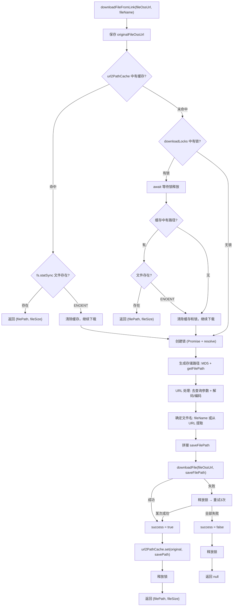
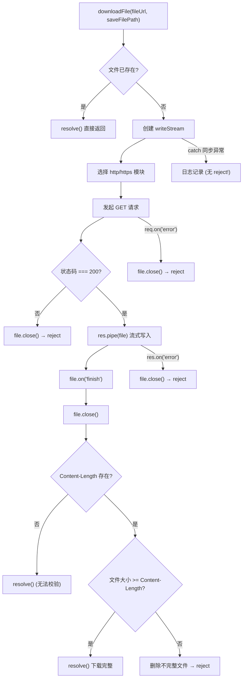
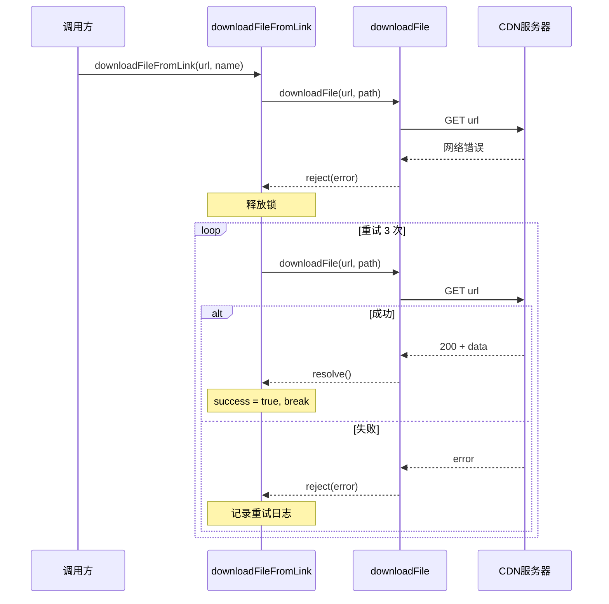
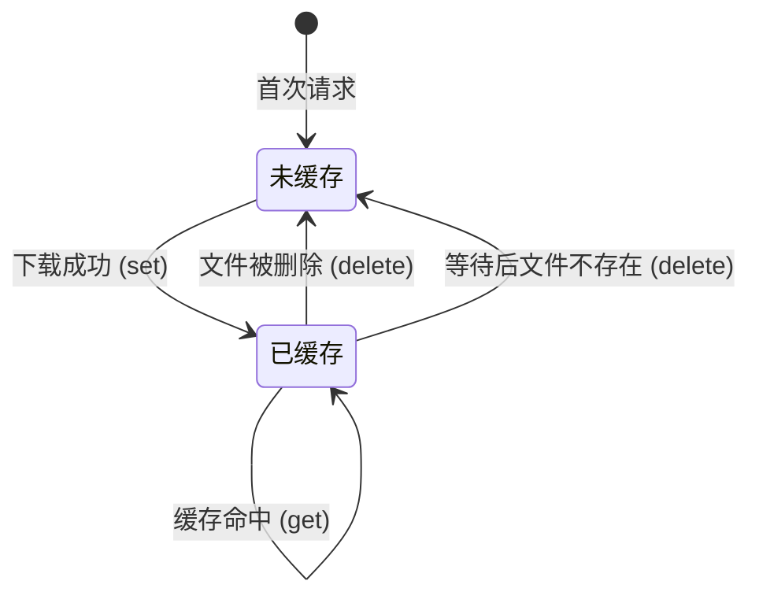
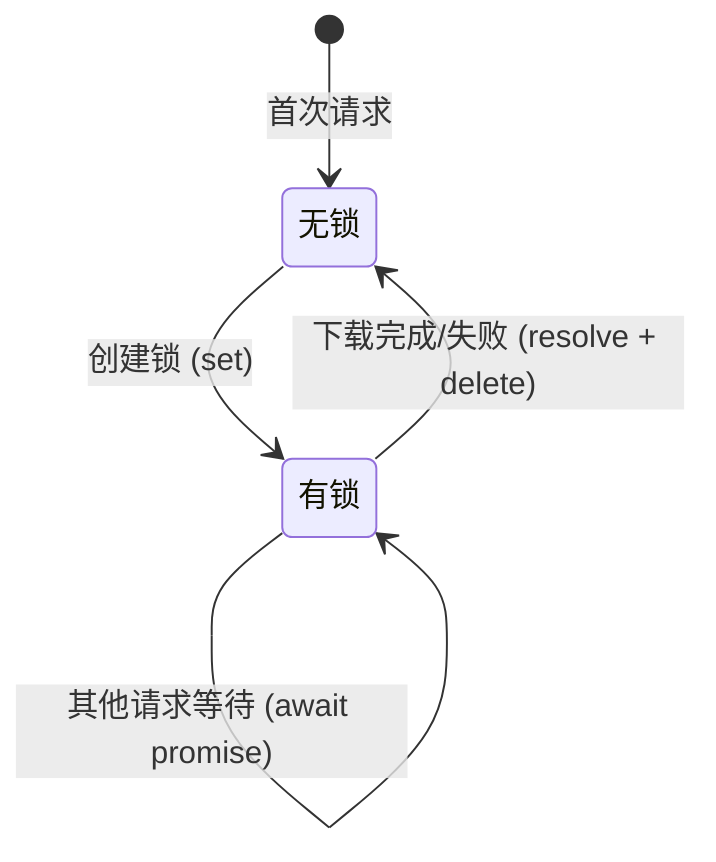

# 文件下载服务深度分析

> **文档定位**：深度解读 `fileDownload.js` 文件下载工具的完整实现，包含缓存机制、并发锁控制、重试策略、文件完整性校验、文件名处理逻辑，以及 `fileUtils.js` 的视频处理能力。重点分析已知 Bug 和优化建议。  
> **适用仓库**：`galaxy-client`  
> **核心源文件**：`src/msg-center/core/utils/fileDownload.js`  
> **关联文件**：`src/msg-center/core/utils/fileUtils.js`

---

## 一、模块职责与存储路径规则

### 1.1 模块职责

`FileDownloadUtil` 是整个消息发送链路中的关键依赖，负责将云端（OSS/CDN）上的文件下载到本地磁盘，供逆向程序读取并发送。

**调用方**：
- `mqttChatService.js`（微信）— 图片/视频/文件/表情消息
- `mqttWorkWxChatService.js`（企微）— 文件/图片/视频/语音消息

### 1.2 存储路径规则

文件下载后的存储路径基于 URL 的 MD5 哈希值：

```
~/silkfile/{md5(url)}/{filename}
```

**平台路径差异**：

| 平台 | 基础路径 | 示例 |
|------|---------|------|
| Windows | `C:\Users\{用户名}\silkfile\` | `C:\Users\admin\silkfile\a1b2c3d4...\报告.pdf` |
| macOS/Linux | `~/silkfile/` | `/Users/admin/silkfile/a1b2c3d4.../报告.pdf` |

**注意**：`fileDownload.js` 使用 `process.env.HOME || process.env.USERPROFILE` 获取主目录，而 `fileUtils.js` 使用 `app.getPath("userData")`（Electron 应用数据目录）。两者路径可能不同。

### 1.3 MD5 哈希目录命名

```javascript
let prefix = crypto.createHash("md5").update(fileOssUrl).digest("hex");
pathUrl = this.getFilePath(prefix);
```

**设计目的**：
- 同一 URL 的文件总是存在同一目录下 → 支持缓存
- 不同 URL 的文件不会互相覆盖 → 避免冲突
- 哈希值固定32位 → 目录名规范统一

---

## 二、downloadFileFromLink 核心流程

### 2.1 完整流程图



### 2.2 步骤详解

#### 步骤 1：缓存检查

```javascript
// fileDownload.js:257-291
const originalFileOssUrl = fileOssUrl;
let pathUrl = this.url2PathCache.get(fileOssUrl);
if (pathUrl) {
    try {
        const file = fs.statSync(pathUrl);
        // 缓存命中 + 文件存在 → 直接返回
        return { filePath: pathUrl, fileSize: file.size };
    } catch (error) {
        if (error.code === 'ENOENT') {
            // 文件已删除 → 清除缓存，继续下载
            this.url2PathCache.delete(fileOssUrl);
        } else {
            throw error;
        }
    }
}
```

**SLS 日志**：
- 缓存命中：`[文件下载缓存] [fileOssUrl] : {url} [fileSize]:{size} [pathUrl] : {path}`
- 缓存失效：`[文件缓存失效] [fileOssUrl] : {url} [pathUrl] : {path}`

#### 步骤 2：并发锁控制

```javascript
// fileDownload.js:293-339
if (!this.downloadLocks) this.downloadLocks = new Map();

if (this.downloadLocks.has(fileOssUrl)) {
    // 有其他请求正在下载 → 等待
    await this.downloadLocks.get(fileOssUrl).promise;
    // 等待完成后检查缓存
    const cachedPath = this.url2PathCache.get(fileOssUrl);
    if (cachedPath) {
        // 前一个请求成功了 → 使用其结果
        const fileStats = fs.statSync(cachedPath);
        return { filePath: cachedPath, fileSize: fileStats.size };
    }
    // 前一个请求失败了 → 自己来下载
} else {
    // 首次下载 → 创建锁
    let resolveLock;
    const lockPromise = new Promise(resolve => resolveLock = resolve);
    this.downloadLocks.set(fileOssUrl, { promise: lockPromise, resolve: resolveLock });
}
```

**锁的数据结构**：

```javascript
downloadLocks: Map<string, { promise: Promise, resolve: Function }>
```

| 操作 | 时机 | 方法 |
|------|------|------|
| 创建锁 | 首次下载某 URL | `downloadLocks.set(url, { promise, resolve })` |
| 等待锁 | 其他请求发现已有锁 | `await downloadLocks.get(url).promise` |
| 释放锁 | 下载完成（成功或失败） | `downloadLocks.get(url).resolve()` |
| 删除锁 | 释放后清理 | `downloadLocks.delete(url)` |

**SLS 日志**：`[首次下载文件] url:[{url}]`

#### 步骤 3：存储路径生成

```javascript
// fileDownload.js:341-390
// 3a. MD5 哈希作为目录名
let prefix = crypto.createHash("md5").update(fileOssUrl).digest("hex");
pathUrl = this.getFilePath(prefix);

// 3b. 去除 URL 查询参数
if (fileOssUrl.includes("?")) {
    fileOssUrl = fileOssUrl.substring(0, fileOssUrl.lastIndexOf("?"));
}

// 3c. URL 解码/编码处理
let tail = path.basename(fileOssUrl);
tail = decodeURIComponent(tail);
fileOssUrl = fileOssUrl.substring(0, fileOssUrl.lastIndexOf("/") + 1)
    + encodeURIComponent(tail);

// 3d. 文件名确定
if (!fileName) {
    fileName = tail;
}

// 3e. 拼接完整路径
let suffix = path.extname(fileName);
if (!suffix) {
    fileName = Date.now() + getFileExtension(fileOssUrl);
}
saveFilePath = path.join(pathUrl, fileName);
```

**关键细节**：
- `fileOssUrl` 在步骤 3b 去除了查询参数，但此时 `originalFileOssUrl` 仍保留原始 URL
- 步骤 3c 会重新编码文件名中的特殊字符（如中文）
- 如果文件名没有扩展名，使用 `时间戳 + URL中的扩展名` 作为文件名

**SLS 日志**：`[文件下载] [fileOssUrl] : {url} [filename]: {name} [saveFilePath] : {path}`

#### 步骤 4：执行下载

```javascript
// fileDownload.js:393-423
let success = false;
try {
    await this.downloadFile(fileOssUrl, saveFilePath);
    success = true;
} catch (error) {
    // 首次失败，释放锁，然后重试
    if (this.downloadLocks.has(fileOssUrl)) {
        this.downloadLocks.get(fileOssUrl).resolve();
        this.downloadLocks.delete(fileOssUrl);
    }
    // 重试 3 次（立即重试，无退避）
    for (let i = 0; i < 3; i++) {
        try {
            await this.downloadFile(fileOssUrl, saveFilePath);
            success = true;
            break;
        } catch (e1) {
            // SLS关键字: "[下载文件重试]"
        }
    }
}
```

#### 步骤 5：结果处理

```javascript
// fileDownload.js:426-462
if (success) {
    // 更新缓存（使用原始 URL 作为 key）
    this.url2PathCache.set(originalFileOssUrl, saveFilePath);
    // 释放锁
    if (this.downloadLocks.has(fileOssUrl)) {
        this.downloadLocks.get(fileOssUrl).resolve();
        this.downloadLocks.delete(fileOssUrl);
    }
    // 获取文件大小
    const fileStats = fs.statSync(saveFilePath);
    return { filePath: saveFilePath, fileSize: fileStats.size };
}
// 失败 → 释放锁 → 返回 null
```

**SLS 日志**：
- 成功：`[文件下载成功] [fileOssUrl] : {url} [filename]: {name} [saveFilePath] : {path}`
- 成功但文件不存在：`[下载成功但文件不存在]`

---

## 三、downloadFile 底层实现

### 3.1 完整流程图



### 3.2 HTTP/HTTPS 协议选择

```javascript
const httpFetch = fileUrl.includes("https") ? https : http;
```

通过 URL 中是否包含 "https" 字符串决定使用哪个模块。

### 3.3 流式写入

```javascript
let file = fs.createWriteStream(saveFilePath);
res.pipe(file);
```

使用 Node.js Stream 的 `pipe()` 方法，将 HTTP 响应流直接导入文件写入流。内存友好，适合大文件。

### 3.4 完整性校验

```javascript
file.on("finish", () => {
    file.close();
    const contentLength = parseInt(res.headers['content-length'], 10);
    if (!isNaN(contentLength)) {
        fs.stat(saveFilePath, (err, stats) => {
            if (stats.size < contentLength) {
                // 文件不完整 → 删除 → reject
                fs.unlinkSync(saveFilePath);
                reject(new Error('文件下载不完整'));
            } else {
                resolve();
            }
        });
    } else {
        resolve();  // 无 Content-Length，无法校验
    }
});
```

**SLS 日志**：
- 请求失败：`[下载文件请求失败] url:{url} 状态码：{code}`
- 传输错误：`[下载文件数据传输错误] url:{url} {error}`
- 不完整：`[文件下载不完整] url:{url} 预期大小: {expected}, 实际大小: {actual}`
- 请求错误：`[下载文件失败] url:{url} {error}`
- 同步异常：`[下载文件失败2] url:{url} {error}`

### 3.5 错误事件处理

downloadFile 中有**三层**错误监听：

| 层次 | 事件 | 捕获范围 | 处理方式 |
|------|------|---------|---------|
| 请求层 | `req.on("error")` | DNS 解析失败、连接超时、ECONNRESET | `file.close()` + `reject` |
| 响应层 | `res.on('error')` | 数据传输中的网络错误 | `file.close()` + `reject` |
| 文件层 | `file.on("finish")` | 写入完成后的校验 | 不完整则 `unlinkSync` + `reject` |
| 同步层 | `try-catch` | createWriteStream 等同步异常 | 仅日志，**无 reject** |

---

## 四、重试机制

### 4.1 重试策略

```
首次尝试 → 失败 → 释放锁 → 重试1 → 失败 → 重试2 → 失败 → 重试3 → 失败 → 返回null
```

**特点**：
- 最多重试 3 次（共 4 次尝试）
- **立即重试**，无延迟/退避策略
- 首次失败后会释放下载锁
- 重试期间不重新创建锁

### 4.2 重试时序图



---

## 五、缓存与锁的生命周期

### 5.1 url2PathCache 缓存



| 操作 | 触发时机 | 方法 |
|------|---------|------|
| `set(url, path)` | 下载成功后 | `url2PathCache.set(originalFileOssUrl, saveFilePath)` |
| `get(url)` | 检查缓存时 | `url2PathCache.get(fileOssUrl)` |
| `delete(url)` | 缓存文件被删（ENOENT） | `url2PathCache.delete(fileOssUrl)` |

**重要细节**：
- `set` 使用 `originalFileOssUrl`（原始 URL）作为 key
- `get` 和 `delete` 使用 `fileOssUrl`（可能已被编码处理的 URL）
- 两者可能不一致（见 Bug 分析章节）

### 5.2 downloadLocks 锁



| 操作 | 触发时机 |
|------|---------|
| 创建锁 | 首次下载某 URL，无缓存无锁 |
| 等待锁 | 其他请求发现同 URL 正在下载 |
| 释放锁 | 缓存命中时（防御性释放）、下载成功后、下载失败后、重试前 |
| 删除锁 | 释放后立即删除 |

---

## 六、文件名处理逻辑

### 6.1 getFileName：从字符串中提取文件名

```javascript
getFileName(str) {
    // 第一步：尝试匹配 CDN 格式 (文件名.扩展名_哈希)
    let m1 = str.match(CDN_FILE_PATTERN);  // /([^\\]+)\.([0-9a-zA-Z]{1,7})_([0-9a-zA-Z]+)/
    if (m1) str = m1[0];
    
    // 第二步：匹配普通文件名 (文件名.扩展名)
    let m2 = str.match(TARGET_FILE_PATTERN2);  // /([^\\]+)\.([.0-9a-zA-Z]{1,7})/
    if (m2) fileName = m2[0];
    
    return fileName;
}
```

**匹配示例**：

| 输入 | CDN 匹配 | 最终结果 |
|------|---------|---------|
| `image.jpg_abc123` | `image.jpg_abc123` → `image.jpg` | `image.jpg` |
| `report.pdf` | 不匹配 → `report.pdf` | `report.pdf` |
| `https://cdn.com/path/file.mp4?token=xxx` | 不匹配 | `file.mp4` |

### 6.2 getFileRealPath：去除 CDN 哈希后缀

```javascript
getFileRealPath(filePath) {
    let endWithStr = filePath.substring(filePath.lastIndexOf(".") + 1);
    if (endWithStr.length > 32) {
        if (endWithStr.indexOf("_") !== -1) {
            // 格式: jpg_abc123 → jpg
            endWithStr = endWithStr.substring(0, endWithStr.indexOf("_"));
        } else {
            // 格式: jpgabc123def456... → jpg (总长度 - 32位哈希)
            endWithStr = endWithStr.substring(0, endWithStr.length - 32);
        }
        filePath = filePath.substring(0, filePath.lastIndexOf(".") + 1) + endWithStr;
    }
    return filePath;
}
```

### 6.3 getFileExtension：从 URL 提取扩展名

```javascript
const getFileExtension = (url) => {
    const filename = url.substring(url.lastIndexOf("/") + 1);
    const fileExt = filename.lastIndexOf(".") !== -1
        ? filename.substring(filename.lastIndexOf("."))
        : "";
    return fileExt;  // 如 ".jpg", ".mp4", ""
};
```

---

## 七、fileUtils 视频处理

### 7.1 videoImage：视频截帧

**调用方**：`mqttWorkWxChatService.js` 在发送视频消息时调用

**实现原理**：

```javascript
// src/msg-center/core/utils/fileUtils.js:103-144
async videoImage(filePath, dir) {
    // 1. 使用 ffprobe 获取视频时长
    const duration = await new Promise((resolve, reject) => {
        ff.ffprobe((err, data) => {
            resolve(data.format.duration);
        });
    });
    
    // 2. 确定截帧时间点
    let filename = `tmp_${uuid.v4()}.png`;
    
    // 3. 截帧
    ff.screenshots({
        timestamps: [duration > 1 ? 0.5 : duration / 2],
        folder: dir,
        filename,
    });
    
    return path.resolve(dir, filename);
}
```

**截帧策略**：

| 视频时长 | 截帧时间点 | 原因 |
|---------|-----------|------|
| > 1 秒 | 0.5 秒 | 通常第 0.5 秒已经有有效画面 |
| <= 1 秒 | duration / 2 | 短视频取中间帧更有代表性 |

**依赖**：
- `fluent-ffmpeg`：FFmpeg 的 Node.js 封装
- `ffmpeg-static-electron`：Electron 预编译的 ffmpeg 二进制
- `ffprobe-static-electron`：Electron 预编译的 ffprobe 二进制

### 7.2 getMp4Duration：获取视频时长

```javascript
// src/msg-center/core/utils/fileUtils.js:154-172
async getMp4Duration(videoPath) {
    const ff = ffmpeg(videoPath);
    const data = await new Promise((resolve, reject) => {
        ff.ffprobe((err, data) => {
            if (err) reject(err);
            else resolve(data.format.duration);
        });
    });
    return Math.round(Number(data));  // 四舍五入为整数秒
}
```

**注意**：在 `mqttWorkWxChatService.js` 中，如果 `getMp4Duration` 失败，默认值为 23 秒：
```javascript
let seconds = mp4Duration ?? 23;
```

### 7.3 isWithin14Days：14 天有效期判断

```javascript
// src/msg-center/core/utils/fileUtils.js:199-207
isWithin14Days(filePath) {
    const dateTimestrap = this.extractDateFromString(filePath);
    const now = new Date().getTime();
    return now - dateTimestrap < 1209600000;  // 14天 = 1209600000ms
}
```

**extractDateFromString 实现**：
```javascript
extractDateFromString(str) {
    const match = str.match(/(\d{10,})/g);
    return match ? +match?.[1] : 0;  // 注意：返回第二个匹配项 [1]
}
```

**使用场景**：企微语音消息判断 silk 文件是否在 14 天有效期内。超过 14 天需要重新下载。

---

## 八、SLS 日志关键字速查表

### 8.1 下载全链路日志

按执行顺序排列：

| 序号 | 日志关键字 | 代码位置 | 含义 | 级别 |
|------|-----------|---------|------|------|
| 1 | `[文件下载缓存]` | downloadFileFromLink:265 | 缓存命中，直接返回 | info |
| 2 | `[文件缓存失效]` | downloadFileFromLink:279 | 缓存的文件被删除 | warn |
| 3 | `[等待下载后文件不存在]` | downloadFileFromLink:315 | 等待其他下载完成后文件仍不存在 | warn |
| 4 | `[首次下载文件]` | downloadFileFromLink:332 | 首次下载，创建锁 | info |
| 5 | `[文件下载]` | downloadFileFromLink:396 | 开始下载，记录 URL/文件名/路径 | info |
| 6 | `[文件下载成功]` | downloadFileFromLink:437 | 下载完成 | info |
| 7 | `[下载成功但文件不存在]` | downloadFileFromLink:447 | 下载方法成功但文件实际不存在 | error |

### 8.2 downloadFile 底层日志

| 日志关键字 | 代码位置 | 含义 | 级别 |
|-----------|---------|------|------|
| `[下载文件请求失败]` | downloadFile:514 | HTTP 状态码非 200 | error |
| `[下载文件数据传输错误]` | downloadFile:527 | 数据传输中网络错误 | error |
| `[检查文件大小失败]` | downloadFile:550 | fs.stat 失败 | error |
| `[文件下载不完整]` | downloadFile:559 | 实际大小 < Content-Length | error |
| `[下载文件失败]` | downloadFile:589 | 请求层错误（DNS/连接等） | error |
| `[下载文件失败2]` | downloadFile:600 | 同步代码异常 | error |

### 8.3 重试日志

| 日志关键字 | 含义 |
|-----------|------|
| `[下载文件重试] 第1次重试下载失败` | 第 1 次重试失败 |
| `[下载文件重试] 第2次重试下载失败` | 第 2 次重试失败 |
| `[下载文件重试] 第3次重试下载失败` | 第 3 次重试失败（最终失败） |

### 8.4 路径相关日志

| 日志关键字 | 含义 |
|-----------|------|
| `downloadFileFromLinkDecodeURIComponentError` | URL 解码失败 |
| `[SocketMsgRecordServiceImpl-operate] - 创建文件夹失败` | 存储目录创建失败 |

### 8.5 典型排查场景

**场景：文件下载超时**

```
# 查看下载全链路
"[文件下载]" and "{fileOssUrl的部分路径}"

# 查看是否有重试
"[下载文件重试]" and "{fileOssUrl的部分路径}"

# 查看具体失败原因
("[下载文件请求失败]" or "[下载文件数据传输错误]" or "[文件下载不完整]") and "{url片段}"
```

**场景：文件缓存问题**

```
# 查看缓存命中情况
("[文件下载缓存]" or "[文件缓存失效]") and "{url片段}"

# 查看是否因并发锁等待
"[首次下载文件]" or "[等待下载后文件不存在]"
```

**场景：视频处理失败**

```
# 查看 ffmpeg 相关错误
"getMp4DurationError" and wxid-{wxId}
```

---

## 九、已知 Bug 与优化建议

### 9.1 【严重】Bug：downloadFile 的 catch 中没有 reject

**位置**：fileDownload.js 第 598-606 行

```javascript
downloadFile(fileUrl, saveFilePath) {
    return new Promise((resolve, reject) => {
        try {
            // ... 下载逻辑
        } catch (error) {
            logUtil.customLog(`[下载文件失败2] ...`);
            // ← 这里没有 reject(error)!
        }
    });
}
```

**影响**：如果 `fs.createWriteStream(saveFilePath)` 等同步代码抛出异常（例如磁盘满、路径非法），Promise 将永远处于 pending 状态，不会 resolve 也不会 reject。调用方的 `await` 将永远等待，导致：
1. 该 MQTT 任务永远不会完成
2. 对应的下载锁永远不会释放
3. 后续对同一 URL 的下载请求也会永远等待

**建议修复**：

```javascript
} catch (error) {
    logUtil.customLog(`[下载文件失败2] ...`);
    reject(error);  // 添加 reject
}
```

### 9.2 【严重】Bug：锁的 key 在 URL 编码后不一致

**位置**：fileDownload.js 步骤 3c

```javascript
// 步骤2中: 锁使用原始 fileOssUrl 创建
this.downloadLocks.set(fileOssUrl, { promise, resolve });

// 步骤3c中: fileOssUrl 被重新编码
fileOssUrl = fileOssUrl.substring(0, fileOssUrl.lastIndexOf("/") + 1)
    + encodeURIComponent(tail);

// 步骤5中: 使用编码后的 fileOssUrl 尝试释放锁
if (this.downloadLocks.has(fileOssUrl)) {
    this.downloadLocks.get(fileOssUrl).resolve();  // ← key 不匹配，锁可能无法释放
}
```

**场景示例**：

```
原始 URL: https://cdn.com/文件.pdf
锁创建 key: https://cdn.com/文件.pdf
编码后 URL: https://cdn.com/%E6%96%87%E4%BB%B6.pdf
锁释放 key: https://cdn.com/%E6%96%87%E4%BB%B6.pdf  ← 不匹配！
```

**影响**：对于包含中文或特殊字符的 URL，下载锁可能永远无法释放，导致后续对同一 URL 的请求永远等待。

**建议修复**：在编码 URL 之前保存锁的 key：

```javascript
const lockKey = fileOssUrl;  // 编码前保存

// ... URL 编码处理 ...

// 释放时使用原始 key
if (this.downloadLocks.has(lockKey)) {
    this.downloadLocks.get(lockKey).resolve();
    this.downloadLocks.delete(lockKey);
}
```

### 9.3 【中等】Bug：req.on("error") 中未删除临时文件

**位置**：fileDownload.js 第 584-594 行

```javascript
req.on("error", (error) => {
    file.close();
    // fs.unlinkSync(saveFilePath);  ← 这行被注释掉了！
    reject(error);
});
```

**影响**：当 HTTP 请求失败时（如 ECONNRESET），已创建的空文件或部分写入的文件不会被删除。由于 `downloadFile` 开头有存在性检查：

```javascript
if (fs.existsSync(saveFilePath)) {
    resolve();  // 文件已存在，直接返回
    return;
}
```

残留的空文件会导致后续重试认为文件已下载成功，返回一个空文件/不完整文件给逆向。

**建议修复**：取消注释 `fs.unlinkSync(saveFilePath)`。

### 9.4 【中等】风险：无请求超时设置

`downloadFile` 中使用的 `http.get()` / `https.get()` 没有设置请求超时：

```javascript
let req = httpFetch.get(fileUrl, (res) => { ... });
// 没有 req.setTimeout() 或 options.timeout
```

**影响**：如果 CDN 服务器不响应，HTTP 请求会一直挂起。由于操作系统 TCP 默认超时时间可能很长（Linux 默认约 2 分钟），这会导致：
1. 当前消息发送任务长时间等待
2. 如果有下载锁，其他请求也会等待

**建议修复**：

```javascript
let req = httpFetch.get(fileUrl, (res) => { ... });
req.setTimeout(60000, () => {  // 60秒超时
    req.destroy();
    reject(new Error('下载请求超时'));
});
```

### 9.5 【低】风险：缓存无上限

```javascript
const MAX_CACHE_SIZE = 10000;  // 定义了常量，但从未使用
url2PathCache: new Map(),       // 无容量限制
```

**影响**：长时间运行后，`url2PathCache` 会无限增长。虽然 Map 的 key 和 value 都是字符串（内存占用较小），但在极端情况下（大量不同 URL 的文件下载）可能导致内存问题。

**建议修复**：在 `set` 时检查容量，超出时删除最早的条目：

```javascript
if (this.url2PathCache.size >= MAX_CACHE_SIZE) {
    const firstKey = this.url2PathCache.keys().next().value;
    this.url2PathCache.delete(firstKey);
}
this.url2PathCache.set(url, path);
```

### 9.6 【低】优化：重试无退避策略

当前重试是立即执行的，对于网络抖动等临时性故障，立即重试可能同样失败。

**建议**：添加指数退避：

```javascript
for (let i = 0; i < 3; i++) {
    await new Promise(r => setTimeout(r, Math.pow(2, i) * 1000));  // 1s, 2s, 4s
    try {
        await this.downloadFile(fileOssUrl, saveFilePath);
        success = true;
        break;
    } catch (e1) { ... }
}
```

### 9.7 【低】冗余：downloadAsync 与 downloadAsyncReturnFileInfo 完全相同

```javascript
async downloadAsync(fileOssUrl, fileName) {
    return await this.downloadFileFromLink(fileOssUrl, fileName);
}

async downloadAsyncReturnFileInfo(fileOssUrl, fileName) {
    return await this.downloadFileFromLink(fileOssUrl, fileName);
}
```

两个方法实现完全一致，增加了维护成本。建议合并为一个方法，另一个作为别名：

```javascript
async downloadAsyncReturnFileInfo(fileOssUrl, fileName) {
    return await this.downloadFileFromLink(fileOssUrl, fileName);
}
downloadAsync: this.downloadAsyncReturnFileInfo,
```

### 9.8 【低】fileUtils.extractDateFromString 返回第二个匹配项

```javascript
extractDateFromString(str) {
    const match = str.match(/(\d{10,})/g);
    return match ? +match?.[1] : 0;  // ← 使用 [1] 而非 [0]
}
```

`.match()` 使用全局匹配 `g`，返回所有匹配项的数组。使用 `[1]` 意味着返回**第二个**匹配项。如果路径中只有一个时间戳，会返回 `undefined`，`+undefined = NaN`，导致 `isWithin14Days` 返回 false（`NaN < 1209600000` 为 false）。

这可能是有意为之（路径中第一个数字可能是其他含义），也可能是 bug。需要确认实际路径格式。

### 9.9 Bug 优先级总结

| 优先级 | Bug | 影响 | 修复复杂度 |
|-------|-----|------|-----------|
| P0 | downloadFile catch 无 reject | Promise 永远 pending | 1行 |
| P0 | 锁 key 不一致 | 中文 URL 锁无法释放 | 3行 |
| P1 | req.error 不删临时文件 | 重试时返回空文件 | 1行 |
| P1 | 无请求超时 | 请求永远挂起 | 3行 |
| P2 | 缓存无上限 | 长期运行内存增长 | 5行 |
| P2 | 重试无退避 | 立即重试效果差 | 3行 |
| P3 | 冗余方法 | 维护成本 | 2行 |
| P3 | extractDateFromString 取 [1] | 部分场景 NaN | 需确认 |

---

*文档生成时间：2026-03-17 | 基于 galaxy-client 仓库实际代码分析*
