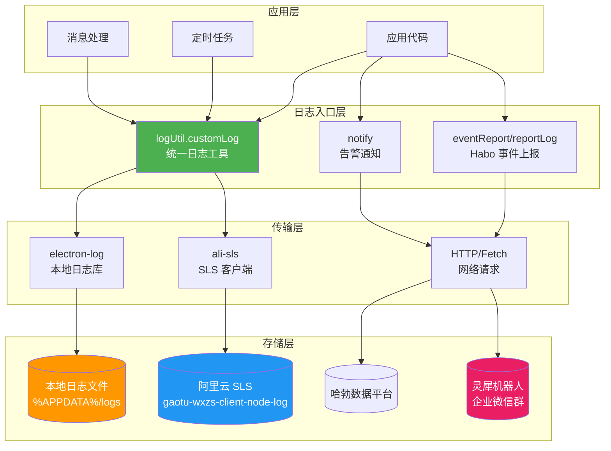
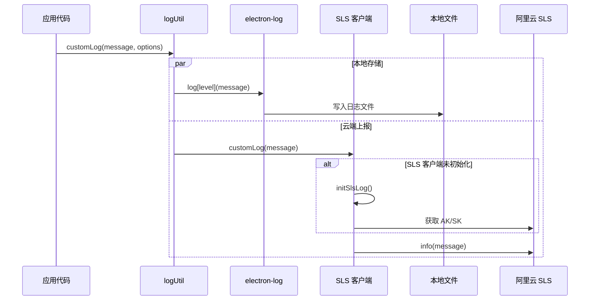
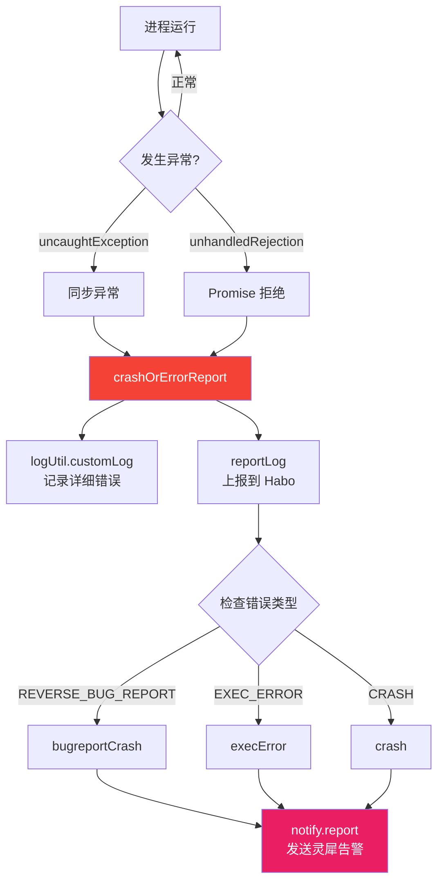
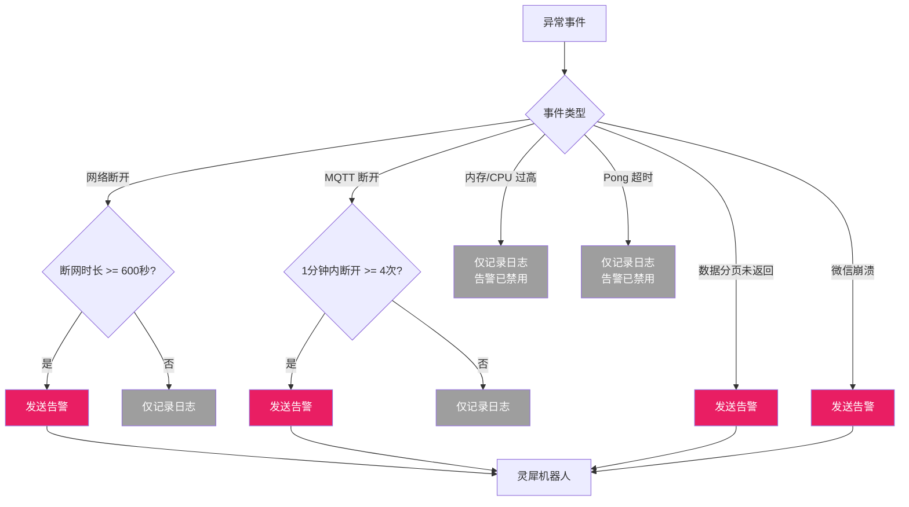
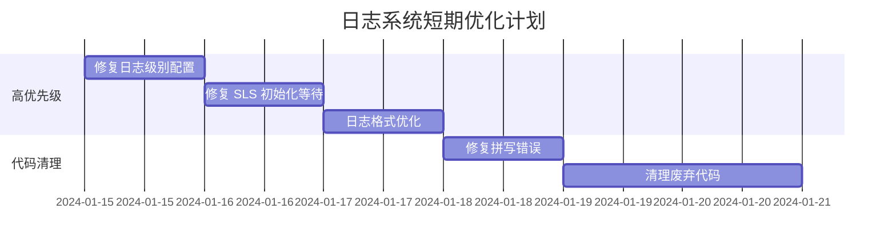

# 日志系统分析报告

## 一、系统概述

本项目的日志系统采用**双轨制架构**：本地日志 + 云端日志同步存储。

### 核心模块

| 模块 | 文件路径 | 职责 |
|------|---------|------|
| 日志初始化 | `src/init/initLog.js` | 配置 electron-log 和初始化 SLS |
| 统一日志工具 | `src/init/log.js` | 提供统一的日志记录入口 |
| SLS 云端日志 | `src/init/slsLog.js` | 阿里云日志服务上报 |
| Habo 事件上报 | `src/init/habo.js` | 哈勃数据平台上报 |
| 错误监控 | `src/common/monitor.js` | 全局异常捕获 |
| 告警通知 | `src/common/notify.js` | 灵犀机器人告警 |

---

## 二、架构图

### 2.1 日志系统整体架构



### 2.2 日志记录流程



### 2.3 错误处理流程



### 2.4 告警通知决策流程



---

## 三、日志存储策略

### 是否同步保存云端和本地？

**是的，采用双写策略**：

```
┌─────────────────────────────────────────────────────────────┐
│                    logUtil.customLog()                       │
├─────────────────────────┬───────────────────────────────────┤
│                         │                                   │
│    ▼                    │                   ▼               │
│  ┌─────────────┐        │         ┌─────────────────┐       │
│  │ electron-log │        │         │    ali-sls      │       │
│  └──────┬──────┘        │         └────────┬────────┘       │
│         │               │                  │                │
│         ▼               │                  ▼                │
│  ┌─────────────┐        │         ┌─────────────────┐       │
│  │  本地文件    │        │         │   阿里云 SLS    │       │
│  │ (100MB上限)  │        │         │ (无限存储)      │       │
│  └─────────────┘        │         └─────────────────┘       │
│                         │                                   │
│      本地存储            │           云端存储                │
└─────────────────────────┴───────────────────────────────────┘
```

| 存储位置 | 技术方案 | 日志级别 | 存储上限 | 保留策略 |
|---------|---------|---------|---------|---------|
| 本地 | electron-log | error only | 100MB | 单文件滚动 |
| 云端 | ali-sls | info (全量) | 无限制 | 按 SLS 配置 |

---

## 四、完善程度评估

### 4.1 已实现的功能

| 功能 | 状态 | 说明 |
|------|------|------|
| 本地文件日志 | ✅ 已实现 | electron-log 自动写入 |
| 云端日志同步 | ✅ 已实现 | 阿里云 SLS |
| 统一日志入口 | ✅ 已实现 | logUtil.customLog |
| 全局异常捕获 | ✅ 已实现 | uncaughtException/unhandledRejection |
| 告警通知 | ✅ 已实现 | 灵犀机器人 |
| 日志大小限制 | ✅ 已实现 | 100MB 上限 |
| 上下文信息 | ✅ 已实现 | 用户、GID、版本号 |
| 错误码标识 | ✅ 已实现 | errorKey 参数 |

### 4.2 缺失的功能

| 功能 | 状态 | 重要程度 |
|------|------|---------|
| 日志级别控制 | ❌ 缺失 | 高 |
| 日志格式规范 | ❌ 缺失 | 高 |
| 日志轮转策略 | ⚠️ 不完善 | 中 |
| 性能日志 | ❌ 缺失 | 中 |
| 日志采样 | ❌ 缺失 | 中 |
| 日志查询界面 | ❌ 缺失 | 低 |
| 日志脱敏 | ❌ 缺失 | 高 |
| 结构化日志 | ❌ 缺失 | 中 |

### 4.3 完善度评分

```
整体完善度: ██████░░░░ 60%

- 基础功能:   █████████░ 90%
- 存储策略:   ███████░░░ 70%
- 格式规范:   ████░░░░░░ 40%
- 监控告警:   ███████░░░ 70%
- 性能优化:   ███░░░░░░░ 30%
- 安全合规:   ██░░░░░░░░ 20%
```

---

## 五、工作原理详解

### 5.1 初始化流程

```javascript
// src/electron.js 启动时调用
initLog();  // → src/init/initLog.js

// initLog.js 内部流程
function initLog() {
    // 1. 配置本地文件日志格式
    log.transports.file.format = '{h}:{i}:{s}:{ms} {text}';
    
    // 2. 设置日志级别（仅 error）
    log.transports.file.level = 'error';
    
    // 3. 设置文件大小上限
    log.transports.file.maxSize = 1024*1024*100;  // 100MB
    
    // 4. 初始化 SLS 客户端（异步）
    slsLogUtil.initSlsLog();
}
```

### 5.2 日志记录流程

```javascript
// 业务代码调用
logUtil.customLog(
    `[codeError] [someError] [wxid-${wxid}] [${error.message}]`,
    { level: 'error', errorKey: 'someError' }
);

// logUtil.customLog 内部实现
customLog(message, options) {
    // 1. 上报到 SLS（异步，不等待）
    slsLogUtil.customLog(message);
    
    // 2. 写入本地日志
    const { level = 'info', errorKey = '' } = options ?? {};
    if (level === 'error') {
        log[level](errorKey, message);  // error 级别带 errorKey
    } else {
        log[level](message);
    }
}
```

### 5.3 SLS 上报流程

```javascript
// slsLogUtil.customLog 内部实现
async customLog(message, options) {
    // 1. 确保客户端已初始化
    if (!this.slsClient) {
        await this.initSlsLog();
    }
    
    // 2. 获取上下文信息
    const casUserInfo = store.getUserInfo();
    const registrys = registryList.getRegistryList();
    
    // 3. 发送到 SLS（格式：[用户] [GID] [子版本] [主版本] [号数量] 消息）
    this.slsClient?.info(
        `[${casUserInfo?.user}] [${this.gid}] [${clientSonVersion}] [${clientVersion}] [号数量: ${registrys.length}] ${message}`
    );
}
```

### 5.4 告警通知流程

```javascript
// 告警触发（以断网告警为例）
onNetChange(isConnected, registryList = []) {
    if (!isConnected) {
        this.disconnectedTime = now;  // 记录断网时间
    } else if (this.disconnectedTime) {
        const duration = (now - this.disconnectedTime) / 1000;
        
        // 超过 600 秒才告警
        if (duration >= 600) {
            this.report({  // → 发送到灵犀
                wxid: registryList.map(s => s.wxid).join(','),
                content: `断网时长：${duration}秒...`,
            });
            logUtil.customLog(...);  // 同时记录日志
        }
    }
}
```

---

## 六、需要优化的地方

### 6.1 高优先级问题

#### 1. 日志级别配置不合理

**当前问题**：本地日志仅记录 `error` 级别，丢失大量 `info`/`warn` 日志

```javascript
// 当前配置 - src/init/initLog.js
log.transports.file.level = 'error';  // 只有 error 写入文件
```

**建议修改**：

```javascript
// 开发环境记录所有日志
log.transports.file.level = isDev ? 'debug' : 'info';

// 或者提供配置项
log.transports.file.level = AppConfig.logLevel || 'info';
```

#### 2. SLS 初始化未等待完成

**当前问题**：`initSlsLog()` 是异步函数，但调用时未等待

```javascript
// 当前代码
function initLog() {
    // ...
    slsLogUtil.initSlsLog();  // 未 await，可能导致首批日志丢失
}
```

**建议修改**：

```javascript
async function initLog() {
    // ...
    await slsLogUtil.initSlsLog();  // 等待初始化完成
}
```

#### 3. 日志格式缺少日期

**当前问题**：日志只有时间，没有日期

```javascript
// 当前格式
log.transports.file.format = '{h}:{i}:{s}:{ms} {text}';
// 输出：14:30:25:123 [error] something happened

// 建议格式
log.transports.file.format = '[{y}-{m}-{d} {h}:{i}:{s}.{ms}] [{level}] {text}';
// 输出：[2024-01-15 14:30:25.123] [error] something happened
```

#### 4. 敏感信息未脱敏

**当前问题**：日志中可能包含敏感信息（微信 ID、用户名等）

```javascript
// 当前代码直接打印 wxid
logUtil.customLog(`[wxid-${wxid}]...`);
```

**建议增加脱敏处理**：

```javascript
function maskWxId(wxid) {
    if (!wxid) return '-';
    return wxid.slice(0, 3) + '***' + wxid.slice(-3);
}
```

### 6.2 中优先级问题

#### 5. 缺少结构化日志

**当前问题**：日志是纯文本，不利于搜索和分析

```javascript
// 当前方式
logUtil.customLog(`[codeError] [someError] [wxid-${wxid}] [${error.message}]`);
```

**建议修改**：

```javascript
// 结构化日志
logUtil.customLog({
    type: 'codeError',
    errorKey: 'someError',
    wxid: wxid,
    message: error.message,
    stack: error.stack,
    timestamp: Date.now()
});
```

#### 6. 告警频率缺少全局控制

**当前问题**：每种告警单独控制，容易告警风暴

```javascript
// 当前方式：每个告警方法自己控制
onMqttClose() {
    this.mqttCloseTimes++;
    // ...
}
```

**建议增加统一的告警限流器**：

```javascript
class AlertRateLimiter {
    constructor(maxPerMinute = 5) {
        this.alerts = new Map();
        this.maxPerMinute = maxPerMinute;
    }
    
    canAlert(alertKey) {
        const now = Date.now();
        const records = this.alerts.get(alertKey) || [];
        const recent = records.filter(t => now - t < 60000);
        
        if (recent.length >= this.maxPerMinute) {
            return false;
        }
        
        recent.push(now);
        this.alerts.set(alertKey, recent);
        return true;
    }
}
```

#### 7. SLS 凭证未刷新

**当前问题**：`slsExpiration` 定义了但未使用

```javascript
// 当前代码
slsExpiration: 0,  // 定义了但未使用
```

**建议增加刷新机制**：

```javascript
async customLog(message) {
    // 检查凭证是否过期
    if (Date.now() > this.slsExpiration - 60000) {
        await this.refreshCredentials();
    }
    // ...
}
```

### 6.3 低优先级问题

#### 8. 拼写错误

```javascript
// slsLog.js
pedding: false,  // 应为 pending

// habo.js
const snedNotifyReport = ...;  // 应为 sendNotifyReport

// store 中
data.user_number = userInfo.accoundId;  // 应为 accountId
```

#### 9. 废弃代码未清理

`monitor.js` 中有大量注释掉的 Sentry 代码，应该清理或移到独立文件。

#### 10. 魔法数字

```javascript
// habo.js
env: 9,  // 魔法数字，应定义常量

// notify.js
if (duration >= 600) {  // 应定义为 DISCONNECT_ALERT_THRESHOLD
```

---

## 七、优化方案

### 7.1 短期优化（1-2周）



### 7.2 中期优化（1-2个月）

1. **日志脱敏系统**
   - 实现敏感信息自动识别
   - 支持配置化的脱敏规则

2. **结构化日志改造**
   - 定义统一的日志 Schema
   - 支持 JSON 格式输出

3. **告警聚合系统**
   - 实现告警去重
   - 支持告警抑制和升级

### 7.3 长期优化（3-6个月）

1. **日志分析平台**
   - 接入 Kibana 或类似工具
   - 实现日志可视化查询

2. **APM 接入**
   - 接入 Sentry 或其他 APM
   - 实现全链路追踪

3. **智能告警**
   - 基于 ML 的异常检测
   - 动态告警阈值

---

## 八、总结

### 优势

1. **双写架构**：本地 + 云端，保证日志不丢失
2. **统一入口**：通过 `logUtil` 统一管理
3. **告警集成**：支持实时告警通知
4. **错误追踪**：全局异常捕获机制

### 不足

1. **日志级别**：本地仅 error，信息丢失严重
2. **格式规范**：缺少结构化，不利分析
3. **安全合规**：缺少脱敏处理
4. **运维支持**：缺少日志查询界面

### 改进建议

按优先级依次实现：
1. 修复日志级别和格式配置
2. 增加日志脱敏
3. 实现结构化日志
4. 建设日志分析平台
